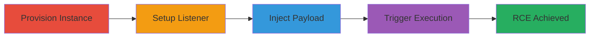

# Grafana RCE via CRLF Injection in Aiven SMTP Configuration

Multi-stage attack chain demonstrating exploitation of CRLF injection in Aiven's Grafana service to achieve remote code execution on the Grafana server, enabling data access, modification, and potential pivoting within the Aiven network.

## Chain Metrics Dashboard

| Metric | Value |
|--------|-------|
| Chain Status | Unverified |
| Total Steps | 4 |
| Execution Time | ~5 minutes |
| Skill Level | Intermediate |
| Complexity | Medium |
| Impact Level | High |

## Attack Flow Visualization



## Prerequisites & Requirements

### Required Tools

- [[tools/netcat]]

### Target Environment

- Aiven Cloud platform
- Grafana service with API access
- Required services/ports: Aiven API (HTTPS), port 4444 open on attacker machine
- Network access requirements: Valid Aiven project credentials and API token

### Initial Access Requirements

- Aiven account with project creation privileges
- API token obtained from browser session (e.g., via developer tools)
- Attacker server with public IP for reverse shell callback

## Detailed Attack Procedures

### Step 1: Provision Grafana Instance
procedure: [[procedures/Provision-Aiven-Grafana-Instance]]

**Objective**: Create a new Grafana instance in Aiven to obtain credentials and endpoints for exploitation.

**Instructions**: Use the Aiven console or API to provision a new Grafana service in your project. Note the instance name, subdomain, and API endpoints.

**Expected Output**: Grafana instance details including service URI and initial credentials.

**Success Indicators**:
- Instance provisioned successfully
- API endpoint accessible with provided token

### Step 2: Setup Reverse Shell Listener
procedure: [[procedures/Setup-Netcat-Listener-for-Reverse-Shell]]

**Objective**: Prepare the attacker's server to receive the incoming reverse shell connection.

**Instructions**: Execute [[commands/nc-listen-on-port-4444]] to start listening on port 4444.

```bash
nc -n -lvp 4444
```

**Expected Output**: Listener active, waiting for connections.

**Success Indicators**:
- Port 4444 listening without errors
- No firewall blocks on attacker side

### Step 3: Inject CRLF Payload
procedure: [[procedures/Inject-CRLF-Payload-into-SMTP-Password-via-Aiven-API]]

**Objective**: Exploit the CRLF injection vulnerability in the SMTP password field to inject configuration for the grafana-image-renderer plugin.

**Instructions**: Send a PUT request to the Aiven API with the injected payload in the password field. Replace placeholders: PROJECT_NAME, GRAFANA_INSTANCE_NAME, SERVER_IP (attacker's IP), and use your Aiven API token in the Authorization header.

**Expected Output**: HTTP 200 response confirming configuration update.

**Success Indicators**:
- Configuration applied without validation errors
- No immediate alerts from Aiven

### Step 4: Trigger Image Renderer
procedure: [[procedures/Trigger-Grafana-Image-Renderer-to-Execute-Payload]]

**Objective**: Invoke the Grafana render endpoint to trigger the image renderer, executing the injected bash reverse shell command.

**Instructions**: Browse to the render endpoint in a web browser or use curl to access https://INSTANCE_SUBDOMAIN.aivencloud.com/render/x, which will invoke the renderer with the malicious rendering_args.

**Expected Output**: Reverse shell connection established on the netcat listener.

**Success Indicators**:
- Incoming connection on port 4444
- Bash shell prompt from Grafana server

## Attack Chain Summary

### Key Achievements

1. Successful CRLF injection to override plugin configuration
2. Arbitrary command execution on Grafana server
3. Remote shell access for further exploitation

## Technique & Tactic Coverage

### MITRE ATT&CK Techniques

- [[Exploit Public-Facing Application]]
- [[Unix Shell]]

### MITRE ATT&CK Tactics

- [[Initial Access]]
- [[Execution]]

---
*Last updated: 2023-10-01T00:00:00Z*
