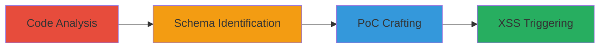

---
tags:
  - xss
  - config-override
  - grammarly
  - web-vulnerability
type: attack_chain
tools: []
tactics:
  - '[[Initial Access]]'
  - '[[Execution]]'
commands:
  - '[[commands/grammarly-xss-poc-new-doc]]'
  - '[[commands/grammarly-xss-poc-main-page]]'
  - '[[commands/grammarly-xss-poc-office-addin]]'
  - '[[commands/grammarly-config-override-download-urls]]'
platforms:
  - Web
complexity: medium
procedures:
  - '[[procedures/Analyze-Application-Code-for-Config-Handling]]'
  - '[[procedures/Identify-Missing-Properties-in-TypeScript-Schema]]'
  - '[[procedures/Craft-PoC-URLs-for-Config-Injection]]'
  - '[[procedures/Trigger-XSS-via-Affected-Features]]'
step_count: 4
techniques:
  - '[[Exploit Public-Facing Application]]'
  - '[[JavaScript]]'
description: >-
  Multi-stage attack chain exploiting a configuration override vulnerability in
  Grammarly's web application to achieve reflected XSS.
skill_level: intermediate
impact_level: high
id: 29d161a2-b883-46f9-a8ad-f55615ab6402
created_at: '2025-12-13T23:56:20.283Z'
updated_at: '2025-12-13T23:56:20.283Z'
verified: false
validated: true
submitted: true
mitre_tactics:
  - '[[Initial Access]]'
  - '[[Execution]]'
mitre_techniques:
  - '[[Exploit Public-Facing Application]]'
  - '[[JavaScript]]'
---
# Grammarly Config Override Leading to Reflected XSS

Multi-stage attack chain demonstrating a complete attack workflow.

## Chain Metrics Dashboard

| Metric | Value |
|--------|-------|
| Chain Status | Unverified |
| Total Steps | 4 |
| Execution Time | ~10 minutes |
| Skill Level | Intermediate |
| Complexity | Medium |
| Impact Level | High |

## Attack Flow Visualization



## Prerequisites & Requirements

### Required Tools

- None

### Target Environment

- Web platform
- Services: app.grammarly.com
- Tech stack: TypeScript, JSON

### Initial Access Requirements

- Access to the Grammarly web application
- Browser for testing
- No credentials required for basic exploitation

## Detailed Attack Procedures

### Step 1: Analyze Application Code
procedure: [[procedures/Analyze-Application-Code-for-Config-Handling]]

**Objective**: Examine the application's code to understand how the config parameter is handled.

**Instructions**: Analyze the code that processes the query.get('config') parameter, involving JSON parsing and partial TypeScript schema validation. Identify that it allows HttpString types starting with https? or wss?.

**Expected Output**: Identification of config handling mechanisms.

**Success Indicators**:
- Config processing code understood
- Validation schema details noted

### Step 2: Identify Missing Properties
procedure: [[procedures/Identify-Missing-Properties-in-TypeScript-Schema]]

**Objective**: Compare the schema to live config to find unvalidated properties.

**Instructions**: Compare the TypeScript schema to actual live config parameters, identifying missing validations for properties like api.redirect and account.subscription.

**Expected Output**: List of unvalidated properties.

**Success Indicators**:
- Missing properties documented
- Potential injection points identified

### Step 3: Craft PoC URLs
procedure: [[procedures/Craft-PoC-URLs-for-Config-Injection]]

**Objective**: Create URLs that inject malicious JSON config overrides.

**Instructions**: Craft URLs with the ?config= parameter containing JSON that overrides parameters to javascript: URIs. For example, use [[commands/grammarly-xss-poc-new-doc]]:

```
https://app.grammarly.com/docs/new?config={%22account%22:{%22subscription%22:%22javascript:alert(document.domain)//%22},%22api%22:{%22redirect%22:%22javascript:alert(document.domain)//%22}}
```

Also test with [[commands/grammarly-xss-poc-main-page]]:

```
https://app.grammarly.com/?config={%22api%22:{%22redirect%22:%22javascript:alert(document.domain)//%22}}
```

**Expected Output**: Functional PoC URLs that inject config.

**Success Indicators**:
- URLs successfully override config
- No immediate errors in loading

### Step 4: Trigger XSS
procedure: [[procedures/Trigger-XSS-via-Affected-Features]]

**Objective**: Interact with application features to execute the injected XSS payload.

**Instructions**: Access features like upgrade links or subscription menus using the crafted URLs, causing navigation to the injected javascript: URI. For instance, after loading [[commands/grammarly-xss-poc-main-page]], click on upgrade features to trigger the alert.

**Expected Output**: Execution of javascript:alert(document.domain).

**Success Indicators**:
- Alert popup appears
- Script execution confirmed in browser

## Attack Chain Summary

### Key Achievements

1. Identification of validation gaps in config handling
2. Successful injection of arbitrary config values
3. Execution of reflected XSS payloads

## Technique & Tactic Coverage

### MITRE ATT&CK Techniques

- [[Exploit Public-Facing Application]]
- [[JavaScript]]

### MITRE ATT&CK Tactics

- [[Initial Access]]
- [[Execution]]

*Last updated: [TIMESTAMP]*
