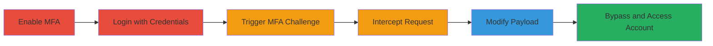

---
tags:
  - mfa-bypass
  - authentication-bypass
  - web-vulnerability
  - device-trust-exploit
type: attack_chain
tools:
  - '[[tools/Burp-Suite]]'
tactics:
  - '[[Initial Access]]'
verified: false
platforms:
  - Web
submitted: true
complexity: medium
created_at: '2023-10-01T00:00:00Z'
procedures:
  - '[[procedures/Enable-and-Configure-MFA-on-Target-Account]]'
  - '[[procedures/Login-with-Victim-Credentials-to-Trigger-MFA]]'
  - '[[procedures/Enter-Invalid-MFA-Code-to-Initiate-Request]]'
  - '[[procedures/Intercept-Login-POST-Request-with-Burp-Suite]]'
  - '[[procedures/Modify-MFA-Payload-to-Bypass-Authentication]]'
  - '[[procedures/Send-Modified-Request-to-Gain-Access]]'
step_count: 6
techniques:
  - '[[Valid Accounts]]'
  - '[[Steal Application Access Token]]'
  - '[[Modify Authentication Process]]'
updated_at: '2025-12-14T17:24:48.312Z'
description: >-
  Multi-stage attack exploiting improper authentication in Grammarly's MFA
  system by modifying login requests to switch MFA mode and disable secure
  login, leveraging stolen device cookies and timing within the trust window.
skill_level: intermediate
impact_level: high
id: 0dd10b5e-154e-43c5-b720-0dbdc6977283
validated: true
mitre_tactics:
  - '[[Initial Access]]'
mitre_techniques:
  - '[[Valid Accounts]]'
  - '[[Steal Application Access Token]]'
  - '[[Modify Authentication Process]]'
---
# Grammarly MFA Bypass via Mode Switching and Device Trust Exploitation

Multi-stage attack chain demonstrating a complete workflow to bypass multi-factor authentication (MFA) in Grammarly's login system by exploiting improper validation of MFA mode and secure login flags in the authentication endpoint, combined with device trust mechanisms.

## Chain Metrics Dashboard

| Metric | Value |
|--------|-------|
| Chain Status | Unverified |
| Total Steps | 6 |
| Execution Time | ~5-10 minutes |
| Skill Level | Intermediate |
| Complexity | Medium |
| Impact Level | High |

## Attack Flow Visualization

## Prerequisites & Requirements

### Required Tools

- [[tools/Burp-Suite]]

### Target Environment

- Web platform (Grammarly login at auth.grammarly.com)
- Required services: MFA (SMS or email mode)
- Network access: Direct internet access to Grammarly endpoints

### Initial Access Requirements

- Victim's email and password credentials
- Access to victim's 'tdi' cookie (requires device compromise or session hijacking)
- Matching User-Agent string from victim's browser
- Timing: Request must be issued within 15 minutes of victim's login from trusted device

## Detailed Attack Procedures

### Step 1: Enable and Configure MFA
procedure: [[procedures/Enable-and-Configure-MFA-on-Target-Account]]

**Objective**: Prepare the target account by enabling MFA to trigger the vulnerable authentication flow.

**Instructions**: Access the victim's account settings via the Grammarly web interface and enable MFA in SMS or email mode.

**Expected Output**: MFA confirmation page or settings update indicating MFA is active.

**Success Indicators**:
- MFA enabled in account settings
- Victim can log in and receive MFA prompts

### Step 2: Login with Victim Credentials
procedure: [[procedures/Login-with-Victim-Credentials-to-Trigger-MFA]]

**Objective**: Initiate the login process to reach the MFA challenge stage.

**Instructions**: Submit the victim's email and password to the login form on auth.grammarly.com.

**Expected Output**: Redirection to the MFA challenge page.

**Success Indicators**:
- Credentials accepted
- MFA code prompt displayed

### Step 3: Enter Invalid MFA Code
procedure: [[procedures/Enter-Invalid-MFA-Code-to-Initiate-Request]]

**Objective**: Force the submission of an MFA response to capture the vulnerable POST request.

**Instructions**: On the MFA page, input a random invalid code and attempt to proceed by clicking 'Sign in securely'.

**Expected Output**: Request intercepted before submission (if proxy is active).

**Success Indicators**:
- Invalid code entered
- POST request to /v3/api/login triggered

### Step 4: Intercept Login POST Request
procedure: [[procedures/Intercept-Login-POST-Request-with-Burp-Suite]]

**Objective**: Capture the authentication request for modification using a proxy tool.

**Instructions**: Configure Burp Suite as a proxy and intercept the POST request to auth.grammarly.com/v3/api/login when submitting the MFA code.

**Expected Output**: Raw HTTP request visible in Burp Suite's proxy tab.

**Success Indicators**:
- Request body contains JSON payload with 'mode' and 'secureLogin' fields
- Cookies including 'tdi' are present in headers

### Step 5: Modify MFA Payload
procedure: [[procedures/Modify-MFA-Payload-to-Bypass-Authentication]]

**Objective**: Alter the request to switch MFA mode and disable secure login, exploiting lack of server-side validation.

**Instructions**: In Burp Suite, edit the JSON payload: change 'mode' from 'sms' to 'email', set 'secureLogin' to false; ensure 'tdi' cookie and matching User-Agent are included; time the send within 15 minutes of victim's login.

**Expected Output**: Modified request ready for forwarding.

**Success Indicators**:
- Payload fields updated correctly
- No validation errors on modification

### Step 6: Send Modified Request
procedure: [[procedures/Send-Modified-Request-to-Gain-Access]]

**Objective**: Complete the bypass and achieve unauthorized access to the account.

**Instructions**: Forward the modified request through Burp Suite to the server.

**Expected Output**: Successful login response, redirecting to the account dashboard without valid MFA.

**Success Indicators**:
- 200 OK response or session established
- Access to victim's Grammarly account

## Attack Chain Summary

### Key Achievements

1. Enabled MFA to set up the vulnerable flow
2. Bypassed MFA validation through payload manipulation
3. Gained unauthorized account access using stolen session artifacts

## Technique & Tactic Coverage

### MITRE ATT&CK Techniques

- [[Valid Accounts]] Valid Accounts
- [[Steal Application Access Token]] Steal Web Session Cookie
- [[Modify Authentication Process]] Modify Authentication Process

### MITRE ATT&CK Tactics

- [[Initial Access]] Initial Access

---
*Last updated: 2023-10-01T00:00:00Z*
