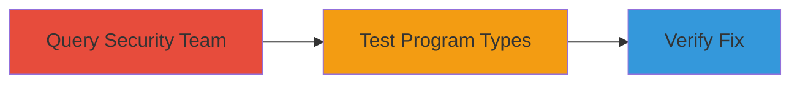

# GraphQL API Information Disclosure Exposing Whitelisted Hackers Count

Multi-stage attack chain demonstrating reconnaissance via unauthorized access to HackerOne's GraphQL API, disclosing sensitive team and program details such as the number of whitelisted hackers (users with 2FA and IP restrictions enabled). This reveals program privacy levels (public, soft-launched, private) and participant counts, even for uninvited or left programs.

## Chain Metrics Dashboard

| Metric | Value |
|--------|-------|
| Chain Status | Unverified |
| Total Steps | 3 |
| Execution Time | ~5 minutes |
| Skill Level | Intermediate |
| Complexity | Low |
| Impact Level | Medium |

## Attack Flow Visualization



## Prerequisites & Requirements

### Required Tools

- None (uses standard HTTP clients like curl)

### Target Environment

- Web platform with GraphQL API endpoint (e.g., HackerOne's API at https://api.hackerone.com/graphql)
- No specific ports required (HTTPS/443)
- Internet access to public API

### Initial Access Requirements

- No credentials needed (unauthenticated access)
- Public network position
- No prior access required

## Detailed Attack Procedures

### Step 1: Query Security Team Whitelisted Hackers
procedure: [[procedures/Query-Security-Team-Whitelisted-Hackers]]

**Objective**: Retrieve the total count of whitelisted hackers for the 'security' team to demonstrate unauthorized disclosure.

**Instructions**: Send a POST request to the GraphQL endpoint using [[commands/graphql-query-security-team]] to fetch team details including whitelisted_hackers total_count.

```bash
curl -X POST https://api.hackerone.com/graphql \
  -H "Content-Type: application/json" \
  -d '{"query": "query {team(handle:\"security\"){id,name,handle,whitelisted_hackers{total_count}}}"}'
```

**Expected Output**: JSON response showing team data with total_count, e.g., {"data":{"team":{"id":"Z2lkOi8vaGFja2Vyb25lL1RlYW0vMTM=","name":"HackerOne","handle":"security","whitelisted_hackers":{"total_count":30}}}}.

**Success Indicators**:
- Response includes non-zero total_count (e.g., 30)
- No authentication error

### Step 2: Test Whitelisted Hackers on Program Types
procedure: [[procedures/Test-Whitelisted-Hackers-on-Program-Types]]

**Objective**: Confirm disclosure applies to public, soft-launched, private, and left programs by querying different team handles.

**Instructions**: Repeat GraphQL queries for various team handles using [[commands/graphql-query-nonpublic-program]], [[commands/graphql-query-private-program]], and [[commands/graphql-query-left-program]]. For example, for a non-public program:

```bash
curl -X POST https://api.hackerone.com/graphql \
  -H "Content-Type: application/json" \
  -d '{"query": "query {team(handle:\"█████\"){id,name,handle,whitelisted_hackers{total_count}}}"}'
```

Adapt the handle parameter for private or left programs as needed.

**Expected Output**: Responses with counts like 94, 203, 1188, or 551, disclosing participant numbers without authorization.

**Success Indicators**:
- Counts returned for uninvited or left programs
- Varying counts indicate program types (e.g., higher for private)

### Step 3: Verify GraphQL Fix for Whitelisted Hackers
procedure: [[procedures/Verify-GraphQL-Fix-for-Whitelisted-Hackers]]

**Objective**: Test post-fix behavior to confirm resolution, where non-members see 0 and authorized see accurate counts.

**Instructions**: Send the original query via curl using [[commands/curl-verify-graphql-fix]] to a soft-launched team handle.

```bash
curl -X POST https://api.hackerone.com/graphql \
  -H "Content-Type: application/json" \
  -d '{"query": "query {team(handle:\"example-soft-launch\"){id,name,handle,whitelisted_hackers{total_count}}}"}'
```

**Expected Output**: For non-members, total_count: 0; for whitelisted, e.g., total_count: 1.

**Success Indicators**:
- Zero count for unauthorized access
- Restricted disclosure post-fix

## Attack Chain Summary

### Key Achievements

1. Unauthorized disclosure of 30 whitelisted hackers on the 'security' team.
2. Exposure of participant counts across program types, aiding reconnaissance of private programs.
3. Confirmation of fix, highlighting authorization improvements.

## Technique & Tactic Coverage

### MITRE ATT&CK Techniques

- [[Exploit Public-Facing Application]] Exploit Public-Facing Application
- [[System Information Discovery]] System Information Discovery

### MITRE ATT&CK Tactics

- [[Reconnaissance]] Reconnaissance
- [[Discovery]] Discovery

---

*Last updated: 2023-10-01T00:00:00Z*
