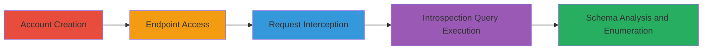

# GraphQL Introspection Enabled Leading to Schema Disclosure and User Enumeration

Multi-stage attack chain demonstrating exploitation of GraphQL introspection misconfiguration to leak the entire API schema, facilitating discovery of sensitive operations like user existence checks for enumeration attacks.

## Chain Metrics Dashboard

| Metric | Value |
|--------|-------|
| Chain Status | Unverified |
| Total Steps | 5 |
| Execution Time | ~10 minutes |
| Skill Level | Intermediate |
| Complexity | Medium |
| Impact Level | High |

## Attack Flow Visualization



## Prerequisites & Requirements

### Required Tools

- [[tools/Burp-Suite]]

### Target Environment

- Web platform with GraphQL API
- No specific ports required (HTTPS/443 implied)
- Network access to the public-facing GraphQL endpoint

### Initial Access Requirements

- Ability to create a user account on the target website
- Browser or HTTP client for accessing the endpoint
- Proxy tool like Burp Suite for request manipulation

## Detailed Attack Procedures

### Step 1: Account Creation

procedure: [[procedures/Exploit-GraphQL-Introspection-for-Schema-Leakage]]

**Objective**: Gain legitimate access to the application to interact with the GraphQL endpoint.

**Instructions**: Register a new user account via the website's registration form, providing valid email and password details.

**Expected Output**: Confirmation of account creation and login success.

**Success Indicators**:
- User dashboard or profile accessible
- No rate limiting or CAPTCHA blocking registration

### Step 2: Navigate to GraphQL Endpoint

procedure: [[procedures/Exploit-GraphQL-Introspection-for-Schema-Leakage]]

**Objective**: Locate and access the GraphQL API endpoint for further interaction.

**Instructions**: Use a browser to visit https://www.on-running.com/en-in/graphql directly.

**Expected Output**: HTTP 200 response or GraphQL playground if available.

**Success Indicators**:
- Endpoint responds without 404 or authentication errors
- Any initial query returns schema hints

### Step 3: Intercept Request with Burp Suite

procedure: [[procedures/Exploit-GraphQL-Introspection-for-Schema-Leakage]]

**Objective**: Capture and prepare the HTTP request for modification to inject the introspection query.

**Instructions**: Configure Burp Suite proxy to intercept traffic from the browser. Load the endpoint and forward the request to the Repeater tab.

**Expected Output**: Captured POST request to /graphql in Repeater, ready for editing.

**Success Indicators**:
- Request body visible and editable
- No TLS issues with proxy interception

### Step 4: Execute Introspection Query

procedure: [[procedures/Exploit-GraphQL-Introspection-for-Schema-Leakage]]

**Objective**: Send the introspection query to retrieve the full GraphQL schema.

**Instructions**: In Burp Repeater, replace the request body with the introspection query using [[commands/graphql-introspection-query]]:

```bash
curl -X POST https://www.on-running.com/en-in/graphql \
  -H "Content-Type: application/json" \
  -d '{"query": "query IntrospectionQuery { __schema {queryType { name },mutationType { name },subscriptionType { name },types {...FullType},directives {name,description,args {...InputValue},onOperation,onFragment,onField}}\nfragment FullType on __Type {kind,name,description,fields(includeDeprecated: true) {name,description,args {...InputValue},type {...TypeRef},isDeprecated,deprecationReason},inputFields {...InputValue},interfaces {...TypeRef},enumValues(includeDeprecated: true) {name,description,isDeprecated,deprecationReason},possibleTypes {...TypeRef}}\nfragment InputValue on __InputValue {name,description,type { ...TypeRef },defaultValue}\nfragment TypeRef on __Type {kind,name,ofType {kind,name,ofType {kind,name,ofType {kind,name}}}}"}'
```

Send the request and capture the response.

**Expected Output**: JSON response containing __schema with types, queries, mutations, and fields.

**Success Indicators**:
- Schema details leaked without errors
- Queries like userExists visible in response

### Step 5: Analyze Schema and Perform Enumeration

procedure: [[procedures/Exploit-GraphQL-Introspection-for-Schema-Leakage]]

**Objective**: Extract operations from the schema and test for unauthorized actions like user enumeration.

**Instructions**: Parse the response for available queries/mutations. Test user enumeration using [[commands/graphql-user-exists-enumeration]]:

```bash
curl -X POST https://www.on-running.com/en-in/graphql \
  -H "Content-Type: application/json" \
  -d '{"query": "query { userExists(email:\"test@example.com\") }"}'
```

Replace email as needed to check existence.

**Expected Output**: Boolean response indicating user existence.

**Success Indicators**:
- Schema reveals sensitive operations
- Enumeration queries succeed without auth

## Attack Chain Summary

### Key Achievements

1. Full GraphQL schema disclosure via introspection
2. Discovery of userExists query for enumeration
3. Potential for broader API abuse based on leaked mutations

## Technique & Tactic Coverage

### MITRE ATT&CK Techniques

- [[Vulnerability Scanning]]
- [[Account Discovery]]

### MITRE ATT&CK Tactics

- [[Reconnaissance]]
- [[Discovery]]

---

*Last updated: 2023-10-01T00:00:00Z*
