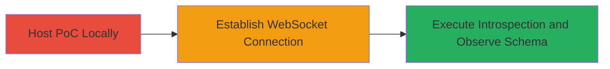

---
tags:
  - graphql
  - websocket
  - introspection
  - schema-disclosure
  - misconfiguration
type: attack_chain
tools:
  - '[[tools/Python-Built-in-HTTP-Server]]'
tactics:
  - '[[Reconnaissance]]'
verified: false
platforms:
  - Web
submitted: true
complexity: medium
created_at: '2023-10-01T00:00:00Z'
procedures:
  - '[[procedures/Start-Local-HTTP-Server-for-PoC-Hosting]]'
  - '[[procedures/Open-WebSocket-PoC-HTML-in-Browser]]'
  - '[[procedures/Observe-GraphQL-Schema-Dump]]'
step_count: 3
techniques:
  - '[[Gather Victim Host Information]]'
  - '[[Exploit Public-Facing Application]]'
updated_at: '2025-12-14T17:25:53.230Z'
description: >-
  An attack chain exploiting a misconfigured unauthenticated WebSocket endpoint
  to perform GraphQL introspection and disclose the full API schema.
skill_level: intermediate
impact_level: high
id: 3e904095-1ec3-41fd-b212-261367c4ef29
validated: true
mitre_tactics:
  - '[[Reconnaissance]]'
mitre_techniques:
  - '[[Gather Victim Host Information]]'
  - '[[Exploit Public-Facing Application]]'
---
# GraphQL Schema Disclosure via Unauthenticated WebSocket Introspection

Multi-stage attack chain demonstrating exploitation of an unauthenticated WebSocket endpoint to execute GraphQL introspection queries and disclose the full API schema, including methods and data types.

## Chain Metrics Dashboard

| Metric | Value |
|--------|-------|
| Chain Status | Unverified |
| Total Steps | 3 |
| Execution Time | ~5 minutes |
| Skill Level | Intermediate |
| Complexity | Medium |
| Impact Level | High |

## Attack Flow Visualization



## Prerequisites & Requirements

### Required Tools

- [[tools/Python-Built-in-HTTP-Server]]

### Target Environment

- Web platform with GraphQL over WebSocket endpoint
- Access to a browser for PoC execution
- Local Python 3 installation

### Initial Access Requirements

- No credentials required due to unauthenticated endpoint
- Network access to the target WebSocket URL
- No prior access needed

## Detailed Attack Procedures

### Step 1: Host PoC Locally
procedure: [[procedures/Start-Local-HTTP-Server-for-PoC-Hosting]]

**Objective**: Set up a local static HTTP server to host the PoC HTML file, bypassing browser CORS restrictions when loading local files.

**Instructions**: Ensure the PoC HTML file (ws.html) is in the current directory. Execute [[commands/start-python-http-server]] to start the server:

```bash
python3 -m http.server
```

**Expected Output**: Server output indicating it's serving on port 8000, e.g., "Serving HTTP on 0.0.0.0 port 8000 (http://0.0.0.0:8000/) ...".

**Success Indicators**:
- Local server is running without errors
- http://localhost:8000 is accessible in the browser

### Step 2: Establish WebSocket Connection
procedure: [[procedures/Open-WebSocket-PoC-HTML-in-Browser]]

**Objective**: Load the PoC HTML file in the browser to initiate an unauthenticated WebSocket connection to the target GraphQL endpoint.

**Instructions**: With the local server running, navigate to http://localhost:8000/ws.html in your browser. The page will automatically establish the WebSocket connection to the target server (replace the target URL in the HTML if needed).

**Expected Output**: Browser console logs showing WebSocket connection established, or no immediate errors on page load.

**Success Indicators**:
- WebSocket connection opens successfully
- No CORS or connection errors in browser console

### Step 3: Execute Introspection and Observe Schema
procedure: [[procedures/Observe-GraphQL-Schema-Dump]]

**Objective**: Send the GraphQL introspection query via WebSocket and capture the full API schema response for analysis.

**Instructions**: The PoC HTML automatically sends a WebSocket message of type 'start' with the introspection query payload: {type: 'start', payload: {query: 'query IntrospectionQuery { __schema { queryType { name } mutationType { name } subscriptionType { name } types { ...FullType } directives { name description locations args { ...InputValue } } } } function FullType: Type { kind name description fields(includeDeprecated: true) { name description args { ...InputValue } type { ...TypeRef } isDeprecated deprecationReason } inputFields { ...InputValue } interfaces { ...TypeRef } enumValues(includeDeprecated: true) { name description isDeprecated deprecationReason } possibleTypes { ...TypeRef } } function InputValue: __InputValue { name description type { ...TypeRef } defaultValue } function TypeRef: __Type { kind name ofType { kind name ofType { kind name ofType { kind name ofType { kind name ofType { kind name ofType { kind name ofType { kind name } } } } } } } }'}}. Observe the response displayed on the page.

**Expected Output**: A JSON dump of the GraphQL schema, revealing all types, queries, mutations, and fields.

**Success Indicators**:
- Schema details are displayed without authentication prompts
- Full API structure is visible, including sensitive methods

## Attack Chain Summary

### Key Achievements

1. Bypassed authentication via WebSocket misconfiguration
2. Executed unauthorized GraphQL introspection query
3. Disclosed complete API schema for further attack planning

## Technique & Tactic Coverage

### MITRE ATT&CK Techniques

- [[Gather Victim Host Information]] Gather Victim Host Information
- [[Exploit Public-Facing Application]] Exploit Public-Facing Application

### MITRE ATT&CK Tactics

- [[Reconnaissance]] Reconnaissance

---
*Last updated: 2023-10-01T00:00:00Z*
