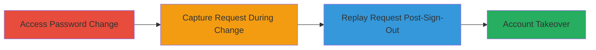

---
tags:
  - graphql
  - auth-bypass
  - session-replay
  - account-takeover
type: attack_chain
tools:
  - '[[tools/Charles-Proxy]]'
tactics:
  - '[[Initial Access]]'
verified: false
platforms:
  - Web
submitted: true
complexity: medium
created_at: '2023-10-01T00:00:00Z'
procedures:
  - '[[procedures/Access-HackerOne-Password-Change-Page]]'
  - '[[procedures/Capture-GraphQL-Password-Change-Request]]'
  - '[[procedures/Replay-Captured-GraphQL-Request-for-Password-Change]]'
step_count: 3
techniques:
  - '[[Valid Accounts]]'
updated_at: '2025-12-14T17:25:52.997Z'
description: >-
  Attack chain exploiting delayed invalidation of GraphQL tokens and sessions
  after password change on HackerOne, allowing replay of captured requests to
  takeover accounts.
skill_level: intermediate
impact_level: high
id: 92028174-823f-4f9e-b726-68bf9df4c1f0
validated: true
mitre_tactics:
  - '[[Initial Access]]'
mitre_techniques:
  - '[[Valid Accounts]]'
---
# GraphQL Session Replay for Unauthorized Password Change Leading to Account Takeover

Multi-stage attack chain demonstrating exploitation of GraphQL session invalidation delay on the HackerOne platform, enabling unauthorized password changes via request replay for potential account takeover.

## Chain Metrics Dashboard

| Metric | Value |
|--------|-------|
| Chain Status | Unverified |
| Total Steps | 3 |
| Execution Time | ~10-20 minutes |
| Skill Level | Intermediate |
| Complexity | Medium |
| Impact Level | High |

## Attack Flow Visualization

## Prerequisites & Requirements

### Required Tools

- [[tools/Charles-Proxy]]

### Target Environment

- Web platform (HackerOne at https://hackerone.com)
- Required services/ports: HTTPS (443)
- Network access requirements: Direct internet access to HackerOne

### Initial Access Requirements

- Valid user credentials for the target account
- Network position: Attacker must have MiTM capability or access to captured requests (e.g., shared device or proxy logs)
- Prior access needed: Ability to login to the target account initially

## Detailed Attack Procedures

### Step 1: Access Password Change Page
procedure: [[procedures/Access-HackerOne-Password-Change-Page]]

**Objective**: Log in to the target account and navigate to the password change interface to prepare for request capture.

**Instructions**: Use a web browser to log in to HackerOne and access the settings page for password modification. Enter the current password, new password, and confirmation, but do not submit yet if capturing.

**Expected Output**: Page loads at https://hackerone.com/settings/pass/edit with form fields ready for input.

**Success Indicators**:
- Successful login and navigation to password edit page
- Form visible for password input

### Step 2: Capture GraphQL Password Change Request
procedure: [[procedures/Capture-GraphQL-Password-Change-Request]]

**Objective**: Perform the password change while intercepting the GraphQL mutation request using a proxy to capture authentication tokens and session cookies.

**Instructions**: Configure [[tools/Charles-Proxy]] to intercept traffic from the browser. Submit the password change form, capturing the GraphQL mutation request which includes the x-auth-token header and __Host-session cookie. Note the user is signed out and redirected to login after submission.

**Expected Output**: Captured HTTP request showing GraphQL mutation payload with old and new password hashes, along with auth headers; successful sign-out.

**Success Indicators**:
- Request intercepted with valid tokens
- Password change succeeds, triggering sign-out

### Step 3: Replay Captured GraphQL Request for Password Change
procedure: [[procedures/Replay-Captured-GraphQL-Request-for-Password-Change]]

**Objective**: Replay the captured request with modified password values after sign-out to bypass re-authentication and alter the account password.

**Instructions**: Using [[tools/Charles-Proxy]], modify the captured GraphQL mutation to set a new desired password and replay it immediately after sign-out, within the 5-20 minute token validity window. The request uses the original x-auth-token and __Host-session without needing login.

**Expected Output**: Server response confirming password update success; ability to login with the new password.

**Success Indicators**:
- Request succeeds without authentication prompt
- Account password changed, enabling takeover with new credentials

## Attack Chain Summary

### Key Achievements

1. Bypassed immediate session invalidation post-password change
2. Demonstrated replay attack feasibility within token expiration window
3. Enabled potential account takeover via unauthorized password reset

## Technique & Tactic Coverage

### MITRE ATT&CK Techniques

- [[Valid Accounts]]

### MITRE ATT&CK Tactics

- [[Initial Access]]

---
*Last updated: 2023-10-01T00:00:00Z*
