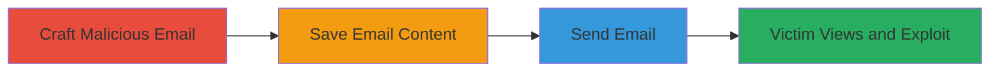

---
tags:
  - xss
  - stored-xss
  - email-exploit
  - account-takeover
  - html-sanitizer-bypass
type: attack_chain
tools:
  - '[[tools/sendmail]]'
tactics:
  - '[[Initial Access]]'
  - '[[Execution]]'
  - '[[Collection]]'
commands:
  - '[[commands/sendmail-send-raw-email]]'
platforms:
  - Web
complexity: medium
procedures:
  - '[[procedures/Craft-Malicious-HTML-Email-for-XSS-Bypass]]'
  - '[[procedures/Send-Raw-Email-Using-Sendmail]]'
step_count: 4
techniques:
  - '[[Drive-by Compromise]]'
  - '[[JavaScript]]'
description: >-
  Multi-stage attack chain exploiting a stored XSS vulnerability in HEY.com's
  email sanitizer to inject malicious HTML and achieve account takeover.
skill_level: intermediate
impact_level: high
id: b6944050-ccd2-40ef-8e67-ff8dc0198db9
created_at: '2025-12-14T00:11:25.134Z'
updated_at: '2025-12-14T00:11:25.134Z'
verified: false
validated: true
submitted: true
mitre_tactics:
  - '[[Initial Access]]'
  - '[[Execution]]'
  - '[[Collection]]'
mitre_techniques:
  - '[[Drive-by Compromise]]'
  - '[[JavaScript]]'
---
# HEY.com Stored XSS via Style Tag Encoding Leading to Account Takeover

Multi-stage attack chain demonstrating a complete attack workflow.

## Chain Metrics Dashboard

| Metric | Value |
|--------|-------|
| Chain Status | Unverified |
| Total Steps | 4 |
| Execution Time | ~5 minutes |
| Skill Level | Intermediate |
| Complexity | Medium |
| Impact Level | High |

## Attack Flow Visualization



## Prerequisites & Requirements

### Required Tools

- [[tools/sendmail]]

### Target Environment

- Web-based email service (HEY.com)
- Services: HEY.com email service, hCaptcha
- Tech Stack: HTML, CSS, JavaScript, Stimulus framework

### Initial Access Requirements

- Ability to send emails to the victim's HEY.com address
- No prior credentials needed for the attacker
- Network access to send emails via sendmail

## Detailed Attack Procedures

### Step 1: Craft Malicious HTML Email
procedure: [[procedures/Craft-Malicious-HTML-Email-for-XSS-Bypass]]

**Objective**: Create a raw HTML email with encoded style tags to bypass the HEY.com sanitizer and inject malicious HTML.

**Instructions**: Craft the email content including headers (From, To, Subject, MIME-Version, Content-type: text/html) and a <style> tag with escaped sequences like \00003c\000027message-content\00003e to inject forms, iframes, or scripts that leverage the Stimulus framework.

**Expected Output**: A complete email body ready to be saved to a file.

**Success Indicators**:
- Email content includes properly encoded malicious HTML
- No syntax errors in the crafted email

### Step 2: Save Email Content to File
procedure: [[procedures/Craft-Malicious-HTML-Email-for-XSS-Bypass]]

**Objective**: Store the crafted email in a text file for sending.

**Instructions**: Write the email headers and body into a file named email.txt using a text editor or command line.

```bash
echo 'From: attacker@example.com
To: victim@hey.com
Subject: Malicious Email
MIME-Version: 1.0
Content-Type: text/html

<style>/* encoded malicious HTML */</style>' > email.txt
```

**Expected Output**: email.txt file created with the malicious content.

**Success Indicators**:
- File exists and contains the correct email structure

### Step 3: Send the Email
procedure: [[procedures/Send-Raw-Email-Using-Sendmail]]

**Objective**: Transmit the malicious email to the victim's HEY.com address.

**Instructions**: Use [[commands/sendmail-send-raw-email]] to send the raw email file:

```bash
/usr/sbin/sendmail -t < email.txt
```

**Expected Output**: Email sent successfully (no output if successful).

**Success Indicators**:
- No errors from sendmail
- Email appears in the victim's inbox

### Step 4: Victim Views the Email
procedure: [[procedures/Craft-Malicious-HTML-Email-for-XSS-Bypass]]

**Objective**: Trigger the XSS upon email viewing, leading to account compromise.

**Instructions**: The victim opens the email in HEY.com, which renders the injected HTML, exploiting the Stimulus framework to auto-submit forms, load iframes, or execute JavaScript via hCaptcha callbacks, potentially setting up email forwarding or stealing credentials.

**Expected Output**: Malicious actions executed, such as alerts or form submissions.

**Success Indicators**:
- Injected HTML renders and executes
- Account actions like forwarding are set up or credentials are captured

## Attack Chain Summary

### Key Achievements

1. Bypassed HTML sanitizer using encoded style tags
2. Injected arbitrary HTML into emails
3. Achieved account takeover via credential theft or forwarding setup

## Technique & Tactic Coverage

### MITRE ATT&CK Techniques

- [[Drive-by Compromise]]
- [[JavaScript]]

### MITRE ATT&CK Tactics

- [[Initial Access]]
- [[Execution]]

*Last updated: 2023-10-01*
