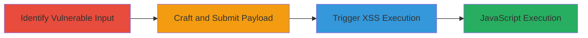

# HTML Injection Leading to Reflected XSS via SVG Payload

Multi-stage attack chain demonstrating exploitation of an HTML injection vulnerability in a web application to achieve reflected cross-site scripting (XSS) using a crafted SVG payload that bypasses web application firewall (WAF) protections and executes JavaScript via the onauxclick event.

## Chain Metrics Dashboard

| Metric | Value |
|--------|-------|
| Chain Status | Unverified |
| Total Steps | 3 |
| Execution Time | ~5 minutes |
| Skill Level | Intermediate |
| Complexity | Medium |
| Impact Level | Low |

## Attack Flow Visualization

## Prerequisites & Requirements

### Required Tools

- Web browser with developer tools (e.g., Chrome DevTools)
- Optional: Proxy tool like Burp Suite for payload testing

### Target Environment

- Web application with user input fields (e.g., search or comment forms)
- No specific ports required; assumes HTTP/HTTPS access
- WAF presence that filters common XSS payloads but allows SVG elements

### Initial Access Requirements

- Valid access to the web application (no authentication needed for reflected XSS)
- Ability to submit and observe reflected input in the browser
- Network position allowing direct interaction with the target site

## Detailed Attack Procedures

### Step 1: Identify Vulnerable Input
procedure: [[procedures/Identify-Vulnerable-HTML-Input]]

**Objective**: Locate an input field in the web application that reflects user input without proper HTML escaping, enabling injection of HTML tags.

**Instructions**: Navigate to the target web application and inspect input fields such as search boxes or forms. Submit test strings like `` and observe if the input is reflected in the HTML response without encoding (e.g., tags are rendered instead of displayed as text). Use browser developer tools to view the page source and confirm reflection points.

**Expected Output**: Reflected input appears in the HTML as raw tags, e.g., `<input value="">` renders the script tag.

**Success Indicators**:
- Input is echoed back without HTML entity encoding (e.g., < remains <, not &lt;)
- Basic HTML tags like <b>bold</b> render as bold text

### Step 2: Craft and Submit XSS Payload
procedure: [[procedures/Craft-and-Submit-XSS-Payload]]

**Objective**: Develop a payload that injects an executable SVG element with a JavaScript event handler to bypass WAF filters and achieve XSS.

**Instructions**: Based on the identified reflection point, craft the payload: `1"><svg height="1000" width="1000" onauxclick=confirm`12233`><circle cx="500" cy="500" r="400" stroke="black" stroke-width="3" fill="red"/></svg>`. Submit this via the vulnerable input field (e.g., in a search parameter like ?q=payload). The payload closes any open tag with `1">`, injects the SVG, and uses onauxclick to execute confirm(12233) on auxiliary click (e.g., middle mouse button).

**Expected Output**: The SVG element renders in the page, visible as a red circle, and the input is reflected with the injected HTML.

**Success Indicators**:
- SVG graphic appears on the page without WAF blocking
- Page source shows the onauxclick attribute intact

### Step 3: Trigger XSS Payload Execution
procedure: [[procedures/Trigger-XSS-Payload-Execution]]

**Objective**: Interact with the injected SVG to fire the onauxclick event, executing arbitrary JavaScript in the victim's browser context.

**Instructions**: Once the payload is reflected and the SVG is visible, perform an auxiliary click (e.g., middle mouse button or right-click + shift) on the SVG element. This triggers the onauxclick event, running the JavaScript confirm(12233), which displays a dialog box with '12233'.

**Expected Output**: A browser confirm dialog pops up showing '12233', confirming JavaScript execution.

**Success Indicators**:
- Confirm dialog appears on interaction
- No errors in browser console; JavaScript executes in the site's context

## Attack Chain Summary

### Key Achievements

1. Identified and confirmed HTML injection in a reflected input field.
2. Bypassed WAF using an SVG-based payload with onauxclick event to inject executable JavaScript.
3. Achieved low-severity XSS, demonstrating potential for session hijacking or phishing attacks.

## Technique & Tactic Coverage

### MITRE ATT&CK Techniques

- [[Exploit Public-Facing Application]]
- [[JavaScript]]

### MITRE ATT&CK Tactics

- [[Initial Access]]
- [[Execution]]

---
*Last updated: 2023-10-01T00:00:00Z*
