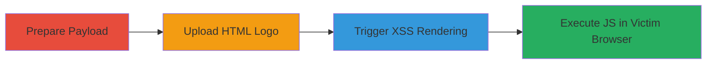

# HTML Injection and Limited Stored XSS via Logo Upload in Nextcloud

Multi-stage attack chain demonstrating a complete attack workflow exploiting Nextcloud Server v12.0.0's logo upload vulnerability.

## Chain Metrics Dashboard

| Metric | Value |
|--------|-------|
| Chain Status | Unverified |
| Total Steps | 3 |
| Execution Time | ~5 minutes |
| Skill Level | Intermediate |
| Complexity | Medium |
| Impact Level | Medium |

## Attack Flow Visualization

## Prerequisites & Requirements

### Required Tools

- Web browser (e.g., for file upload and testing)
- Text editor (e.g., Notepad++ or VS Code) for crafting HTML

### Target Environment

- Nextcloud Server v12.0.0
- Administrator privileges on the Nextcloud instance
- Web platform access

### Initial Access Requirements

- Valid admin credentials for Nextcloud
- Direct network access to the Nextcloud server (e.g., http://[server]/nextcloud)
- No prior access needed beyond admin login

## Detailed Attack Procedures

### Step 1: Prepare Malicious HTML Payload
procedure: [[procedures/Create-Malicious-HTML-Payload-for-Nextcloud-Logo]]

**Objective**: Craft an HTML file containing benign-looking content and JavaScript payloads that bypass CSP to enable XSS in IE11.

**Instructions**: Use a text editor to create an HTML file with elements like headings, text, and XSS vectors such as SVG onload or img onerror handlers.

**Expected Output**: A valid HTML file ready for upload, e.g., logo.html.

**Success Indicators**:
- HTML file created with embedded JS payloads
- Payloads validated by saving and opening in a browser (non-IE11 for safety)

### Step 2: Upload HTML as Site Logo
procedure: [[procedures/Upload-Arbitrary-HTML-as-Site-Logo-in-Nextcloud]]

**Objective**: Exploit the unvalidated upload endpoint to set the malicious HTML as the site's logo, storing it server-side.

**Instructions**: Log in as admin and submit the HTML file via the theming interface to the updateLogo endpoint.

**Expected Output**: Upload succeeds without errors; logo updated in admin settings.

**Success Indicators**:
- No validation errors during upload
- Admin interface confirms logo change

### Step 3: Trigger XSS via Logo Endpoint
procedure: [[procedures/Trigger-Stored-XSS-via-Logo-Endpoint-in-IE11]]

**Objective**: Access the logo display endpoint to render the injected HTML and execute JS in vulnerable browsers like IE11.

**Instructions**: Direct a victim (or test in IE11) to visit the logo URL; observe rendering and alert execution.

**Expected Output**: HTML renders as a webpage; JS alert pops in IE11 on Windows 7/10 or Windows Phone 8.1.

**Success Indicators**:
- Page loads with custom HTML content
- JavaScript executes (e.g., alert dialog) only in IE11; no execution in modern browsers

## Attack Chain Summary

### Key Achievements

1. Bypassed file upload validation to store arbitrary HTML.
2. Achieved stored XSS limited to IE11 via CSP-bypassing payloads.
3. Enabled potential admin attacks like CSRF bypass or session actions on tricked victims.

## Technique & Tactic Coverage

### MITRE ATT&CK Techniques

- [[Exploit Public-Facing Application]]
- [[JavaScript]]

### MITRE ATT&CK Tactics

- [[Execution]]

---
*Last updated: 2023-10-01T00:00:00Z*
