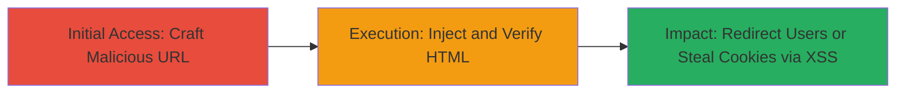

---
tags:
  - html-injection
  - xss
  - reflected-xss
  - web-vulnerability
type: attack_chain
tools: []
tactics:
  - '[[Initial Access]]'
  - '[[Execution]]'
  - '[[Collection]]'
commands:
  - '[[commands/curl-fetch-vulnerable-url]]'
platforms:
  - Web
complexity: low
procedures:
  - '[[procedures/Craft-URL-for-HTML-Injection]]'
  - '[[procedures/Verify-HTML-Injection-on-Page]]'
step_count: 2
techniques:
  - '[[Exploit Public-Facing Application]]'
  - '[[JavaScript]]'
description: >-
  Demonstrates HTML injection via URL parameter on nordvpn.com/blog, enabling
  malicious redirects and potential reflected XSS for session hijacking.
skill_level: intermediate
impact_level: high
id: 6ccf2f1a-c2e3-4372-a07c-7418fc7cb4b4
created_at: '2025-12-14T03:47:18.171Z'
updated_at: '2025-12-14T03:47:18.171Z'
verified: false
validated: true
submitted: true
mitre_tactics:
  - '[[Initial Access]]'
  - '[[Execution]]'
  - '[[Collection]]'
mitre_techniques:
  - '[[Exploit Public-Facing Application]]'
  - '[[JavaScript]]'
---
# HTML Injection in NordVPN Blog URL Parameter Leading to Redirects and Potential XSS

Multi-stage attack chain demonstrating exploitation of an HTML injection vulnerability in the URL parameter of the nordvpn.com/blog endpoint, allowing insertion of arbitrary HTML tags for redirects to malicious or local domains, with potential escalation to reflected XSS for stealing session cookies if Cloudflare protections are bypassed.

## Chain Metrics Dashboard

| Metric | Value |
|--------|-------|
| Chain Status | Unverified |
| Total Steps | 2 |
| Execution Time | ~2 minutes |
| Skill Level | Intermediate |
| Complexity | Low |
| Impact Level | High |

## Attack Flow Visualization



## Prerequisites & Requirements

### Required Tools

- Web browser (e.g., Chrome, Firefox)
- Optional: [[commands/curl-fetch-vulnerable-url]] for automated testing

### Target Environment

- Target Platform: Web application (nordvpn.com/blog)
- Required services/ports: HTTP/HTTPS on port 443
- Network access requirements: Internet access to nordvpn.com

### Initial Access Requirements

- No credentials required
- Public network position (no internal access needed)
- Prior access: None; exploitable via direct URL access

## Detailed Attack Procedures

### Step 1: Craft Malicious URL for HTML Injection
procedure: [[procedures/Craft-URL-for-HTML-Injection]]

**Objective**: Construct a URL-encoded payload to inject an HTML anchor tag that redirects to an arbitrary domain, such as a local IP.

**Instructions**: Use URL encoding to craft the payload injecting `<a href="http://3232235777">` (where 3232235777 is the decimal equivalent of IP 192.168.1.1). The full URL is `https://nordvpn.com/blog/?1%25%32%32%25%33%65%25%33%63%25%32%66%25%36%31%25%13%25%33%63%25%36%31%25%30%63href%25%33%64%25%32%32http://3232235777`. Access this URL in a browser or via [[commands/curl-fetch-vulnerable-url]]:

```bash
curl -s "https://nordvpn.com/blog/?1%25%32%25%32%25%33%65%25%33%63%25%32%66%25%36%31%25%13%25%33%63%25%36%31%25%30%63href%25%33%64%25%32%32http://3232235777" | grep -i "href"
```

**Expected Output**: The response includes the injected HTML tag, visible in the page source or rendered links.

**Success Indicators**:
- Payload decodes to `<a href="http://3232235777">` in the page
- No immediate errors or blocks from Cloudflare

### Step 2: Verify HTML Injection and Assess XSS Potential
procedure: [[procedures/Verify-HTML-Injection-on-Page]]

**Objective**: Confirm the injection by inspecting the rendered page for malicious links and test for XSS escalation by attempting JavaScript injection if filters allow.

**Instructions**: Load the crafted URL in a browser and inspect the bottom of the blog page for injected links pointing to 192.168.1.1. To test reflected XSS, modify the payload to include `<script>alert(1)</script>` URL-encoded (e.g., `%3Cscript%3Ealert(1)%3C/script%3E`) and observe if JavaScript executes, potentially allowing cookie theft via `document.cookie`. Use browser dev tools or [[commands/curl-fetch-vulnerable-url]] to fetch and grep for script tags:

```bash
curl -s "https://nordvpn.com/blog/?[encoded-script-payload]" | grep -i "script"
```

**Expected Output**: Injected links appear at the page bottom; if XSS succeeds, an alert pops or cookies are accessible in console.

**Success Indicators**:
- Links redirect to injected domain (e.g., 192.168.1.1)
- JavaScript executes if Cloudflare bypassed, confirming XSS

## Attack Chain Summary

### Key Achievements

1. Successful HTML injection via unsanitized URL parameter, enabling user redirects to malicious sites.
2. Verification of reflected content manipulation on the page.
3. Potential escalation to XSS for session cookie theft, impacting user privacy and account security.

## Technique & Tactic Coverage

### MITRE ATT&CK Techniques

- [[Exploit Public-Facing Application]] Exploit Public-Facing Application
- [[JavaScript]] JavaScript

### MITRE ATT&CK Tactics

- [[Initial Access]] Initial Access
- [[Execution]] Execution
- [[Collection]] Collection

---
*Last updated: 2023-10-01*
