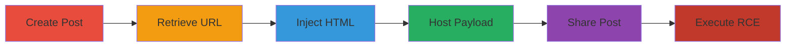

---
tags:
  - html-injection
  - open-redirect
  - rce
  - xss
  - electron
  - slack
type: attack_chain
tools:
  - '[[tools/HTTP-Proxy]]'
  - '[[tools/HTTPS-Enabled-Server]]'
  - '[[tools/Developer-Tools]]'
  - '[[tools/Email-Client]]'
tactics:
  - '[[Initial Access]]'
  - '[[Execution]]'
  - '[[Discovery]]'
commands:
  - '[[commands/open-calculator-macos]]'
  - '[[commands/open-calculator-windows]]'
  - '[[commands/exec-shell-command-nodejs]]'
  - '[[commands/alert-localstorage]]'
platforms:
  - Desktop
  - Mac
  - Windows
  - Linux
  - Electron
complexity: medium
procedures:
  - '[[procedures/Create-Slack-Post-with-Editable-JSON]]'
  - '[[procedures/Retrieve-Private-File-URL-via-Slack-API]]'
  - '[[procedures/Inject-HTML-Payload-into-Slack-Post]]'
  - '[[procedures/Host-RCE-JavaScript-Payload]]'
  - '[[procedures/Share-Injected-Slack-Post-with-Victim]]'
  - '[[procedures/Execute-RCE-on-Victim-Interaction]]'
step_count: 6
techniques:
  - '[[Command-Line Interface]]'
  - '[[JavaScript]]'
  - '[[Exploit Public-Facing Application]]'
description: >-
  Multi-stage attack exploiting HTML injection in Slack Posts to achieve remote
  code execution on desktop apps across platforms
skill_level: intermediate
impact_level: high
id: adce76f5-4f84-43d7-b187-7ae913aa8564
created_at: '2025-12-11T06:10:22.541Z'
updated_at: '2025-12-11T06:10:22.541Z'
verified: false
validated: true
submitted: true
mitre_tactics:
  - '[[TA0001]]'
  - '[[TA0002]]'
  - '[[TA0007]]'
mitre_techniques:
  - '[[T1059]]'
  - '[[T1059.007]]'
  - '[[T1190]]'
---
# HTML Injection in Slack Posts Leading to Remote Code Execution

Multi-stage attack chain demonstrating HTML injection in Slack Posts by editing JSON structures, leading to open redirects and remote code execution via Electron overwrites in the Slack desktop app. This allows arbitrary command execution, data leakage, and potential propagation.

## Chain Metrics Dashboard

| Metric | Value |
|--------|-------|
| Chain Status | Unverified |
| Total Steps | 6 |
| Execution Time | ~15 minutes |
| Skill Level | Intermediate |
| Complexity | Medium |
| Impact Level | High |

## Attack Flow Visualization

## Prerequisites & Requirements

### Required Tools

- [[tools/HTTP-Proxy]]
- [[tools/HTTPS-Enabled-Server]]
- [[tools/Developer-Tools]]
- [[tools/Email-Client]]

### Target Environment

- Desktop platforms: Mac, Windows, Linux with Slack app installed
- Required services: files.slack.com, app.slack.com, Slack API
- Network access: Access to Slack workspace and internet for hosting payload

### Initial Access Requirements

- Access to a Slack workspace where the victim is present
- Ability to share posts in channels or directly
- No prior credentials beyond workspace membership

## Detailed Attack Procedures

### Step 1: Create Slack Post with Editable JSON - [[procedures/Create-Slack-Post-with-Editable-JSON]]

**Procedure**: [[procedures/Create-Slack-Post-with-Editable-JSON]]

**Objective**: Create an initial Slack Post to generate an editable JSON file on files.slack.com.

**Expected Output**: A new Post with JSON structure {'full': '
content
', 'preview': '
content
'}.

**Success Indicators**:
- Post created successfully in Slack.
- JSON file accessible via files.slack.com.

### Step 2: Retrieve Private File URL via Slack API - [[procedures/Retrieve-Private-File-URL-via-Slack-API]]

**Procedure**: [[procedures/Retrieve-Private-File-URL-via-Slack-API]]

**Objective**: Obtain the private URL of the Post's JSON file for editing.

**Expected Output**: URL in format https://files.slack.com/files-pri/{TEAM_ID}-{FILE_ID}/TITLE.

**Success Indicators**:
- API response contains url_private.
- URL points to the correct JSON file.

### Step 3: Inject HTML Payload into Slack Post - [[procedures/Inject-HTML-Payload-into-Slack-Post]]

**Procedure**: [[procedures/Inject-HTML-Payload-into-Slack-Post]]

**Objective**: Modify the JSON to inject arbitrary HTML, such as map and area tags for redirects.

**Expected Output**: JSON edited with injected HTML payload.

**Success Indicators**:
- HTML renders in the Post without restrictions on allowed tags.
- Injectable tags like area/map are permitted.

### Step 4: Host RCE JavaScript Payload - [[procedures/Host-RCE-JavaScript-Payload]]

**Procedure**: [[procedures/Host-RCE-JavaScript-Payload]]

**Objective**: Set up a server to host the JavaScript that overwrites Electron functions and executes commands.

**Expected Output**: Attacker-controlled site hosting the JS payload.

**Success Indicators**:
- Payload accessible via HTTPS.
- JS successfully overwrites window.desktop and leaks Electron objects.

### Step 5: Share Injected Slack Post with Victim - [[procedures/Share-Injected-Slack-Post-with-Victim]]

**Procedure**: [[procedures/Share-Injected-Slack-Post-with-Victim]]

**Objective**: Distribute the malicious Post to the victim for interaction.

**Expected Output**: Victim receives and views the Post.

**Success Indicators**:
- Post shared in channel or DM.
- Victim clicks on the enticing image, triggering redirect.

### Step 6: Execute RCE on Victim Interaction - [[procedures/Execute-RCE-on-Victim-Interaction]]

**Procedure**: [[procedures/Execute-RCE-on-Victim-Interaction]]

**Objective**: Trigger the payload upon click, leading to command execution on the victim's machine.

**Expected Output**: Arbitrary commands executed, e.g., opening Calculator.

**Success Indicators**:
- Command like [[commands/open-calculator-macos]] or [[commands/open-calculator-windows]] runs.
- Data leakage via [[commands/alert-localstorage]] if applicable.

## Attack Chain Summary

### Key Achievements

1. Successful HTML injection bypassing tag restrictions.
2. Open redirect to attacker site within Slack app.
3. Remote code execution via Electron exploitation.

## Technique & Tactic Coverage

### MITRE ATT&CK Techniques

- [[Command-Line Interface]]
- [[JavaScript]]
- [[Exploit Public-Facing Application]]

### MITRE ATT&CK Tactics

- [[Initial Access]]
- [[Execution]]
- [[Discovery]]

*Last updated: 2023-10-01*
