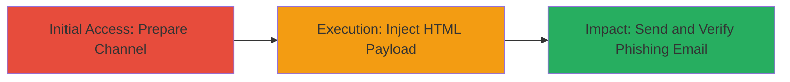

---
tags:
  - xss
  - html-injection
  - phishing
  - mattermost
type: attack_chain
tools: []
tactics:
  - '[[Initial Access]]'
commands: []
platforms:
  - Web
complexity: medium
procedures:
  - '[[procedures/Prepare-Mattermost-Channel-for-Guest-Invite]]'
  - '[[procedures/Inject-HTML-Payload-in-Custom-Message]]'
  - '[[procedures/Send-Invite-and-Verify-Injection]]'
step_count: 3
techniques:
  - '[[Exploit Public-Facing Application]]'
  - '[[T1566.002]]'
description: >-
  A multi-step attack exploiting unsanitized HTML in Mattermost's guest
  invitation emails to inject malicious links and elements, enabling phishing
  for credential theft or account takeover.
skill_level: intermediate
impact_level: high
id: 6899dfd2-e9ac-4f4d-958b-7ad514588671
created_at: '2025-12-14T17:33:24.156Z'
updated_at: '2025-12-14T17:33:24.156Z'
verified: false
validated: true
submitted: true
mitre_tactics:
  - '[[Initial Access]]'
mitre_techniques:
  - '[[Exploit Public-Facing Application]]'
  - '[[T1566.002]]'
---
# HTML Injection via Mattermost Guest Invite Custom Message Leading to Phishing Attacks

Multi-stage attack chain demonstrating a complete attack workflow exploiting an HTML injection vulnerability in Mattermost's invite members feature.

## Chain Metrics Dashboard

| Metric | Value |
|--------|-------|
| Chain Status | Unverified |
| Total Steps | 3 |
| Execution Time | ~5 minutes |
| Skill Level | Intermediate |
| Complexity | Medium |
| Impact Level | High |

## Attack Flow Visualization

## Prerequisites & Requirements

### Required Tools

- Web browser (e.g., Chrome or Firefox)

### Target Environment

- Mattermost workspace (cloud or self-hosted)
- Access to a user account with channel creation and invite permissions
- Valid email address for testing reception

### Initial Access Requirements

- Authenticated session in Mattermost
- No special privileges beyond standard user
- Network access to the Mattermost instance

## Detailed Attack Procedures

### Step 1: Prepare Channel for Guest Invite
procedure: [[procedures/Prepare-Mattermost-Channel-for-Guest-Invite]]

**Objective**: Set up the environment by navigating to the workspace, creating a channel, and initiating the guest invite process to reach the custom message field.

**Instructions**: Log in to the Mattermost workspace at `yourworkspace.cloud.mattermost.com`. Create a new channel using the channel creation feature. Locate and click the invite members option in the channel interface. Enter the target email address. Select the "invite as guest" option and specify the channel name in the "Add to channels" field.

**Expected Output**: The guest invite form is fully prepared, with the custom message field accessible.

**Success Indicators**:
- Channel created successfully
- Guest invite interface loaded with email and channel fields populated

### Step 2: Inject HTML Payload
procedure: [[procedures/Inject-HTML-Payload-in-Custom-Message]]

**Objective**: Exploit the unsanitized custom message field to insert malicious HTML that will render in the invitation email.

**Instructions**: In the custom message field, enter the payload: `<a href=evil.com>click</a><input type=x>`. This injects a clickable link to a phishing site and an input field for potential credential capture.

**Expected Output**: The payload is accepted without sanitization errors.

**Success Indicators**:
- No validation errors on input
- Form allows progression to send

### Step 3: Send Invite and Verify Injection
procedure: [[procedures/Send-Invite-and-Verify-Injection]]

**Objective**: Trigger the email send and confirm the HTML renders maliciously in the recipient's inbox, enabling phishing.

**Instructions**: Click the "Invite" button to send the email. Open the target email inbox and inspect the received invitation for rendered HTML elements like the link and input field.

**Expected Output**: Email arrives with executable HTML, showing a clickable phishing link and form element.

**Success Indicators**:
- Email received with unsanitized HTML
- Link renders as clickable and input field appears functional

## Attack Chain Summary

### Key Achievements

1. Successful HTML injection into Mattermost guest invitation emails
2. Rendering of malicious links and forms in recipient emails
3. Potential for phishing attacks leading to credential theft or account takeover

## Technique & Tactic Coverage

### MITRE ATT&CK Techniques

- [[Exploit Public-Facing Application]]
- [[T1566.002]]

### MITRE ATT&CK Tactics

- [[Initial Access]]

---

*Last updated: 2023-10-01T00:00:00Z*
