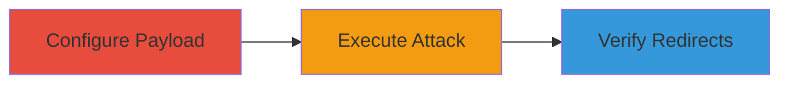

---
tags:
  - http-request-smuggling
  - web-vulnerability
  - redirect
type: attack_chain
tools:
  - '[[tools/Burp-Suite-Intruder]]'
  - '[[tools/Burp-Collaborator]]'
tactics:
  - '[[Initial Access]]'
  - '[[Execution]]'
commands: []
platforms:
  - Web
complexity: medium
procedures:
  - '[[procedures/Configure-Burp-Intruder-for-HTTP-Smuggling]]'
  - '[[procedures/Execute-Burp-Intruder-Attack]]'
  - '[[procedures/Monitor-Burp-Collaborator-for-Redirects]]'
step_count: 3
techniques:
  - '[[Exploit Public-Facing Application]]'
description: >-
  Multi-stage attack chain exploiting HTTP Request Smuggling on Acronis consumer
  site to achieve arbitrary redirects.
skill_level: intermediate
impact_level: low
id: 0e3b4729-1e0d-4c8a-a8dd-f9ffc8dc43dc
created_at: '2025-12-13T09:01:17.707Z'
updated_at: '2025-12-13T09:01:17.707Z'
verified: false
validated: true
submitted: true
mitre_tactics:
  - '[[Initial Access]]'
  - '[[Execution]]'
mitre_techniques:
  - '[[Exploit Public-Facing Application]]'
---
# HTTP Request Smuggling for Arbitrary Redirects on Acronis Consumer Site

Multi-stage attack chain demonstrating the exploitation of HTTP Request Smuggling on https://consumer.acronis.com, allowing attackers to smuggle malicious requests that alter the Host header and force redirects to arbitrary domains. This chain covers configuration, execution, and verification of the exploit, leading to potential user redirection to malicious sites. The vulnerability stems from desynchronization in request processing with chunked transfer encoding and tab characters in headers. Impact is rated low as the domain was unused, but it highlights risks in web server configurations.

## Chain Metrics Dashboard

| Metric | Value |
|--------|-------|
| Chain Status | Unverified |
| Total Steps | 3 |
| Execution Time | ~5 minutes |
| Skill Level | Intermediate |
| Complexity | Medium |
| Impact Level | Low |

## Attack Flow Visualization

## Prerequisites & Requirements

### Required Tools

- [[tools/Burp-Suite-Intruder]]
- [[tools/Burp-Collaborator]]

### Target Environment

- Target OS/Platform: Web
- Required services/ports: HTTPS on port 443
- Network access requirements: Direct access to https://consumer.acronis.com

### Initial Access Requirements

- Credential requirements: None
- Network position: External attacker
- Prior access needed: None

## Detailed Attack Procedures

### Step 1: Configure Burp Intruder Payload
procedure: [[procedures/Configure-Burp-Intruder-for-HTTP-Smuggling]]

**Objective**: Prepare the HTTP Request Smuggling payload using chunked encoding and a tab in the Transfer-Encoding header to smuggle a malicious request.

**Instructions**: In Burp Suite Intruder, configure the attack with the base64-encoded request payload or its decoded form. The payload includes a POST request to / with Transfer-Encoding: chunked (using a tab instead of space), Host set to consumer.acronis.com, and a smuggled POST to /sf with a malicious Host header pointing to a Burp Collaborator domain like 9oyta0p1z1ratbswtnnl67cv1m7cv1.burpcollaborator.net. Ensure the chunk size '64' in hex matches the length of the smuggled request.

**Expected Output**: Payload successfully configured in Burp Intruder.

**Success Indicators**:
- Payload decodes correctly without errors
- Chunk size matches smuggled request length

### Step 2: Execute Burp Intruder Attack
procedure: [[procedures/Execute-Burp-Intruder-Attack]]

**Objective**: Send the crafted requests to exploit the desynchronization between front-end and back-end servers, altering the Host header for redirects.

**Instructions**: Initiate the attack in Burp Intruder to send the smuggled requests, exploiting the vulnerability to force redirects via the altered Host header.

**Expected Output**: Requests sent successfully with no immediate errors in Burp.

**Success Indicators**:
- Attack runs without connection failures
- Responses indicate potential desync

### Step 3: Monitor Burp Collaborator for Redirects
procedure: [[procedures/Monitor-Burp-Collaborator-for-Redirects]]

**Objective**: Confirm the exploitation by observing incoming connections and redirects in Burp Collaborator.

**Instructions**: Check Burp Collaborator for HTTP requests redirected to the specified malicious domain, verifying successful smuggling and redirection.

**Expected Output**: Logged interactions in Burp Collaborator showing redirects.

**Success Indicators**:
- Incoming HTTP requests to the Collaborator domain
- Confirmation of redirect behavior

## Attack Chain Summary

### Key Achievements

1. Successful configuration of smuggling payload
2. Execution of attack leading to request desync
3. Verification of arbitrary redirects

## Technique & Tactic Coverage

### MITRE ATT&CK Techniques

- [[Exploit Public-Facing Application]]

### MITRE ATT&CK Tactics

- [[Initial Access]]
- [[Execution]]

*Last updated: 2023-10-01*
