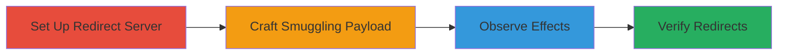

---
tags:
  - http-request-smuggling
  - redirect
  - web-vulnerability
type: attack_chain
tools:
  - '[[tools/socat]]'
  - '[[tools/Burp-Suite]]'
  - '[[tools/Burp-Collaborator]]'
tactics:
  - '[[Initial Access]]'
  - '[[Execution]]'
commands:
  - '[[commands/socat-redirect-server]]'
platforms:
  - Web
complexity: medium
procedures:
  - '[[procedures/Set-Up-Redirect-Server]]'
  - '[[procedures/Craft-and-Send-Smuggling-Payload]]'
  - '[[procedures/Observe-Smuggled-Request-Effects]]'
  - '[[procedures/Verify-User-Redirects]]'
step_count: 4
techniques:
  - '[[Exploit Public-Facing Application]]'
description: >-
  Exploits HTTP Request Smuggling on a web application to force arbitrary
  redirects to malicious domains, potentially bypassing security controls.
skill_level: intermediate
impact_level: low
id: b9b15dc9-3aaf-4b91-b5a7-95441a2756a0
created_at: '2025-12-13T09:01:17.570Z'
updated_at: '2025-12-13T09:01:17.570Z'
verified: false
validated: true
submitted: true
mitre_tactics:
  - '[[Initial Access]]'
  - '[[Execution]]'
mitre_techniques:
  - '[[Exploit Public-Facing Application]]'
---
# HTTP Request Smuggling for Arbitrary Redirects on Acronis Sandbox

Multi-stage attack chain demonstrating HTTP Request Smuggling exploitation on https://promosandbox.acronis.com to force user redirects to attacker-controlled domains.

## Chain Metrics Dashboard

| Metric | Value |
|--------|-------|
| Chain Status | Unverified |
| Total Steps | 4 |
| Execution Time | ~10 minutes |
| Skill Level | Intermediate |
| Complexity | Medium |
| Impact Level | Low |

## Attack Flow Visualization



## Prerequisites & Requirements

### Required Tools

- [[tools/socat]]
- [[tools/Burp-Suite]]
- [[tools/Burp-Collaborator]]

### Target Environment

- Web application at https://promosandbox.acronis.com
- Open ports: 443, 8443
- Network access to the target and attacker-controlled domain

### Initial Access Requirements

- No credentials required
- External network access to the target site
- Control over a domain for redirects (e.g., pqp.mx)

## Detailed Attack Procedures

### Step 1: Set Up Redirect Server
procedure: [[procedures/Set-Up-Redirect-Server]]

**Objective**: Establish a server to handle and redirect incoming connections from smuggled requests.

**Instructions**: Use [[commands/socat-redirect-server]] to set up a TCP listener on port 443 that responds with a 302 redirect:

```bash
socat -v -d -d TCP-LISTEN:443,crlf,reuseaddr,fork 'SYSTEM:/bin/echo "HTTP/1.1 302 Found";/bin/echo "Content-Length: 0";/bin/echo "Location: https://pqp.mx:8443";/bin/echo;/bin/echo'
```

**Expected Output**: Server listens on port 443 and sends redirect responses to incoming connections.

**Success Indicators**:
- Server starts without errors
- Verbose output shows listening status

### Step 2: Craft and Send Smuggling Payload
procedure: [[procedures/Craft-and-Send-Smuggling-Payload]]

**Objective**: Exploit the HTTP Request Smuggling vulnerability by sending a crafted payload to manipulate the Host header.

**Instructions**: In Burp Suite Intruder, configure a base64-encoded payload with chunked transfer encoding including a tab in the Transfer-Encoding header. The payload smuggles a POST request to /sf with a modified Host header (e.g., to a Burp Collaborator domain or attacker's domain). Ensure the hex size (93) matches the smuggled request length. Send the payload to https://promosandbox.acronis.com.

**Expected Output**: The target processes the smuggled request, leading to interference in request handling.

**Success Indicators**:
- Payload sent successfully without immediate errors
- Evidence of request smuggling in server responses

### Step 3: Observe Smuggled Request Effects
procedure: [[procedures/Observe-Smuggled-Request-Effects]]

**Objective**: Monitor interactions to confirm the smuggling leads to redirects.

**Instructions**: Use Burp Collaborator to log any DNS or HTTP requests from the target, indicating successful smuggling and redirects to the specified domain.

**Expected Output**: Logs in Burp Collaborator showing interactions from the target site.

**Success Indicators**:
- Redirect requests appear in Collaborator logs
- Confirmation of Host header manipulation

### Step 4: Verify User Redirects
procedure: [[procedures/Verify-User-Redirects]]

**Objective**: Confirm that users are redirected to the attacker's malicious domain.

**Instructions**: Check the attacker's server logs for incoming connections on port 8443, verifying that redirects from the smuggled requests have reached the malicious site.

**Expected Output**: Server logs show connections from redirected users.

**Success Indicators**:
- Incoming connections on port 8443
- Validation of redirect chain completion

## Attack Chain Summary

### Key Achievements

1. Successful setup of redirect infrastructure
2. Exploitation of HTTP Request Smuggling for Host header manipulation
3. Confirmation of arbitrary redirects to malicious domains

## Technique & Tactic Coverage

### MITRE ATT&CK Techniques

- [[Exploit Public-Facing Application]]

### MITRE ATT&CK Tactics

- [[Initial Access]]
- [[Execution]]

*Last updated: 2023-10-01*
