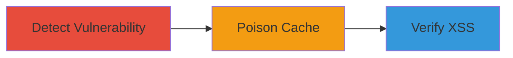

---
tags:
  - http-request-smuggling
  - cache-poisoning
  - xss
  - web-vulnerability
type: attack_chain
tools:
  - '[[tools/Burp-Suite]]'
tactics:
  - '[[Initial Access]]'
  - '[[Execution]]'
commands:
  - '[[commands/test-http-smuggling-cl-te]]'
  - '[[commands/craft-poisoning-request]]'
  - '[[commands/verify-xss-payload]]'
platforms:
  - Web
complexity: medium
procedures:
  - '[[procedures/Detect-HTTP-Request-Smuggling-Vulnerability]]'
  - '[[procedures/Craft-Smuggling-Request-for-Cache-Poisoning]]'
  - '[[procedures/Verify-Stored-XSS-via-Cache-Poisoning]]'
step_count: 3
techniques:
  - '[[Exploit Public-Facing Application]]'
  - '[[JavaScript]]'
description: >-
  Multi-stage attack exploiting HTTP Request Smuggling to poison frontend cache
  and inject stored XSS on PayPal's sign-in page
skill_level: intermediate
impact_level: high
id: ca9c956e-3afd-45cd-9fcd-eed6d5751cb2
created_at: '2025-12-14T00:11:25.439Z'
updated_at: '2025-12-14T00:11:25.439Z'
verified: false
validated: true
submitted: true
mitre_tactics:
  - '[[Initial Access]]'
  - '[[Execution]]'
mitre_techniques:
  - '[[Exploit Public-Facing Application]]'
  - '[[JavaScript]]'
---
# HTTP Request Smuggling for Cache Poisoning and Stored XSS on PayPal Signin

Multi-stage attack chain demonstrating how to exploit a misconfiguration in PayPal's frontend caching servers via HTTP Request Smuggling, leading to cache poisoning and stored XSS that could interfere with page integrity, such as the sign-in page at https://paypal.com/signin.

## Chain Metrics Dashboard

| Metric | Value |
|--------|-------|
| Chain Status | Unverified |
| Total Steps | 3 |
| Execution Time | ~10 minutes |
| Skill Level | Intermediate |
| Complexity | Medium |
| Impact Level | High |

## Attack Flow Visualization



## Prerequisites & Requirements

### Required Tools

- [[tools/Burp-Suite]]

### Target Environment

- Web platform
- Frontend caching servers
- Network access to https://paypal.com/signin

### Initial Access Requirements

- No credentials required
- External network position
- Ability to send HTTP requests to target

## Detailed Attack Procedures

### Step 1: Detect HTTP Request Smuggling Vulnerability
procedure: [[procedures/Detect-HTTP-Request-Smuggling-Vulnerability]]

**Objective**: Identify if the target server is vulnerable to HTTP Request Smuggling due to misconfigurations in handling Content-Length and Transfer-Encoding headers.

**Instructions**: Use [[commands/test-http-smuggling-cl-te]] to test for CL.TE smuggling:

```bash
# Use Burp Repeater or curl to send crafted requests
# Example: Send a request with conflicting CL and TE
POST / HTTP/1.1
Host: paypal.com
Content-Length: 6
Transfer-Encoding: chunked

0

G
```

Monitor for differential responses indicating smuggling.

**Expected Output**: Response showing desynchronization between frontend and backend, confirming vulnerability.

**Success Indicators**:
- Desynchronized responses observed
- Confirmation of smuggling possible

### Step 2: Craft Smuggling Request for Cache Poisoning
procedure: [[procedures/Craft-Smuggling-Request-for-Cache-Poisoning]]

**Objective**: Exploit the smuggling to inject a malicious redirect or content into the cache, poisoning it for subsequent requests.

**Instructions**: Craft a smuggling request using [[commands/craft-poisoning-request]] to convert a page request into a cached redirect with XSS payload:

```bash
# Example smuggling request to poison cache
POST /signin HTTP/1.1
Host: paypal.com
Content-Length: 100
Transfer-Encoding: chunked

# Inject redirect or XSS here
```

Send the request to poison the cache.

**Expected Output**: Cache entry poisoned with attacker's content.

**Success Indicators**:
- Request accepted without errors
- Cache poisoning confirmed via subsequent probes

### Step 3: Verify Stored XSS via Cache Poisoning
procedure: [[procedures/Verify-Stored-XSS-via-Cache-Poisoning]]

**Objective**: Confirm that the poisoned cache serves malicious content, leading to stored XSS on legitimate user requests.

**Instructions**: Access the sign-in page and use [[commands/verify-xss-payload]] to check for injected content:

```bash
curl https://paypal.com/signin
```

Inspect the response for XSS execution.

**Expected Output**: Page renders with injected XSS payload.

**Success Indicators**:
- Malicious content rendered
- XSS interference with page integrity observed

## Attack Chain Summary

### Key Achievements

1. Detection of HTTP Request Smuggling vulnerability
2. Successful cache poisoning with malicious redirect
3. Verification of stored XSS impacting sign-in page

## Technique & Tactic Coverage

### MITRE ATT&CK Techniques

- [[Exploit Public-Facing Application]]
- [[JavaScript]]

### MITRE ATT&CK Tactics

- [[Initial Access]]
- [[Execution]]

*Last updated: 2023-10-01*
