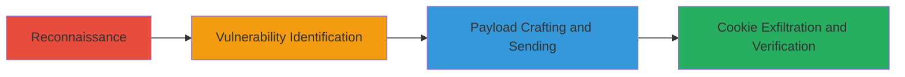

---
tags:
  - http-request-smuggling
  - session-hijacking
  - cookie-theft
  - open-redirect
  - web-vuln
type: attack_chain
tools:
  - '[[tools/Smuggler]]'
  - '[[tools/Burp-Suite]]'
tactics:
  - '[[Initial Access]]'
  - '[[Execution]]'
  - '[[Collection]]'
commands:
  - '[[commands/smuggler-test-url]]'
platforms:
  - Web
complexity: high
procedures:
  - '[[procedures/Perform-Reconnaissance-for-HTTP-Request-Smuggling]]'
  - '[[procedures/Identify-CL-TE-Desync-Vulnerability]]'
  - '[[procedures/Craft-and-Send-Smuggling-Payload]]'
  - '[[procedures/Receive-and-Verify-Stolen-Cookies]]'
step_count: 4
techniques:
  - '[[Exploit Public-Facing Application]]'
  - '[[Steal Web Session Cookie]]'
description: >-
  Exploitation of CL.TE HTTP Request Smuggling on slackb.com to poison backend
  sockets and hijack victim requests for mass session cookie theft via open
  redirect.
skill_level: advanced
impact_level: high
id: eb5616dc-25fd-485d-90ff-8d4b6378eb43
created_at: '2025-12-13T09:01:26.250Z'
updated_at: '2025-12-13T09:01:26.250Z'
verified: false
validated: true
submitted: true
mitre_tactics:
  - '[[Initial Access]]'
  - '[[Execution]]'
  - '[[Collection]]'
mitre_techniques:
  - '[[Exploit Public-Facing Application]]'
  - '[[Steal Web Session Cookie]]'
---
# HTTP Request Smuggling for Slack Session Cookie Theft

Multi-stage attack chain demonstrating exploitation of a CL.TE HTTP Request Smuggling vulnerability on slackb.com to hijack victim requests, force an open redirect, and steal session cookies for mass account takeovers.

## Chain Metrics Dashboard

| Metric | Value |
|--------|-------|
| Chain Status | Unverified |
| Total Steps | 4 |
| Execution Time | ~15 minutes |
| Skill Level | Advanced |
| Complexity | High |
| Impact Level | High |

## Attack Flow Visualization



## Prerequisites & Requirements

### Required Tools

- [[tools/Smuggler]]
- [[tools/Burp-Suite]]

### Target Environment

- Web platform
- Required services/ports: HTTPS on port 443
- Network access requirements: Direct access to slackb.com over HTTPS

### Initial Access Requirements

- No credentials required
- Network position: External attacker with internet access
- Prior access needed: None

## Detailed Attack Procedures

### Step 1: Reconnaissance for HTTP Request Smuggling
procedure: [[procedures/Perform-Reconnaissance-for-HTTP-Request-Smuggling]]

**Objective**: Perform initial testing to identify potential HTTP Request Smuggling vulnerabilities on the target Slack asset.

**Instructions**: Use [[commands/smuggler-test-url]] to run exhaustive tests on the target URL:

```bash
smuggler -u https://slackb.com
```

**Expected Output**: Output logs indicating successes or failures in smuggling tests, highlighting potential desyncs.

**Success Indicators**:
- Detection of desync behaviors in header processing
- Identification of vulnerable endpoints

### Step 2: Identify CL.TE Desync Vulnerability
procedure: [[procedures/Identify-CL-TE-Desync-Vulnerability]]

**Objective**: Confirm the CL.TE desync using specific test cases to validate the mismatch in header processing between frontend and backend.

**Instructions**: Test the 'space1' payload with a space before the colon in the Transfer-Encoding header. Analyze how the frontend uses Content-Length while the backend uses Transfer-Encoding.

**Expected Output**: Confirmation of desync where the backend processes chunked data differently from the frontend.

**Success Indicators**:
- Successful identification of CL.TE vulnerability
- Payload validation showing header mismatch

### Step 3: Craft and Send Smuggling Payload
procedure: [[procedures/Craft-and-Send-Smuggling-Payload]]

**Objective**: Craft a malicious payload to poison the backend socket and hijack victim requests, forcing an open redirect to exfiltrate cookies.

**Instructions**: Using Burp Suite Repeater, configure the target to slackb.com:443 (SSL) and send the crafted CL.TE payload that prepends data to victim requests, changing them to GET https://<attacker-url> HTTP/1.1. Set up Burp Collaborator to receive the redirected requests.

**Expected Output**: Successful poisoning of the backend socket, with subsequent requests being hijacked.

**Success Indicators**:
- Payload sent without errors
- Backend socket poisoned for request hijacking

### Step 4: Receive and Verify Stolen Cookies
procedure: [[procedures/Receive-and-Verify-Stolen-Cookies]]

**Objective**: Poll the collaborator server to retrieve and verify the stolen session cookies from hijacked victim requests.

**Instructions**: In Burp Collaborator Client, click 'Poll now' to retrieve DNS and HTTP interactions, including victim IP addresses and leaked cookies such as the 'd' session cookie.

**Expected Output**: Received requests containing stolen cookies and victim details.

**Success Indicators**:
- Successful exfiltration of session cookies
- Ability to use cookies for account takeovers

## Attack Chain Summary

### Key Achievements

1. Identification and exploitation of CL.TE HTTP Request Smuggling
2. Hijacking of victim requests via socket poisoning
3. Mass theft of Slack session cookies leading to account takeovers

## Technique & Tactic Coverage

### MITRE ATT&CK Techniques

- [[Exploit Public-Facing Application]]
- [[Steal Web Session Cookie]]

### MITRE ATT&CK Tactics

- [[Initial Access]]
- [[Execution]]
- [[Collection]]

*Last updated: 2023-10-01*
