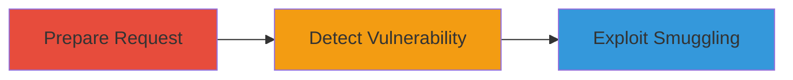

---
tags:
  - http-request-smuggling
  - web-vulnerability
  - twitter
type: attack_chain
tools:
  - '[[tools/Burp-Suite]]'
  - '[[tools/Chrome-Browser]]'
tactics:
  - '[[Initial Access]]'
  - '[[Execution]]'
commands: []
platforms:
  - Web
complexity: medium
procedures:
  - '[[procedures/Prepare-and-Modify-HTTP-Request-for-Smuggling]]'
  - '[[procedures/Detect-and-Confirm-HTTP-Request-Smuggling-Vulnerability]]'
  - '[[procedures/Exploit-Smuggling-to-Execute-Unauthorized-Actions]]'
step_count: 3
techniques:
  - '[[Exploit Public-Facing Application]]'
description: >-
  Exploitation of HTTP Request Smuggling vulnerability in twitter.com to smuggle
  requests and perform unauthorized actions like posting tweets
skill_level: intermediate
impact_level: high
id: 5c2f1643-b34f-4eb7-b90f-05ef0c0739c2
created_at: '2025-12-13T09:01:21.641Z'
updated_at: '2025-12-13T09:01:21.641Z'
verified: false
validated: true
submitted: true
mitre_tactics:
  - '[[Initial Access]]'
  - '[[Execution]]'
mitre_techniques:
  - '[[Exploit Public-Facing Application]]'
---
# HTTP Request Smuggling on Twitter via Chunked Encoding to Post Unauthorized Tweets

Multi-stage attack chain demonstrating exploitation of an HTTP Request Smuggling vulnerability in twitter.com, allowing smuggling of additional requests to perform unauthorized actions such as posting tweets, potentially leading to account compromise or bypassing security controls.

## Chain Metrics Dashboard

| Metric | Value |
|--------|-------|
| Chain Status | Unverified |
| Total Steps | 3 |
| Execution Time | ~15 minutes |
| Skill Level | Intermediate |
| Complexity | Medium |
| Impact Level | High |

## Attack Flow Visualization

## Prerequisites & Requirements

### Required Tools

- [[tools/Burp-Suite]]
- [[tools/Chrome-Browser]]

### Target Environment

- Web platform
- Twitter web services
- Network access to twitter.com

### Initial Access Requirements

- Access to twitter.com via browser
- No prior credentials needed for detection, but authenticated session for full exploitation

## Detailed Attack Procedures

### Step 1: Prepare and Modify HTTP Request
procedure: [[procedures/Prepare-and-Modify-HTTP-Request-for-Smuggling]]

**Objective**: Select and modify a legitimate POST request from twitter.com to set up for smuggling.

**Instructions**: Using [[tools/Burp-Suite]], intercept a valid POST request from twitter.com and send it to Repeater. Remove headers like 'Connection: close' and 'Accept-Encoding: gzip, deflate'. Add 'Transfer-Encoding: chunked' header. Encode the body with chunked encoding, such as adding '0' followed by two CRLFs.

**Expected Output**: Modified request ready for smuggling.

**Success Indicators**:
- Request successfully modified in Burp Repeater
- Chunked encoding applied without errors

### Step 2: Detect and Confirm Vulnerability
procedure: [[procedures/Detect-and-Confirm-HTTP-Request-Smuggling-Vulnerability]]

**Objective**: Test for acceptance of chunked encoding and confirm smuggling potential through response analysis.

**Instructions**: Send a request with valid chunked encoding and observe if a response is received, indicating back-end acceptance. Then send a request with a large hexadecimal chunk value and check for a delayed response, confirming the vulnerability.

**Expected Output**: Response received for valid chunked request; delayed response for large chunk test.

**Success Indicators**:
- Immediate response on valid chunked request
- Timeout or delay on large chunk request

### Step 3: Exploit Smuggling to Execute Unauthorized Actions
procedure: [[procedures/Exploit-Smuggling-to-Execute-Unauthorized-Actions]]

**Objective**: Append and smuggle a second request to perform unauthorized actions like posting a tweet.

**Instructions**: Append a second HTTP request (e.g., a tweet-posting payload) after the chunked body in the modified request. Send the crafted request using [[tools/Burp-Suite]] and verify if the smuggled request executes, such as by checking for a new tweet.

**Expected Output**: Smuggled request processed, resulting in unauthorized tweet posted.

**Success Indicators**:
- New tweet appears on the account
- No errors in response indicating rejection

## Attack Chain Summary

### Key Achievements

1. Successful detection of HTTP Request Smuggling vulnerability
2. Modification and smuggling of requests to bypass controls
3. Execution of unauthorized actions on twitter.com

## Technique & Tactic Coverage

### MITRE ATT&CK Techniques

- [[Exploit Public-Facing Application]]

### MITRE ATT&CK Tactics

- [[Initial Access]]
- [[Execution]]

*Last updated: 2023-10-01*
