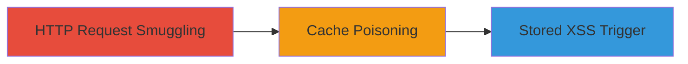

---
tags:
  - http-request-smuggling
  - cache-poisoning
  - stored-xss
  - web-exploitation
type: attack_chain
tools:
  - '[[tools/Burp-Suite]]'
tactics:
  - '[[Initial Access]]'
  - '[[Execution]]'
commands:
  - '[[commands/send-http-smuggling-request]]'
platforms:
  - Web
complexity: medium
procedures:
  - '[[procedures/Exploit-HTTP-Request-Smuggling-for-Cache-Poisoning]]'
  - '[[procedures/Trigger-Stored-XSS-via-Cached-Redirect]]'
step_count: 2
techniques:
  - '[[Exploit Public-Facing Application]]'
  - '[[JavaScript]]'
description: >-
  Exploitation of HTTP Request Smuggling in PayPal's caching servers to create
  cached redirects with malicious content, leading to stored XSS on the sign-in
  page.
skill_level: intermediate
impact_level: high
id: 1e7c3645-16b3-49a6-afa9-1a5f0feaccda
created_at: '2025-12-14T00:11:25.470Z'
updated_at: '2025-12-14T00:11:25.470Z'
verified: false
validated: true
submitted: true
mitre_tactics:
  - '[[Initial Access]]'
  - '[[Execution]]'
mitre_techniques:
  - '[[Exploit Public-Facing Application]]'
  - '[[JavaScript]]'
---
# HTTP Request Smuggling to Cache Poisoning and Stored XSS in PayPal

Multi-stage attack chain demonstrating the exploitation of HTTP Request Smuggling in PayPal's frontend caching servers to inject malicious content via cached redirects, resulting in stored XSS on critical pages like the sign-in page. This bypasses a previous fix and allows interference with page integrity without affecting back-end data.

## Chain Metrics Dashboard

| Metric | Value |
|--------|-------|
| Chain Status | Unverified |
| Total Steps | 2 |
| Execution Time | ~10 minutes |
| Skill Level | Intermediate |
| Complexity | Medium |
| Impact Level | High |

## Attack Flow Visualization



## Prerequisites & Requirements

### Required Tools

- [[tools/Burp-Suite]]

### Target Environment

- Web platform with caching servers
- Services: Caching servers
- Network access requirements: Access to PayPal frontend servers

### Initial Access Requirements

- Network position: External access to public-facing web servers
- Prior access needed: None, public vulnerability

## Detailed Attack Procedures

### Step 1: Exploit HTTP Request Smuggling for Cache Poisoning
procedure: [[procedures/Exploit-HTTP-Request-Smuggling-for-Cache-Poisoning]]

**Objective**: Manipulate the caching behavior to convert a legitimate page request into a cached redirect containing malicious content.

**Instructions**: Use [[tools/Burp-Suite]] to craft and send an HTTP request smuggling payload targeting PayPal's frontend caching servers. Execute [[commands/send-http-smuggling-request]] to inject the malicious redirect:

```bash
curl -X POST https://paypal.com/endpoint --data "smuggled_request_payload" -H "Transfer-Encoding: chunked" -H "Content-Length: manipulated_length"
```

**Expected Output**: Successful caching of the redirect with attacker's arbitrary content.

**Success Indicators**:
- Request accepted without errors
- Cached response confirms poisoned entry

### Step 2: Trigger Stored XSS via Cached Redirect
procedure: [[procedures/Trigger-Stored-XSS-via-Cached-Redirect]]

**Objective**: Access the poisoned cache to render the malicious content on a legitimate page, triggering stored XSS.

**Instructions**: Navigate to the affected page, such as https://paypal.com/signin, which accesses the cached redirect and executes the injected XSS payload. No specific command is needed for triggering, but verify by inspecting the page source for malicious content.

**Expected Output**: Malicious content rendered on the sign-in page, potentially interfering with the login process.

**Success Indicators**:
- XSS payload executes in the browser
- Page integrity is compromised with attacker's content

## Attack Chain Summary

### Key Achievements

1. Bypassed previous vulnerability fix for HTTP Request Smuggling
2. Achieved cache poisoning with arbitrary content
3. Enabled stored XSS on high-impact pages without back-end compromise

## Technique & Tactic Coverage

### MITRE ATT&CK Techniques

- [[Exploit Public-Facing Application]]
- [[JavaScript]]

### MITRE ATT&CK Tactics

- [[Initial Access]]
- [[Execution]]

*Last updated: 2023-10-01*
