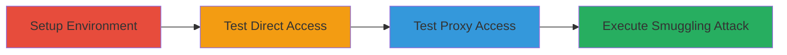

---
tags:
  - http-request-smuggling
  - node-js
  - ats-proxy
  - chunk-extension
type: attack_chain
tools:
  - '[[tools/docker]]'
  - '[[tools/docker-compose]]'
  - '[[tools/curl]]'
  - '[[tools/python3]]'
  - '[[tools/nc]]'
tactics:
  - '[[Initial Access]]'
  - '[[Execution]]'
commands:
  - '[[commands/docker-compose-up-build]]'
  - '[[commands/curl-get-root-direct]]'
  - '[[commands/curl-get-admin-direct]]'
  - '[[commands/curl-get-forbidden-direct]]'
  - '[[commands/curl-get-root-proxy]]'
  - '[[commands/curl-get-admin-proxy]]'
  - '[[commands/curl-get-forbidden-proxy]]'
  - '[[commands/python3-payload-nc]]'
platforms:
  - Web
  - Node.js
  - Linux
complexity: medium
procedures:
  - '[[procedures/Set-Up-PoC-Environment-for-Node-js-and-ATS]]'
  - '[[procedures/Test-Direct-Access-to-Node-js-Server]]'
  - '[[procedures/Test-Access-Through-ATS-Proxy]]'
  - '[[procedures/Execute-HTTP-Request-Smuggling-Attack-via-Chunk-Extension]]'
step_count: 4
techniques:
  - '[[Exploit Public-Facing Application]]'
description: >-
  Exploits a parsing mismatch between Node.js llhttp and ATS to smuggle requests
  and access restricted endpoints
skill_level: intermediate
impact_level: high
id: d01e2bdf-4556-4f96-b65e-43dd43b05461
created_at: '2025-12-13T09:01:17.125Z'
updated_at: '2025-12-13T09:01:17.125Z'
verified: false
validated: true
submitted: true
mitre_tactics:
  - '[[Initial Access]]'
  - '[[Execution]]'
mitre_techniques:
  - '[[Exploit Public-Facing Application]]'
---
# HTTP Request Smuggling via Node.js Chunk Extension Ignoring to Bypass ATS Proxy Controls

Multi-stage attack chain demonstrating HTTP Request Smuggling by exploiting a parsing mismatch in Node.js 16.3.0's llhttp parser and ATS 9.0.0, allowing invalid characters in chunk extensions to smuggle requests and bypass proxy controls to access restricted endpoints like /admin.

## Chain Metrics Dashboard

| Metric | Value |
|--------|-------|
| Chain Status | Unverified |
| Total Steps | 4 |
| Execution Time | ~10 minutes |
| Skill Level | Intermediate |
| Complexity | Medium |
| Impact Level | High |

## Attack Flow Visualization



## Prerequisites & Requirements

### Required Tools

- [[tools/docker]]
- [[tools/docker-compose]]
- [[tools/curl]]
- [[tools/python3]]
- [[tools/nc]]

### Target Environment

- Node.js 16.3.0 with llhttp parser
- Apache Traffic Server (ATS) 9.0.0 as proxy
- HTTP server running on ports 8080 (proxy) and 8081 (direct)
- Linux host with Docker installed

### Initial Access Requirements

- Local access to run Docker containers
- No credentials required for PoC
- Network access to localhost ports 8080 and 8081

## Detailed Attack Procedures

### Step 1: Set Up PoC Environment
procedure: [[procedures/Set-Up-PoC-Environment-for-Node-js-and-ATS]]

**Objective**: Establish the vulnerable Node.js server and ATS proxy environment for testing.

**Instructions**: Unzip the poc.zip file and start the Docker containers using [[commands/docker-compose-up-build]]:

```bash
sudo docker-compose up --build
```

**Expected Output**: Docker containers running, with Node.js on port 8081 and ATS on port 8080.

**Success Indicators**:
- Containers start without errors
- Ports 8080 and 8081 are listening

### Step 2: Test Direct Access to Node.js Server
procedure: [[procedures/Test-Direct-Access-to-Node-js-Server]]

**Objective**: Verify normal responses from the Node.js server endpoints without proxy.

**Instructions**: Send GET requests to the root endpoint using [[commands/curl-get-root-direct]]:

```bash
curl http://localhost:8081
```

To the admin endpoint using [[commands/curl-get-admin-direct]]:

```bash
curl http://localhost:8081/admin
```

To the forbidden endpoint using [[commands/curl-get-forbidden-direct]]:

```bash
curl http://localhost:8081/forbidden
```

**Expected Output**: 'INDEX' for root, 'ADMIN' for admin, 'FORBIDDEN' for forbidden.

**Success Indicators**:
- Expected responses received directly from Node.js
- Confirms server is functioning

### Step 3: Test Access Through ATS Proxy
procedure: [[procedures/Test-Access-Through-ATS-Proxy]]

**Objective**: Verify proxy behavior and access controls that reroute /admin to /forbidden.

**Instructions**: Send GET requests to the root endpoint using [[commands/curl-get-root-proxy]]:

```bash
curl http://localhost:8080
```

To the admin endpoint using [[commands/curl-get-admin-proxy]]:

```bash
curl http://localhost:8080/admin
```

To the forbidden endpoint using [[commands/curl-get-forbidden-proxy]]:

```bash
curl http://localhost:8080/forbidden
```

**Expected Output**: 'INDEX' for root, 'FORBIDDEN' for admin and forbidden.

**Success Indicators**:
- Proxy enforces rerouting for /admin
- Baseline for smuggling confirmed

### Step 4: Execute HTTP Request Smuggling Attack
procedure: [[procedures/Execute-HTTP-Request-Smuggling-Attack-via-Chunk-Extension]]

**Objective**: Smuggle a request with invalid newline in chunk extension to bypass proxy and reach /admin.

**Instructions**: Generate and send the payload using [[commands/python3-payload-nc]]:

```bash
python3 payload.py | nc localhost 8080
```

**Expected Output**: Terminal prints '/admin was reached!' indicating successful smuggling.

**Success Indicators**:
- Smuggled request reaches restricted endpoint
- Proxy bypass confirmed, though response retrieval limited by ATS bug

## Attack Chain Summary

### Key Achievements

1. Environment setup for reproducible PoC
2. Verification of direct and proxy behaviors
3. Successful request smuggling to bypass controls

## Technique & Tactic Coverage

### MITRE ATT&CK Techniques

- [[Exploit Public-Facing Application]]

### MITRE ATT&CK Tactics

- [[Initial Access]]
- [[Execution]]

*Last updated: 2023-10-01*
