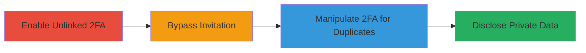

# HackerOne 2FA Bypass Leading to Private Program Information Disclosure

Multi-stage attack chain demonstrating a complete attack workflow exploiting 2FA misconfiguration on HackerOne.

## Chain Metrics Dashboard

| Metric | Value |
|--------|-------|
| Chain Status | Unverified |
| Total Steps | 3 |
| Execution Time | ~5 minutes |
| Skill Level | Intermediate |
| Complexity | Medium |
| Impact Level | High |

## Attack Flow Visualization

## Prerequisites & Requirements

### Required Tools

- [[tools/Google-Authenticator]]

### Target Environment

- Web platform (HackerOne dashboard)
- Required services/ports: HTTPS (443)
- Network access requirements: Internet access to HackerOne

### Initial Access Requirements

- Existing HackerOne account with program invitations
- No prior 2FA setup
- Email access for invitations

## Detailed Attack Procedures

### Step 1: Enable Unlinked 2FA

procedure: [[procedures/Enable-Unlinked-2FA]]

**Objective**: Set up 2FA using Google Authenticator without linking it to the account, allowing unverified access.

**Instructions**: Open the Google Authenticator app on your mobile device and generate a setup code without associating it with any account. Then, in the HackerOne account settings, enable 2FA and input codes from the unlinked app to complete setup without proper verification.

**Expected Output**: 2FA enabled status in HackerOne settings, but no account linkage enforced.

**Success Indicators**:
- 2FA toggle shows as active
- No error during setup despite lack of linkage

### Step 2: Bypass Invitation Acceptance

procedure: [[procedures/Bypass-Invitation-Acceptance]]

**Objective**: Accept program invitations and view sensitive data without full 2FA verification.

**Instructions**: Navigate to the HackerOne dashboard and access an invitation link for a private program. Click accept using the unverified 2FA setup to gain access to program details and participant lists.

**Expected Output**: Access granted to private program dashboard, displaying participant information.

**Success Indicators**:
- Invitation accepted without additional verification prompts
- Visible list of participating hackers and program details

### Step 3: Manipulate 2FA for Duplicate Access

procedure: [[procedures/Manipulate-2FA-for-Duplicate-Access]]

**Objective**: Disable and re-enable 2FA to trigger duplicate invitations, confirming repeated unauthorized access.

**Instructions**: In account settings, disable 2FA. Then re-enable it, this time linking via email with the Google Authenticator app. Check email for duplicate invitation notifications and accept them to re-access the same private data.

**Expected Output**: Duplicate emails received; re-acceptance grants access to the same sensitive information.

**Success Indicators**:
- Duplicate invitations in email inbox
- Repeated access to private program data without re-verification

## Attack Chain Summary

### Key Achievements

1. Bypassed 2FA enforcement to accept invitations unverified
2. Disclosed private program details and all participating hackers
3. Demonstrated repeatable access via 2FA manipulation, highlighting system flaw in tracking acceptances

## Technique & Tactic Coverage

### MITRE ATT&CK Techniques

- [[Valid Accounts]]
- [[Data from Information Repositories]]

### MITRE ATT&CK Tactics

- [[Initial Access]]
- [[Collection]]

---
*Last updated: 2023-10-01T12:00:00Z*
