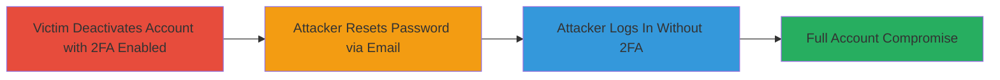

# HackerOne 2FA Bypass via Account Deactivation and Password Reset

Multi-stage attack chain demonstrating a complete attack workflow for bypassing 2FA on the HackerOne platform by leveraging account deactivation and email-based password reset, resulting in unauthorized account access.

## Chain Metrics Dashboard

| Metric | Value |
|--------|-------|
| Chain Status | Unverified |
| Total Steps | 3 |
| Execution Time | ~5 minutes |
| Skill Level | Intermediate |
| Complexity | Medium |
| Impact Level | High |

## Attack Flow Visualization

## Prerequisites & Requirements

### Required Tools

- Web browser (e.g., Chrome or Firefox)
- Access to victim's email account

### Target Environment

- HackerOne web platform
- No specific services/ports required beyond standard HTTPS (443)
- Internet access

### Initial Access Requirements

- Attacker must have access to the victim's email address associated with the HackerOne account
- Victim must have 2FA enabled on their account
- No prior network position needed; attack occurs over public web

## Detailed Attack Procedures

### Step 1: Victim Enables 2FA and Deactivates Account
procedure: [[procedures/HackerOne-Enable-2FA-and-Deactivate-Account]]

**Objective**: Ensure the target account has 2FA enabled and is deactivated, setting up the bypass condition.

**Instructions**: This step is typically performed by the victim or simulated by the attacker if they have prior access. Log into the HackerOne account via the web interface, navigate to security settings to enable 2FA using an authenticator app, then proceed to account settings to deactivate the account.

**Expected Output**: Account shows as deactivated in the platform, with 2FA configured but not prompted post-deactivation.

**Success Indicators**:
- Confirmation email or page indicating account deactivation
- 2FA setup complete with QR code scanned

### Step 2: Password Reset via Email
procedure: [[procedures/HackerOne-Password-Reset-via-Email]]

**Objective**: Use email access to initiate and complete a password reset, which does not require 2FA verification due to the deactivated state.

**Instructions**: Access the victim's email inbox. Visit the HackerOne login page, click 'Forgot password', enter the victim's email, and follow the reset link received in the email to set a new password.

**Expected Output**: Password reset successful, with a new password set for the account.

**Success Indicators**:
- Reset link email received and clicked
- New password confirmation on the platform

### Step 3: Login Bypassing 2FA
procedure: [[procedures/HackerOne-Login-Bypassing-2FA]]

**Objective**: Log into the account using the new password, exploiting the bypass to gain full access without OTP.

**Instructions**: Navigate to the HackerOne login page, enter the email and newly set password. No 2FA prompt will appear due to the deactivation-reset sequence.

**Expected Output**: Successful login to the HackerOne dashboard, with access to private programs and invites.

**Success Indicators**:
- Login successful without 2FA code request
- Access to account features like program invites

## Attack Chain Summary

### Key Achievements

1. Bypassed 2FA requirement entirely using only email access
2. Gained unauthorized full control of the HackerOne account
3. Enabled access to sensitive data such as private bug bounty program invites

## Technique & Tactic Coverage

### MITRE ATT&CK Techniques

- [[Valid Accounts]] Valid Accounts
- [[Account Manipulation]] Account Manipulation

### MITRE ATT&CK Tactics

- [[Initial Access]] Initial Access
- [[Credential Access]] Credential Access

---
*Last updated: 2023-10-01T00:00:00Z*
