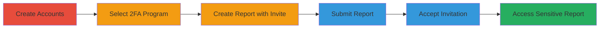

# HackerOne 2FA Bypass via Non-2FA Collaborator Invitation

Multi-stage attack chain demonstrating a complete attack workflow exploiting a business logic error in HackerOne's platform.

## Chain Metrics Dashboard

| Metric | Value |
|--------|-------|
| Chain Status | Unverified |
| Total Steps | 6 |
| Execution Time | ~10 minutes |
| Skill Level | Intermediate |
| Complexity | Low |
| Impact Level | High |

## Attack Flow Visualization

## Prerequisites & Requirements

### Required Tools

- None (manual web interactions)

### Target Environment

- HackerOne platform (web-based)
- Programs enforcing 2FA for reporters but allowing collaborations

### Initial Access Requirements

- Ability to create free HackerOne accounts
- Email addresses for account registration
- No prior privileged access needed

## Detailed Attack Procedures

### Step 1: Create Accounts
procedure: [[procedures/HackerOne-2FA-Bypass-via-Collaborator]]

**Objective**: Establish two accounts—one with 2FA enabled to submit reports and one without to bypass access controls.

**Instructions**: Navigate to the HackerOne registration page and create Account A (enable 2FA in settings after creation). Then create Account B without enabling 2FA. Use distinct email addresses for each.

**Expected Output**: Two active accounts; Account A prompts for 2FA on sensitive actions.

**Success Indicators**:
- Account A: 2FA setup confirmed in profile settings
- Account B: No 2FA prompt during login

### Step 2: Select Program
procedure: [[procedures/HackerOne-2FA-Bypass-via-Collaborator]]

**Objective**: Identify a target program that mandates 2FA for report submission but supports collaborator invitations.

**Instructions**: Log in as Account A, browse HackerOne programs, and review policy details to confirm 2FA requirement and collaboration enabled.

**Expected Output**: Program selected with confirmed 2FA policy.

**Success Indicators**:
- Program policy page shows "2FA required for reporters"
- Collaboration feature available in program settings

### Step 3: Create Report and Invite Collaborator
procedure: [[procedures/HackerOne-2FA-Bypass-via-Collaborator]]

**Objective**: Initiate a report in the 2FA-required program and invite the non-2FA account as collaborator.

**Instructions**: Using Account A, start a new report in the selected program, fill in basic details, and add Account B's email or username in the collaborators field.

**Expected Output**: Invitation queued for sending upon submission.

**Success Indicators**:
- Collaborator added to report draft without errors
- Invitation preview shows Account B details

### Step 4: Submit Report
procedure: [[procedures/HackerOne-2FA-Bypass-via-Collaborator]]

**Objective**: Finalize and submit the report, triggering 2FA verification for the submitter.

**Instructions**: Complete the report form with Account A and submit; authenticate with 2FA as prompted.

**Expected Output**: Report submitted successfully; invitation sent to Account B.

**Success Indicators**:
- Confirmation message: "Report submitted"
- 2FA code accepted for Account A

### Step 5: Receive and Observe Invitation
procedure: [[procedures/HackerOne-2FA-Bypass-via-Collaborator]]

**Objective**: Confirm the collaboration invitation is delivered to the non-2FA account.

**Instructions**: Check email or HackerOne notifications for Account B.

**Expected Output**: Invitation email or in-app notification from HackerOne.

**Success Indicators**:
- Email received with accept link
- No 2FA required to view invitation

### Step 6: Accept Invitation and Access Report
procedure: [[procedures/HackerOne-2FA-Bypass-via-Collaborator]]

**Objective**: Gain unauthorized access to sensitive report details without 2FA.

**Instructions**: Log in as Account B (no 2FA), click the accept link, and navigate to the report.

**Expected Output**: Full read access to report contents, including vulnerability details.

**Success Indicators**:
- Report page loads without 2FA prompt
- Sensitive information visible (e.g., vulnerability description, attachments)

## Attack Chain Summary

### Key Achievements

1. Successful creation of dual accounts to test 2FA enforcement gaps
2. Submission of a report in a 2FA-mandated program using a compliant account
3. Bypassed 2FA for collaborator access, exposing sensitive vulnerability reports

## Technique & Tactic Coverage

### MITRE ATT&CK Techniques

- [[Valid Accounts]]

### MITRE ATT&CK Tactics

- [[Initial Access]]

---
*Last updated: 2023-10-01T00:00:00Z*
