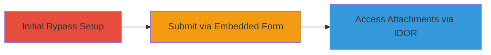

# HackerOne 2FA and Restriction Bypass via Embedded Submission Form Leading to Attachment Access

Multi-stage attack chain demonstrating a complete attack workflow exploiting vulnerabilities in the HackerOne platform to bypass security restrictions and access sensitive data.

## Chain Metrics Dashboard

| Metric | Value |
|--------|-------|
| Chain Status | Unverified |
| Total Steps | 2 |
| Execution Time | ~10 minutes |
| Skill Level | Intermediate |
| Complexity | Medium |
| Impact Level | High |

## Attack Flow Visualization

## Prerequisites & Requirements

### Required Tools

- None (browser-based)

### Target Environment

- Web platform: HackerOne
- Required services/ports: HTTPS access to hackerone.com
- Network access requirements: Standard internet access

### Initial Access Requirements

- HackerOne account credentials
- Network position: External
- Prior access needed: Valid account

## Detailed Attack Procedures

### Step 1: Bypass 2FA and Restrictions - [[procedures/Bypass-2FA-and-Restrictions-Using-Embedded-Submission-Form]]

**Procedure**: [[procedures/Bypass-2FA-and-Restrictions-Using-Embedded-Submission-Form]]

**Objective**: Disable 2FA and use the embedded form to submit reports bypassing program restrictions.

**Expected Output**: Successful submission of a report without 2FA enforcement.

**Success Indicators**:
- Report is created despite missing 2FA
- No blocks from rate limits or blacklists

First, log in to your HackerOne account and disable 2FA if enabled by accessing account settings.

Then, attempt submission via the standard form at https://hackerone.com/parrot_sec to observe the 2FA block.

Obtain the embedded submission URL from the program policy page, such as https://hackerone.com/0a1e1f11-257e-4b46-b949-c7151212ffbb/embedded_submissions/new.

Fill and submit the form via the embedded endpoint, confirming bypass.

### Step 2: Access Attachments via IDOR - [[procedures/Access-Other-Users-Report-Attachments-via-Anonymous-Submissions]]

**Procedure**: [[procedures/Access-Other-Users-Report-Attachments-via-Anonymous-Submissions]]

**Objective**: Exploit improper access control to access attachments from other users' drafts.

**Expected Output**: Retrieval of attachments from unrelated report drafts.

**Success Indicators**:
- Successful loading of drafts and attachments not belonging to the submitter
- Ability to steal sensitive files

Perform an anonymous submission by omitting the tracer parameter, causing the system to fallback to nil and load drafts from authenticated users in the same program.

Access the attachments via the vulnerable endpoint.

## Attack Chain Summary

### Key Achievements

1. Bypassed 2FA, rate limits, and blacklists for report submission
2. Accessed sensitive attachments from other users' drafts
3. Demonstrated combined impact leading to a $10,000 bounty

## Technique & Tactic Coverage

### MITRE ATT&CK Techniques

- [[Valid Accounts]]
- [[Cloud Service Dashboard]]

### MITRE ATT&CK Tactics

- [[Initial Access]]
- [[Privilege Escalation]]

---

*Last updated: [TIMESTAMP]*
