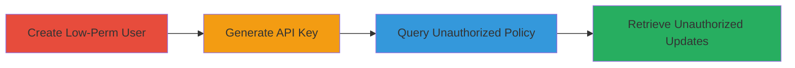

# HackerOne API Improper Access Control for Unauthorized Program Policy Disclosure

Multi-stage attack chain demonstrating exploitation of improper access controls in HackerOne's API, where low-privilege API keys can access sensitive policies and updates for unauthorized programs, bypassing UI-based restrictions.

## Chain Metrics Dashboard

| Metric | Value |
|--------|-------|
| Chain Status | Unverified |
| Total Steps | 4 |
| Execution Time | ~15 minutes |
| Skill Level | Intermediate |
| Complexity | Medium |
| Impact Level | High |

## Attack Flow Visualization



## Prerequisites & Requirements

### Required Tools

- [[tools/curl]]

### Target Environment

- HackerOne platform (web-based bug bounty service)
- Required services/ports: HTTPS (443)
- Network access requirements: Internet access to HackerOne domains

### Initial Access Requirements

- Administrative access to a HackerOne organization with multiple programs
- Ability to create users and groups

## Detailed Attack Procedures

### Step 1: Create Low-Permission User
procedure: [[procedures/Create-Low-Permission-User-in-HackerOne-Organization]]

**Objective**: Set up a user with restricted access to only one program in a multi-program organization to test API boundaries.

**Instructions**: Navigate to organization settings, add a new user, create a low-permission group for one program, and assign the user to it. Verify UI access is limited.

**Expected Output**: User account created with access only to the specified program (e.g., askcmsakmdfksqa_h1r).

**Success Indicators**:
- User added successfully
- UI shows access only to authorized program

### Step 2: Generate API Key
procedure: [[procedures/Generate-API-Key-for-Low-Permission-User]]

**Objective**: Obtain an API token for the low-privilege user to use in subsequent API queries.

**Instructions**: Log in as the low-permission user, navigate to API token settings, and generate a new token.

**Expected Output**: API key generated and copied (e.g., format like ██████=).

**Success Indicators**:
- Token created without errors
- Token authentication succeeds in basic tests

### Step 3: Query Unauthorized Program Policy
procedure: [[procedures/Query-Unauthorized-Program-Policy-via-API]]

**Objective**: Use the low-privilege API key to fetch sensitive policy data for an unauthorized program, demonstrating the access control bypass.

**Instructions**: Execute [[commands/curl-hackerone-api-query]] to GET the program details for the unauthorized handle (e.g., askcmsakmdfksqa_h1b):

```bash
curl "https://api.hackerone.com/v1/hackers/programs/askcmsakmdfksqa_h1b/" -X GET -u "██████=" -H 'Accept: application/json'
```

**Expected Output**: JSON response containing unauthorized program policy and sensitive details.

**Success Indicators**:
- API returns data for unauthorized program
- No authentication or access errors

### Step 4: Retrieve Unauthorized Program Updates
procedure: [[procedures/Retrieve-Unauthorized-Program-Updates-via-API]]

**Objective**: Access and disclose program updates containing sensitive information using the same API key.

**Instructions**: Query the updates endpoint for the unauthorized program using a similar [[commands/curl-hackerone-api-query]] adapted for updates:

```bash
curl "https://api.hackerone.com/v1/hackers/programs/askcmsakmdfksqa_h1b/updates" -X GET -u "██████=" -H 'Accept: application/json'
```

**Expected Output**: JSON array of unauthorized updates with sensitive content.

**Success Indicators**:
- Updates retrieved successfully
- Sensitive data visible in response

## Attack Chain Summary

### Key Achievements

1. Created isolated low-privilege user environment
2. Bypassed UI restrictions via API key
3. Disclosed policies for unauthorized programs
4. Accessed sensitive updates, enabling information leakage

## Technique & Tactic Coverage

### MITRE ATT&CK Techniques

- [[Valid Accounts]]
- [[Exploit Public-Facing Application]]

### MITRE ATT&CK Tactics

- [[Initial Access]]
- [[Collection]]

---

*Last updated: 2024-10-01T00:00:00Z*
