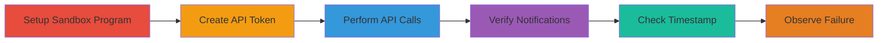

---
tags:
  - business-logic
  - api
  - monitoring-failure
  - hackerone
type: attack_chain
tools:
  - '[[tools/curl]]'
tactics:
  - '[[Defense Evasion]]'
verified: false
platforms:
  - Web
submitted: true
complexity: low
created_at: '2023-10-01T00:00:00Z'
procedures:
  - '[[procedures/Create-Sandbox-Program-and-API-Token]]'
  - '[[procedures/Perform-API-Operations-with-Curl]]'
  - '[[procedures/Verify-Notifications-and-Timestamp-Failure]]'
step_count: 6
techniques:
  - '[[Disable or Modify Tools]]'
updated_at: '2025-12-14T17:32:29.223Z'
description: >-
  Demonstrates a business logic error in HackerOne's API administration where
  the 'Last request' timestamp fails to update after API token usage, leading to
  false security assumptions.
skill_level: intermediate
impact_level: low
id: 9b8e0aba-d0cd-4f6a-b330-cb6c7f8f351c
validated: true
mitre_tactics:
  - '[[Defense Evasion]]'
mitre_techniques:
  - '[[Disable or Modify Tools]]'
---
# HackerOne API Token Last Request Timestamp Update Failure

Multi-stage demonstration of a business logic vulnerability in HackerOne's API administration interface. The 'Last request' timestamp for API tokens does not update after successful API calls, remaining 'Never' in the UI despite backend activity and notifications confirming usage. This creates a false sense of security for administrators monitoring token activity, potentially allowing overlooked active tokens.

## Chain Metrics Dashboard

| Metric | Value |
|--------|-------|
| Chain Status | Unverified |
| Total Steps | 6 |
| Execution Time | ~10 minutes |
| Skill Level | Intermediate |
| Complexity | Low |
| Impact Level | Low |

## Attack Flow Visualization



## Prerequisites & Requirements

### Required Tools

- [[tools/curl]]

### Target Environment

- HackerOne platform (web-based)
- Access to create programs and API tokens (requires HackerOne account with appropriate permissions)
- No specific services/ports beyond standard HTTPS (443)

### Initial Access Requirements

- Valid HackerOne account
- Ability to create sandbox programs
- No prior network access beyond internet connectivity

## Detailed Attack Procedures

### Step 1: Create Sandbox Program
procedure: [[procedures/Create-Sandbox-Program-and-API-Token]]

**Objective**: Set up a test environment by creating a sandbox program to isolate the demonstration.

**Instructions**: Log in to HackerOne and navigate to the programs section to create a new sandbox program for testing purposes.

**Expected Output**: A new program created with a unique handle (e.g., 'sandbox-test').

**Success Indicators**:
- Program creation confirmation in the UI
- Program handle visible in the dashboard

### Step 2: Navigate to API Settings
procedure: [[procedures/Create-Sandbox-Program-and-API-Token]]

**Objective**: Access the API administration page for the sandbox program.

**Instructions**: Go to the program settings and select the API tab using the URL format https://hackerone.com/PROGRAM_HANDLE/api, replacing PROGRAM_HANDLE with the sandbox handle.

**Expected Output**: API management page loads, showing options to create tokens.

**Success Indicators**:
- Page loads without errors
- 'Last request' field visible for tokens (initially 'Never')

### Step 3: Create API Token and Assign Roles
procedure: [[procedures/Create-Sandbox-Program-and-API-Token]]

**Objective**: Generate an API token with necessary roles to perform operations.

**Instructions**: On the API page, create a new token and assign it to a user with standard user and admin roles.

**Expected Output**: Token generated with a secret key; roles assigned successfully.

**Success Indicators**:
- Token details displayed
- Roles confirmed in the UI

### Step 4: Perform API Requests
procedure: [[procedures/Perform-API-Operations-with-Curl]]

**Objective**: Execute various API operations using the token to simulate usage.

**Instructions**: Use [[commands/curl-api-read-reports]] to read reports:

```bash
curl -H "Authorization: Token token=YOUR_TOKEN" https://api.hackerone.com/v1/reports
```

Then use [[commands/curl-api-assign-report]] to assign a report:

```bash
curl -X POST -H "Authorization: Token token=YOUR_TOKEN" -d '{"report_id":123,"state":"triage"}' https://api.hackerone.com/v1/reports/123/state_changes
```

Finally, fetch program details with [[commands/curl-api-fetch-program]]:

```bash
curl -H "Authorization: Token token=YOUR_TOKEN" https://api.hackerone.com/v1/programs/PROGRAM_HANDLE
```

**Expected Output**: JSON responses confirming successful operations (e.g., report lists, assignment confirmations).

**Success Indicators**:
- HTTP 200 responses
- Data retrieved or modified as expected

### Step 5: Verify Notifications
procedure: [[procedures/Verify-Notifications-and-Timestamp-Failure]]

**Objective**: Confirm backend activity through UI notifications.

**Instructions**: Return to the HackerOne UI and open the notifications popup to check for confirmations of actions like report assignments and comments.

**Expected Output**: Notifications appear detailing the API-performed actions.

**Success Indicators**:
- Notifications present for each API call
- Actions logged as completed

### Step 6: Check Last Request Timestamp
procedure: [[procedures/Verify-Notifications-and-Timestamp-Failure]]

**Objective**: Observe the failure of the timestamp to update.

**Instructions**: Reload the API page at https://hackerone.com/PROGRAM_HANDLE/api and inspect the 'Last request' field for the token.

**Expected Output**: Field still shows 'Never' despite successful API usage.

**Success Indicators**:
- Timestamp unchanged
- UI discrepancy confirmed

## Attack Chain Summary

### Key Achievements

1. Successful API operations via curl with token authentication
2. Backend notifications confirming activity
3. UI 'Last request' field failing to update, exposing monitoring flaw

## Technique & Tactic Coverage

### MITRE ATT&CK Techniques

- [[Disable or Modify Tools]] Disable or Modify Tools (impairing monitoring UI)

### MITRE ATT&CK Tactics

- [[Defense Evasion]] Defense Evasion

---
*Last updated: 2023-10-01T00:00:00Z*
