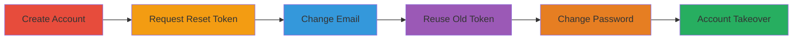

---
tags:
  - broken-auth
  - account-takeover
  - password-reset
  - token-reuse
type: attack_chain
tools: []
tactics:
  - '[[Initial Access]]'
verified: false
platforms:
  - Web
submitted: true
complexity: medium
created_at: '2023-10-01T00:00:00Z'
procedures:
  - '[[procedures/Create-HackerOne-Account]]'
  - '[[procedures/Request-Password-Reset-Token]]'
  - '[[procedures/Change-Account-Email]]'
  - '[[procedures/Reuse-Old-Reset-Token]]'
  - '[[procedures/Complete-Password-Change]]'
step_count: 5
techniques:
  - '[[Valid Accounts]]'
updated_at: '2025-12-14T17:31:19.260Z'
description: >-
  A multi-step attack exploiting a flaw in HackerOne's password reset mechanism
  where tokens sent to an old email are not invalidated after email change,
  enabling unauthorized account takeover if the attacker controls the old email.
skill_level: intermediate
impact_level: high
id: 87c0d0e8-1c6b-4272-bb93-d5940eee2404
validated: true
mitre_tactics:
  - '[[Initial Access]]'
mitre_techniques:
  - '[[Valid Accounts]]'
---
# HackerOne Account Takeover via Password Reset Token Reuse After Email Change

Multi-stage attack chain demonstrating a complete attack workflow exploiting broken authentication in HackerOne's email and password reset systems.

## Chain Metrics Dashboard

| Metric | Value |
|--------|-------|
| Chain Status | Unverified |
| Total Steps | 5 |
| Execution Time | ~10 minutes |
| Skill Level | Intermediate |
| Complexity | Medium |
| Impact Level | High |

## Attack Flow Visualization

## Prerequisites & Requirements

### Required Tools

- Web browser (e.g., Chrome or Firefox)
- Access to two email accounts (old and new)

### Target Environment

- HackerOne web platform
- No specific ports or services beyond standard HTTPS (443)
- Internet access required

### Initial Access Requirements

- No prior credentials needed; starts with account creation
- Attacker must control the old email address for token access

## Detailed Attack Procedures

### Step 1: Create Account
procedure: [[procedures/Create-HackerOne-Account]]

**Objective**: Establish a test account using the target email address to set up the vulnerability exploitation.

**Instructions**: Navigate to the HackerOne registration page and create a new account with the email a@x.com. Complete any required fields such as username and password.

**Expected Output**: Successful account creation with confirmation email sent to a@x.com.

**Success Indicators**:
- Account dashboard accessible after login
- Confirmation email received

### Step 2: Request Password Reset Token
procedure: [[procedures/Request-Password-Reset-Token]]

**Objective**: Generate a password reset token sent to the original email without using it immediately.

**Instructions**: Log out of the account, then go to the password reset page on HackerOne and enter the email a@x.com to request a reset link. Receive the email containing the reset token link but do not click it.

**Expected Output**: Email received with a clickable reset link (e.g., containing a token parameter).

**Success Indicators**:
- Reset email arrives in a@x.com inbox
- Link is valid but unused

### Step 3: Change Account Email
procedure: [[procedures/Change-Account-Email]]

**Objective**: Update the account's email address to a new one, leaving the old reset token active due to the vulnerability.

**Instructions**: Log back in using the original password, navigate to account settings, change the email to b@x.com, and complete the verification process by clicking the confirmation link sent to b@x.com.

**Expected Output**: Email successfully updated in account settings, with verification email sent to b@x.com.

**Success Indicators**:
- New email b@x.com receives verification link
- Account settings reflect the updated email

### Step 4: Reuse Old Reset Token
procedure: [[procedures/Reuse-Old-Reset-Token]]

**Objective**: Access the previously sent reset link from the old email to initiate an unauthorized password reset.

**Instructions**: Log out of the account, then open the old reset email from a@x.com and click the reset link to access the password change form.

**Expected Output**: Password reset form loads without requiring authentication to the new email.

**Success Indicators**:
- Reset form accessible via old token
- No additional verification prompted

### Step 5: Complete Password Change
procedure: [[procedures/Complete-Password-Change]]

**Objective**: Set a new password using the old token, achieving account takeover.

**Instructions**: In the reset form, enter a new password and confirm it to complete the change.

**Expected Output**: Password successfully updated; ability to log in with the new password.

**Success Indicators**:
- Login successful with new password
- Account fully controlled without old email access

## Attack Chain Summary

### Key Achievements

1. Demonstrated persistence of reset tokens post-email change
2. Enabled unauthorized password reset via old email access
3. Achieved full account takeover under controlled conditions

## Technique & Tactic Coverage

### MITRE ATT&CK Techniques

- [[Valid Accounts]]

### MITRE ATT&CK Tactics

- [[Initial Access]]

---

*Last updated: 2023-10-01T00:00:00Z*
