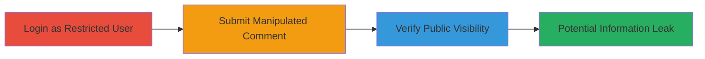

---

# HackerOne Authorization Bypass: Public Comment Posting via is_internal Parameter Manipulation

Multi-stage attack chain demonstrating a complete attack workflow for bypassing comment visibility restrictions in HackerOne.

## Chain Metrics Dashboard

| Metric | Value |
|--------|-------|
| Chain Status | Unverified |
| Total Steps | 3 |
| Execution Time | ~5 minutes |
| Skill Level | Intermediate |
| Complexity | Medium |
| Impact Level | Medium |

## Attack Flow Visualization



## Prerequisites & Requirements

### Required Tools

- Browser with developer tools (e.g., Chrome DevTools) or proxy like Burp Suite for parameter manipulation

### Target Environment

- HackerOne platform (web application)
- Required services/ports: HTTPS on port 443
- Network access requirements: Internet access to hackerone.com

### Initial Access Requirements

- Valid HackerOne credentials for a team member with 'Post internal comments' permission only
- Access to a specific report (e.g., report ID 107329)
- No elevated privileges required beyond login

## Detailed Attack Procedures

### Step 1: Login as Restricted User
procedure: [[procedures/Login-as-Restricted-HackerOne-User]]

**Objective**: Gain access to the HackerOne platform using credentials limited to internal comment posting.

**Instructions**: Navigate to the HackerOne login page and authenticate with restricted team member credentials. Ensure the account is associated with a group that has only 'Post internal comments' permission.

**Expected Output**: Successful login redirect to the dashboard, with access to reports but restricted actions.

**Success Indicators**:
- Dashboard loads without errors
- Attempt to post a standard public comment fails due to permissions

### Step 2: Submit Manipulated Comment
procedure: [[procedures/Submit-Manipulated-Internal-Comment]]

**Objective**: Bypass the internal-only restriction by tampering with the 'is_internal' parameter in the comment submission form.

**Instructions**: Open the target report (e.g., ID 107329) and use browser developer tools or a proxy to intercept and modify the comment POST request. Append a comma to the 'is_internal' parameter (e.g., 'is_internal=,'). Submit the form with sample message like 'test'.

Use [[commands/curl-post-manipulated-hackerone-comment]] to simulate via curl if needed:

```bash
curl -X POST 'https://hackerone.com/reports/107329/comments' \
  -H 'Cookie: your_session_cookie_here' \
  -d 'message=test&substate=&is_internal=,&reference=&add_reporter_to_original=false&reply_action=add-comment&reports_count=1&report_ids%5B%5D=107329'
```

**Expected Output**: Server response with JSON confirming comment creation, e.g., {"flash":"Comment was created successfully.","reports":[{"latest_activity":"2015-12-29T13:35:34.210Z","id":107329,...}]}

**Success Indicators**:
- No permission error returned
- Comment appears in the report activity

### Step 3: Verify Public Visibility
procedure: [[procedures/Verify-Public-Comment-Visibility]]

**Objective**: Confirm the manipulated comment is visible to all report participants, including reporters.

**Instructions**: Refresh the report page or log in as a reporter/participant account to check if the comment is visible. Look for the comment in the public activity feed.

**Expected Output**: The comment 'test' appears in the report's comment section, accessible without internal permissions.

**Success Indicators**:
- Comment visible to non-team participants
- No 'internal only' indicator on the comment

## Attack Chain Summary

### Key Achievements

1. Successful login with restricted permissions
2. Bypassed internal comment restriction via parameter manipulation
3. Confirmed unauthorized visibility, enabling potential sensitive information leakage

## Technique & Tactic Coverage

### MITRE ATT&CK Techniques

- [[Exploit Public-Facing Application]]

### MITRE ATT&CK Tactics

- [[Privilege Escalation]]

---

*Last updated: 2024-10-04T12:00:00Z*
