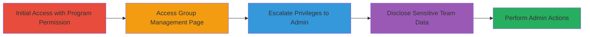

# HackerOne Broken RBAC Privilege Escalation via Group Management

Multi-stage attack chain demonstrating a complete attack workflow exploiting inadequate access controls in HackerOne's team management system.

## Chain Metrics Dashboard

| Metric | Value |
|--------|-------|
| Chain Status | Unverified |
| Total Steps | 4 |
| Execution Time | ~5 minutes |
| Skill Level | Intermediate |
| Complexity | Medium |
| Impact Level | High |

## Attack Flow Visualization



## Prerequisites & Requirements

### Required Tools

- Web browser (e.g., Chrome with developer tools)

### Target Environment

- HackerOne platform (Ruby on Rails web application)
- Valid user account with at least 'Program' permission in a team
- Network access to HackerOne's web interface

### Initial Access Requirements

- Authenticated session as a team member with 'Program' permission
- No prior admin access required
- Direct browser access to the HackerOne dashboard

## Detailed Attack Procedures

### Step 1: Access the Group Management Page
procedure: [[procedures/Escalate-Privileges-via-Broken-RBAC-in-Group-Management]]

**Objective**: Bypass UI restrictions to reach the hidden group management interface, exploiting the lack of backend authorization checks.

**Instructions**: Log in to HackerOne with a 'Program' permission account. Despite the absence of 'Group Management' or 'User Management' menus, directly navigate to the group management URL in the browser address bar.

```plaintext
https://hackerone.com/TEAM/groups
```

Replace 'TEAM' with the actual team slug. The page loads successfully due to broken access controls.

**Expected Output**: The group management page displays, listing available groups without errors.

**Success Indicators**:
- Page loads without 403 or 404 errors
- Groups are visible and editable

### Step 2: Select the Current User's Group
procedure: [[procedures/Escalate-Privileges-via-Broken-RBAC-in-Group-Management]]

**Objective**: Identify and target the group assigned to the low-privilege user for modification.

**Instructions**: On the loaded /TEAM/groups page, locate and select the group that includes the current user (with 'Program' permission). Use the UI dropdown or list to choose the relevant group.

**Expected Output**: The selected group's details and current permissions are displayed for editing.

**Success Indicators**:
- User's group is selectable
- Permission editing interface appears

### Step 3: Add Admin Permissions to the Group
procedure: [[procedures/Escalate-Privileges-via-Broken-RBAC-in-Group-Management]]

**Objective**: Escalate privileges by assigning higher roles like 'Admin' to the group, granting full control.

**Instructions**: In the group editing interface, add 'Admin' permission (or other elevated roles such as 'Reward' and 'Report') to the group's permission set. Save the changes via the UI submit button.

**Expected Output**: Permissions update successfully; upon refresh or logout/login, the user now has Admin access, including new menus for reports, rewards, and user invitations.

**Success Indicators**:
- Admin menus appear in the dashboard
- Ability to perform actions like granting rewards or managing reports

### Step 4: Disclose Sensitive Team Information
procedure: [[procedures/Disclose-Team-Information-via-JSON-Endpoints]]

**Objective**: Leverage accessible endpoints to extract internal team structures, even with low privileges.

**Instructions**: With escalated or even readonly access, directly access the JSON endpoints in the browser or via developer tools. Navigate to:

```plaintext
https://hackerone.com/teams.json
https://hackerone.com/TEAM/groups.json
```

Replace 'TEAM' as needed. The responses return unfiltered JSON data.

**Expected Output**: JSON objects containing team details, user IDs, names, groups, and permissions.

**Success Indicators**:
- JSON data loads without authentication errors
- Sensitive info like user IDs and permissions is visible

## Attack Chain Summary

### Key Achievements

1. Bypassed RBAC to access hidden group management
2. Self-escalated from Program to Admin privileges
3. Gained control over reports, rewards, and user invitations
4. Disclosed internal team structures via JSON endpoints

## Technique & Tactic Coverage

### MITRE ATT&CK Techniques

- [[Exploitation for Privilege Escalation]] Exploitation for Privilege Escalation
- [[System Information Discovery]] System Information Discovery

### MITRE ATT&CK Tactics

- [[Privilege Escalation]] Privilege Escalation
- [[Discovery]] Discovery

---

*Last updated: 2023-10-01T00:00:00Z*
