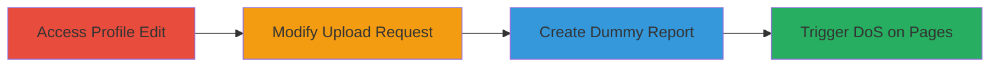

---
tags:
  - dos
  - web
  - graphql
  - file-upload
type: attack_chain
tools:
  - '[[tools/Burp-Suite]]'
tactics:
  - '[[Initial Access]]'
  - '[[Impact]]'
commands: []
platforms:
  - Web
  - AWS
complexity: medium
procedures:
  - '[[procedures/Navigate-to-Profile-Edit-Page]]'
  - '[[procedures/Intercept-and-Modify-Upload-Request]]'
  - '[[procedures/Create-Dummy-Report-and-Invite-Accounts]]'
  - '[[procedures/Load-Affected-Pages-to-Trigger-DoS]]'
step_count: 4
techniques:
  - '[[Exploit Public-Facing Application]]'
  - '[[Endpoint Denial of Service]]'
description: >-
  Multi-stage attack exploiting lack of filename length validation in HackerOne
  profile picture uploads to cause denial of service through large GraphQL
  responses
skill_level: intermediate
impact_level: high
id: 93b9b53a-c127-4681-a492-dc6de5f6d177
created_at: '2025-12-11T06:10:22.293Z'
updated_at: '2025-12-11T06:10:22.293Z'
verified: false
validated: true
submitted: true
mitre_tactics:
  - '[[TA0001]]'
  - '[[TA0040]]'
mitre_techniques:
  - '[[T1190]]'
  - '[[T1499]]'
---
# HackerOne Denial of Service via Oversized Profile Picture Filename

Multi-stage attack chain demonstrating how to exploit the lack of filename length restrictions on HackerOne's profile picture upload feature, leading to denial of service on various platform pages via oversized GraphQL responses.

## Chain Metrics Dashboard

| Metric | Value |
|--------|-------|
| Chain Status | Unverified |
| Total Steps | 4 |
| Execution Time | ~10 minutes |
| Skill Level | Intermediate |
| Complexity | Medium |
| Impact Level | High |

## Attack Flow Visualization

## Prerequisites & Requirements

### Required Tools

- [[tools/Burp-Suite]]

### Target Environment

- Web platform (HackerOne)
- AWS-hosted services including S3 for storage
- GraphQL endpoints

### Initial Access Requirements

- Valid HackerOne account with profile edit access
- Network access to https://hackerone.com

## Detailed Attack Procedures

## Step 1: Access Profile Edit Page - [[procedures/Navigate-to-Profile-Edit-Page]]

**Objective**: Initiate the profile picture upload process to prepare for request interception.

**Instructions**: Navigate to the profile edit page by accessing the URL https://hackerone.com/settings/profile/edit. This sets up the environment for uploading a new profile picture.

**Expected Output**: The profile edit page loads successfully, allowing selection of a profile picture file.

**Success Indicators**:
- Page loads without errors
- Upload form is accessible

## Step 2: Intercept and Modify Upload Request - [[procedures/Intercept-and-Modify-Upload-Request]]

**Objective**: Modify the filename parameter in the upload request to include an oversized payload, exploiting the lack of length validation.

**Instructions**: Using [[tools/Burp-Suite]], intercept the HTTP request during the profile picture upload. Modify the filename parameter to prefix a large payload (e.g., 3MB of text from a file like payload.txt) to the filename, such as <payload>abcd.png. Send the modified request to complete the upload.

**Expected Output**: The upload succeeds, and the oversized filename is stored in the system, propagating to user image URLs.

**Success Indicators**:
- Upload confirmation received
- Profile picture updates with the modified filename

## Step 3: Propagate via Dummy Report - [[procedures/Create-Dummy-Report-and-Invite-Accounts]]

**Objective**: Create a report and invite accounts with the malicious profile to trigger large GraphQL responses.

**Instructions**: Create a dummy report on HackerOne and invite accounts that have the oversized filename in their profile pictures. This action triggers GraphQL queries to the /reports/<report-id>/participants/ endpoint, resulting in oversized responses.

**Expected Output**: The report is created, invitations are sent, and GraphQL responses include the large filenames, causing timeouts.

**Success Indicators**:
- Report creation successful
- Invitations trigger slow or timed-out responses

## Step 4: Trigger DoS on Affected Pages - [[procedures/Load-Affected-Pages-to-Trigger-DoS]]

**Objective**: Access pages that fetch the oversized filenames to observe and induce denial of service.

**Instructions**: Using [[tools/Burp-Suite]] or a browser, load affected pages such as user profiles, reports pages, invited reports, or program thanks pages. These pages execute GraphQL queries that fetch the large filenames, leading to slow loading, timeouts, or browser crashes.

**Expected Output**: Pages load slowly, time out, or cause browser crashes due to processing large responses.

**Success Indicators**:
- Observable delays or crashes on targeted pages
- Impact on other users and programs confirmed

## Attack Chain Summary

### Key Achievements

1. Successful upload of oversized filename without validation
2. Propagation of large data to GraphQL endpoints
3. Denial of service affecting multiple platform components

## Technique & Tactic Coverage

### MITRE ATT&CK Techniques

- [[Exploit Public-Facing Application]]
- [[Endpoint Denial of Service]]

### MITRE ATT&CK Tactics

- [[Initial Access]]
- [[Impact]]

*Last updated: 2023-10-01*
