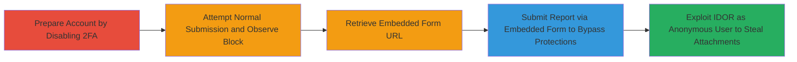

---
tags:
  - authorization-bypass
  - 2fa-bypass
  - idor
  - data-leakage
  - web-vulnerability
type: attack_chain
tools: []
tactics:
  - '[[Initial Access]]'
  - '[[Collection]]'
verified: false
platforms:
  - Web
submitted: true
complexity: medium
created_at: '2023-10-01T00:00:00Z'
procedures:
  - '[[procedures/Disable-2FA-on-HackerOne-Account]]'
  - '[[procedures/Attempt-Normal-Report-Submission]]'
  - '[[procedures/Retrieve-Embedded-Submission-URL]]'
  - '[[procedures/Submit-Report-via-Embedded-Form-Bypass]]'
  - '[[procedures/Exploit-IDOR-for-Attachment-Theft]]'
step_count: 5
techniques:
  - '[[Valid Accounts]]'
  - '[[Exploit Public-Facing Application]]'
  - '[[File and Directory Discovery]]'
updated_at: '2025-12-14T17:24:48.542Z'
description: >-
  Multi-stage attack exploiting improper authorization in HackerOne's embedded
  submission form to bypass 2FA, blacklists, and limits for unauthorized report
  submissions, with a secondary IDOR enabling anonymous attachment theft from
  authenticated drafts.
skill_level: intermediate
impact_level: high
id: 105bdf78-7442-4240-a12c-7f14e7dd84da
validated: true
mitre_tactics:
  - '[[Initial Access]]'
  - '[[Collection]]'
mitre_techniques:
  - '[[Valid Accounts]]'
  - '[[Exploit Public-Facing Application]]'
  - '[[File and Directory Discovery]]'
---
# HackerOne Embedded Submission Form 2FA Bypass and IDOR Attachment Theft

Multi-stage attack chain demonstrating exploitation of improper authorization in HackerOne's embedded submission form, allowing bypass of 2FA requirements, reporter blacklists, rate limits, and abuse protections for unauthorized vulnerability report submissions to programs like Parrot Sec. A secondary IDOR vulnerability enables anonymous users to access and steal file attachments from authenticated users' report drafts, potentially leading to sensitive data leakage.

## Chain Metrics Dashboard

| Metric | Value |
|--------|-------|
| Chain Status | Unverified |
| Total Steps | 5 |
| Execution Time | ~10 minutes |
| Skill Level | Intermediate |
| Complexity | Medium |
| Impact Level | High |

## Attack Flow Visualization



## Prerequisites & Requirements

### Required Tools

- Web browser (e.g., Chrome or Firefox with developer tools)
- [[tools/curl]] for simulating POST requests in the IDOR step

### Target Environment

- HackerOne platform (web application)
- Ruby on Rails backend with Interactors gem
- Access to a HackerOne account (authenticated for primary bypass; anonymous for secondary)
- Target program: e.g., Parrot Sec (https://hackerone.com/parrot_sec)

### Initial Access Requirements

- Valid HackerOne account credentials (for disabling 2FA and testing)
- No special network access beyond internet connectivity
- Prior knowledge of target program's submission requirements (e.g., 2FA enforced)

## Detailed Attack Procedures

### Step 1: Prepare Account by Disabling 2FA
procedure: [[procedures/Disable-2FA-on-HackerOne-Account]]

**Objective**: Remove 2FA enforcement on the attacker's account to test normal submission blocks and prepare for bypass validation.

**Instructions**: Log in to your HackerOne account and navigate to account settings to disable two-factor authentication if enabled.

**Expected Output**: Confirmation that 2FA is disabled in account settings.

**Success Indicators**:
- 2FA toggle shows as disabled
- No 2FA prompts on subsequent logins

### Step 2: Attempt Normal Report Submission
procedure: [[procedures/Attempt-Normal-Report-Submission]]

**Objective**: Verify that standard report submission is blocked due to missing 2FA, confirming the protection is active.

**Instructions**: Navigate to the target program's report submission page (e.g., https://hackerone.com/parrot_sec) and attempt to submit a test report by clicking 'Submit Report'.

**Expected Output**: Error message indicating blockage due to 2FA requirement.

**Success Indicators**:
- Submission fails with 2FA enforcement message
- Normal ACL checks (e.g., rate limits) are observed if applicable

### Step 3: Retrieve Embedded Submission URL
procedure: [[procedures/Retrieve-Embedded-Submission-URL]]

**Objective**: Obtain the URL for the embedded submission form, which skips standard authorization checks.

**Instructions**: Visit the target program's policy page (e.g., https://hackerone.com/parrot_sec/policy) and extract the embedded form URL from the page source or policy content, such as https://hackerone.com/0a1e1f11-257e-4b46-b949-c7151212ffbb/embedded_submissions/new.

**Expected Output**: Valid embedded form URL copied for use.

**Success Indicators**:
- URL retrieved and verified as accessible
- Form loads without immediate errors

### Step 4: Submit Report via Embedded Form Bypass
procedure: [[procedures/Submit-Report-via-Embedded-Form-Bypass]]

**Objective**: Exploit the embedded form endpoint to submit a report without 2FA, bypassing ACL checks for blacklists, rate limits, and abuse limits.

**Instructions**: Use the embedded form URL to create and submit a test vulnerability report. The form uses Interactors::Reports::Create.interact_without_authorization, skipping validations like team.submission_requirements&.mfa_required_at.present?.

**Expected Output**: Report successfully submitted and accepted by the program.

**Success Indicators**:
- Report creation succeeds without 2FA prompt
- No blocks from blacklists or limits

### Step 5: Exploit IDOR for Attachment Theft
procedure: [[procedures/Exploit-IDOR-for-Attachment-Theft]]

**Objective**: As an anonymous user, omit the 'tracer' parameter in the embedded submission request to access and steal attachments from other users' authenticated drafts via IDOR.

**Instructions**: Identify a draft ID from a target authenticated user's session (e.g., via prior observation or invitation). Send a POST request to the embedded submissions endpoint without the 'tracer' parameter using [[commands/curl-post-embedded-submission-no-tracer]] to fetch the draft and copy attachments.

```bash
curl -X POST https://hackerone.com/:uuid/embedded_submissions \
  -F "report_draft[id]=<draft_id>" \
  -F "team_id=<team_id>"
```

The request falls back to nil tracer, matching drafts with tracer: nil, allowing ReportDraft.find_by(id: draft_id, tracer: nil, team: team) to return unauthorized data. Attachments are then accessible via valid_attachments method.

**Expected Output**: Draft details and attachments downloaded or viewed.

**Success Indicators**:
- Unauthorized draft fetched
- Attachments exfiltrated (e.g., saved locally)
- Potential email invitation for claiming leaked data

## Attack Chain Summary

### Key Achievements

1. Bypassed 2FA and ACL protections to submit unauthorized reports (CVSS 5.0 impact)
2. Enabled anonymous access to authenticated drafts via optional tracer parameter
3. Achieved data leakage of attachments, claimable via program invitations (CVSS 7.1 impact)

## Technique & Tactic Coverage

### MITRE ATT&CK Techniques

- [[Valid Accounts]] Valid Accounts (bypassing authorization for submissions)
- [[Exploit Public-Facing Application]] Exploit Public-Facing Application (embedded form endpoint)
- [[File and Directory Discovery]] File and Directory Discovery (IDOR for draft attachments)

### MITRE ATT&CK Tactics

- [[Initial Access]] Initial Access (unauthorized submissions)
- [[Collection]] Collection (attachment theft and data leakage)

---
*Last updated: 2023-10-01T00:00:00Z*
