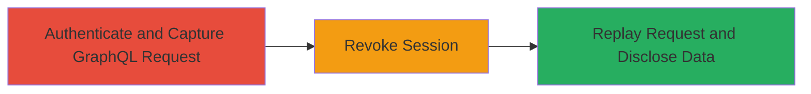

# HackerOne GraphQL Session Replay After Revocation for Sensitive Data Disclosure

Multi-stage attack chain demonstrating exploitation of insufficient session expiration in HackerOne's session management, where revoking a session via the settings page does not invalidate GraphQL query sessions, enabling replay attacks to disclose sensitive information such as rewarded reports, bounty amounts, titles, payment methods, and user details.

## Chain Metrics Dashboard

| Metric | Value |
|--------|-------|
| Chain Status | Unverified |
| Total Steps | 3 |
| Execution Time | ~5 minutes |
| Skill Level | Intermediate |
| Complexity | Medium |
| Impact Level | High |

## Attack Flow Visualization

## Prerequisites & Requirements

### Required Tools

- [[tools/Burp-Suite]]

### Target Environment

- Web platform: HackerOne.com
- Required services/ports: HTTPS (443)
- Network access requirements: Direct internet access to hackerone.com

### Initial Access Requirements

- Valid HackerOne user credentials (hacker or program owner account)
- Network position: External attacker with authenticated access
- Prior access needed: None beyond valid login

## Detailed Attack Procedures

### Step 1: Authenticate and Capture GraphQL Request
procedure: [[procedures/Authenticate-and-Capture-GraphQL-Request]]

**Objective**: Gain authenticated access to HackerOne and intercept a GraphQL query to a sensitive endpoint for later replay.

**Instructions**: Login to HackerOne using valid credentials. Configure Burp Suite as a proxy to intercept traffic. Navigate to a sensitive page like bounty settings and capture the GraphQL POST request.

**Expected Output**: Captured GraphQL request with session token, query for user bounty settings (e.g., {"query":"query User_bounty_settings_page($first_0:Int!,$currency_1:CurrencyCode!,$currency_2:CurrencyCode!) { me { id, ...Fg } } ..."}, variables {"first_0":100,"currency_1":"USD","currency_2":"XLA"}).

**Success Indicators**:
- Successful login and navigation to https://hackerone.com/settings/bounties
- GraphQL request intercepted in Burp Suite

### Step 2: Revoke Session
procedure: [[procedures/Revoke-HackerOne-Session]]

**Objective**: Invalidate the current session via the settings page to simulate session expiration, confirming standard session revocation works.

**Instructions**: Access the sessions management page at https://hackerone.com/settings/sessions, select the current session, and click Revoke. Observe the logout redirection.

**Expected Output**: User redirected to login page, indicating session destruction for standard HTTP requests.

**Success Indicators**:
- Session revoked successfully
- Logout from the account confirmed

### Step 3: Replay GraphQL Request for Data Disclosure
procedure: [[procedures/Replay-GraphQL-Request-for-Data-Disclosure]]

**Objective**: Replay the captured GraphQL request using the revoked session token to verify that GraphQL sessions are not invalidated, resulting in sensitive data disclosure.

**Instructions**: In Burp Repeater, send the previously captured GraphQL POST request to https://hackerone.com/graphql. Analyze the response for disclosed data.

**Expected Output**: Server responds with 200 OK and JSON containing sensitive data like bounties, awarded amounts, report titles, teams, and payment preferences.

**Success Indicators**:
- GraphQL query succeeds despite revocation
- Sensitive information (e.g., bounty details, report titles) returned in response

## Attack Chain Summary

### Key Achievements

1. Successful capture of authenticated GraphQL query
2. Confirmation of session revocation for standard sessions
3. Replay of GraphQL query to disclose sensitive user data post-revocation

## Technique & Tactic Coverage

### MITRE ATT&CK Techniques

- [[Valid Accounts]]
- [[Steal Web Session Cookie]]

### MITRE ATT&CK Tactics

- [[Initial Access]]
- [[Collection]]

---

*Last updated: 2024-10-01T00:00:00Z*
