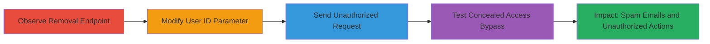

---
tags:
  - idor
  - broken-access-control
  - web
  - hackerone
  - bug-bounty
type: attack_chain
tools: []
tactics:
  - '[[Privilege Escalation]]'
verified: false
platforms:
  - Web
submitted: true
complexity: medium
created_at: '2023-10-01T00:00:00Z'
procedures:
  - '[[procedures/Observe-HackerOne-User-Removal-Endpoint]]'
  - '[[procedures/Alter-User-ID-for-IDOR-Exploitation]]'
  - '[[procedures/Send-IDOR-Removal-Request]]'
  - '[[procedures/Bypass-Concealed-Team-Member-Restrictions]]'
step_count: 4
techniques:
  - '[[Exploitation for Privilege Escalation]]'
  - '[[Exploit Public-Facing Application]]'
updated_at: '2025-12-14T17:25:23.566Z'
description: >-
  This attack chain exploits an Insecure Direct Object Reference (IDOR) in
  HackerOne's bug report management system to send misleading removal
  notifications to arbitrary users, enabling spam and confusion, combined with a
  broken access control vulnerability allowing concealed team members to perform
  restricted actions like managing participants and posting public comments.
skill_level: intermediate
impact_level: high
id: f9cb352e-d368-4b30-b2cc-39d5134ca124
validated: true
mitre_tactics:
  - '[[Privilege Escalation]]'
mitre_techniques:
  - '[[Exploitation for Privilege Escalation]]'
  - '[[Exploit Public-Facing Application]]'
---
# HackerOne IDOR in Bug Report External User Removal Leading to Unauthorized Spam and Access Bypass

Multi-stage attack chain demonstrating exploitation of IDOR and broken access control in HackerOne's platform to manipulate user notifications and bypass visibility restrictions.

## Chain Metrics Dashboard

| Metric | Value |
|--------|-------|
| Chain Status | Unverified |
| Total Steps | 4 |
| Execution Time | ~5 minutes |
| Skill Level | Intermediate |
| Complexity | Medium |
| Impact Level | High |

## Attack Flow Visualization



## Prerequisites & Requirements

### Required Tools

- Web proxy like Burp Suite (for intercepting and modifying requests)

### Target Environment

- HackerOne platform (web application)
- Authenticated session as a report participant or admin

### Initial Access Requirements

- Valid HackerOne account with access to a bug report
- CSRF token from the session
- Knowledge of a target report ID and arbitrary user IDs

## Detailed Attack Procedures

### Step 1: Observe Removal Endpoint
procedure: [[procedures/Observe-HackerOne-User-Removal-Endpoint]]

**Objective**: Identify the DELETE endpoint used for removing external users from bug reports to understand the request structure.

**Instructions**: Use browser developer tools or a web proxy to monitor network traffic while attempting to remove a legitimate participant from a bug report. Look for the DELETE request to /reports/<report_id>/external_users/<user_id>.

**Expected Output**: Captured request showing URL path, headers like X-CSRF-Token, Cookie, and Referer.

**Success Indicators**:
- Endpoint structure confirmed
- Required headers (CSRF, auth cookie) identified

### Step 2: Alter User ID Parameter for IDOR Exploitation
procedure: [[procedures/Alter-User-ID-for-IDOR-Exploitation]]

**Objective**: Modify the user_id in the request to target a non-participant, testing for IDOR by attempting unauthorized removal.

**Instructions**: In your web proxy, intercept the DELETE request and change the <user_id> in the URL to an arbitrary HackerOne user ID not invited to the report. Retain all other parameters like report_id, CSRF token, and cookies.

**Expected Output**: Modified request ready for forwarding, with altered user_id.

**Success Indicators**:
- Parameter successfully changed without breaking request format
- No immediate server-side validation error on modification

### Step 3: Send IDOR Removal Request
procedure: [[procedures/Send-IDOR-Removal-Request]]

**Objective**: Execute the modified request to trigger unauthorized removal notification to the target user, demonstrating the IDOR.

**Instructions**: Forward the modified DELETE request using a tool like curl or your proxy. Use the following command, replacing placeholders:

Execute [[commands/delete-hackerone-external-user]]:

```bash
curl -X DELETE "https://hackerone.com/reports/<report_id>/external_users/<user_id>" \
  -H "X-CSRF-Token: <token>" \
  -H "Cookie: <cookies>" \
  -H "Referer: <referer>" \
  -H "X-Requested-With: XMLHttpRequest" \
  -H "Accept-Language: en-US,en;q=0.5" \
  -H "Accept-Encoding: gzip, deflate"
```

**Expected Output**: HTTP 200 or success response, followed by an email notification sent to the targeted non-participant user claiming removal from the report, and incorrect update to the participant list.

**Success Indicators**:
- Request succeeds without authorization error
- Target user receives misleading removal email
- Report participant list shows phantom changes

### Step 4: Bypass Concealed Team Member Restrictions
procedure: [[procedures/Bypass-Concealed-Team-Member-Restrictions]]

**Objective**: Test and exploit broken access controls by inviting a concealed team member and verifying they can perform restricted actions.

**Instructions**: Invite a team member with concealed visibility to the report. Then, as that member, attempt to add/remove external reporters and post public comments using standard platform UI or API requests similar to the removal endpoint.

**Expected Output**: Successful addition/removal of participants and public comment posting, visible to reporters despite concealed status.

**Success Indicators**:
- Concealed member can manage external users
- Public comments from concealed member appear to reporters
- No enforcement of visibility restrictions

## Attack Chain Summary

### Key Achievements

1. Successful IDOR exploitation sending spam-like removal emails to arbitrary users via legitimate HackerOne notifications
2. Manipulation of report participant lists causing confusion among users
3. Bypass of concealed team member restrictions, allowing unintended disclosure and access control violations
4. Potential for mass spamming by chaining multiple unauthorized removals

## Technique & Tactic Coverage

### MITRE ATT&CK Techniques

- [[Exploitation for Privilege Escalation]] Exploitation for Privilege Escalation
- [[Exploit Public-Facing Application]] Exploit Public-Facing Application

### MITRE ATT&CK Tactics

- [[Privilege Escalation]] Privilege Escalation

---

*Last updated: 2023-10-01T00:00:00Z*
