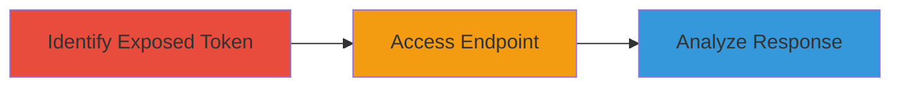

---
tags:
  - information-disclosure
  - token-exposure
  - privacy-leak
  - hackerone
type: attack_chain
tools: []
tactics:
  - '[[Discovery]]'
verified: false
platforms:
  - Web
submitted: true
complexity: low
created_at: '2024-01-01T00:00:00Z'
procedures:
  - '[[procedures/Identify-Exposed-Invitation-Token]]'
  - '[[procedures/Access-Invitation-Endpoint]]'
  - '[[procedures/Analyze-JSON-Response]]'
step_count: 3
techniques:
  - '[[Gather Victim Org Information]]'
  - '[[Email Addresses]]'
updated_at: '2025-12-14T17:25:12.958Z'
description: >-
  Multi-stage attack chain exploiting human error in a public HackerOne report
  to disclose sensitive researcher and private program information via an
  unaccepted invitation token.
skill_level: novice
impact_level: medium
id: 283c42cb-5202-4340-b9b2-c43ba4a97469
validated: true
mitre_tactics:
  - '[[Discovery]]'
mitre_techniques:
  - '[[Gather Victim Org Information]]'
  - '[[Email Addresses]]'
---
# HackerOne Information Disclosure via Exposed Invitation Token

Multi-stage attack chain demonstrating a complete attack workflow exploiting human error in exposing an unaccepted invitation token in a public HackerOne report, leading to disclosure of sensitive researcher email and private program details.

## Chain Metrics Dashboard

| Metric | Value |
|--------|-------|
| Chain Status | Unverified |
| Total Steps | 3 |
| Execution Time | ~5 minutes |
| Skill Level | Novice |
| Complexity | Low |
| Impact Level | Medium |

## Attack Flow Visualization



## Prerequisites & Requirements

### Required Tools

- None (uses standard HTTP client like curl or browser)

### Target Environment

- Web platform
- Access to public HackerOne reports
- No special services or ports required

### Initial Access Requirements

- Public internet access
- No credentials needed
- Valid exposed token from a public report summary

## Detailed Attack Procedures

### Step 1: Identify Exposed Token
procedure: [[procedures/Identify-Exposed-Invitation-Token]]

**Objective**: Locate and extract the unaccepted invitation token from the public summary of a HackerOne report.

**Instructions**: Navigate to the public report page, such as https://hackerone.com/reports/283309, and inspect the summary for any embedded invitation URLs containing a token in the format https://hackerone.com/invitations/<token>.json. Copy the token value.

**Expected Output**: A valid token string extracted from the URL.

**Success Indicators**:
- Token identified in the report summary
- URL format matches expected pattern

### Step 2: Access Endpoint
procedure: [[procedures/Access-Invitation-Endpoint]]

**Objective**: Perform an unauthorized GET request to the invitation endpoint using the exposed token to retrieve sensitive data.

**Instructions**: Use [[commands/curl-get-invitation]] to send a GET request to the endpoint:

```bash
curl -X GET "https://hackerone.com/invitations/<token>.json"
```
Replace <token> with the extracted token.

**Expected Output**: JSON response containing invitation details.

**Success Indicators**:
- HTTP 200 response received
- JSON payload returned without authentication prompt

### Step 3: Analyze Response
procedure: [[procedures/Analyze-JSON-Response]]

**Objective**: Parse the JSON response to extract and review sensitive information such as email addresses and private program details.

**Instructions**: Save the response to a file and inspect it manually or with a JSON parser. Look for fields like 'email', 'team' (with 'name', 'handle', 'profile_picture', 'url').

**Expected Output**: Extracted sensitive data including researcher's email and program metadata.

**Success Indicators**:
- Email address visible in response
- Private program details (name, handle, profile picture URL) disclosed

## Attack Chain Summary

### Key Achievements

1. Exposed token identification from public report
2. Unauthorized access to private invitation data
3. Disclosure of researcher email and confidential program information

## Technique & Tactic Coverage

### MITRE ATT&CK Techniques

- [[Gather Victim Org Information]] Gather Victim Org Information
- [[Email Addresses]] Gather Victim Identity Information: Email Addresses

### MITRE ATT&CK Tactics

- [[Discovery]] Discovery

---
*Last updated: 2024-01-01T00:00:00Z*
