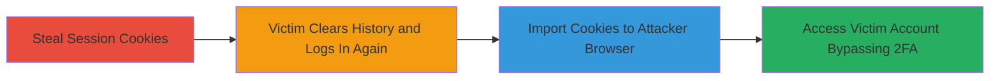

---
tags:
  - session-hijacking
  - 2fa-bypass
  - cookie-theft
  - account-takeover
type: attack_chain
tools:
  - '[[tools/EditThisCookie]]'
tactics:
  - '[[Credential Access]]'
  - '[[Initial Access]]'
verified: false
platforms:
  - Web
submitted: true
complexity: medium
created_at: '2023-10-01T00:00:00Z'
procedures:
  - '[[procedures/Steal-Victims-Session-Cookies]]'
  - '[[procedures/Import-Stolen-Cookies-into-Browser]]'
  - '[[procedures/Access-Victims-Account-with-Persistent-Session]]'
step_count: 3
techniques:
  - '[[Steal Web Session Cookie]]'
  - '[[Valid Accounts]]'
updated_at: '2025-12-14T17:24:47.881Z'
description: >-
  An attack chain exploiting persistent session cookies in HackerOne to bypass
  2FA and achieve account takeover after cookie theft.
skill_level: intermediate
impact_level: high
id: 971edf51-43c1-4866-b0d5-9cf05916dbf6
validated: true
mitre_tactics:
  - '[[Credential Access]]'
  - '[[Initial Access]]'
mitre_techniques:
  - '[[Steal Web Session Cookie]]'
  - '[[Valid Accounts]]'
---
# HackerOne Insufficient Session Expiration Leading to 2FA Bypass and Account Takeover

Multi-stage attack chain demonstrating session hijacking via persistent cookies on the HackerOne platform, allowing attackers to bypass 2FA and take over victim accounts.

## Chain Metrics Dashboard

| Metric | Value |
|--------|-------|
| Chain Status | Unverified |
| Total Steps | 3 |
| Execution Time | ~5 minutes |
| Skill Level | Intermediate |
| Complexity | Medium |
| Impact Level | High |

## Attack Flow Visualization

## Prerequisites & Requirements

### Required Tools

- [[tools/EditThisCookie]]

### Target Environment

- Web platform: HackerOne (https://hackerone.com/)
- Required services/ports: HTTPS (443)
- Network access requirements: Internet access to HackerOne domain

### Initial Access Requirements

- Credential requirements: None for attacker initially; relies on stolen cookies
- Network position: External attacker with stolen cookies
- Prior access needed: Method to steal cookies (e.g., XSS, MITM, or physical access)

## Detailed Attack Procedures

### Step 1: Steal Victim's Session Cookies
procedure: [[procedures/Steal-Victims-Session-Cookies]]

**Objective**: Obtain the victim's active session cookies from their browser to enable session hijacking.

**Instructions**: Use any available method such as XSS, network interception, or browser access to extract cookies from the victim's session on https://hackerone.com/. Export the cookies including session identifiers.

**Expected Output**: Raw cookie data (e.g., key-value pairs like _h1_session=abc123).

**Success Indicators**:
- Cookies successfully extracted and contain valid session tokens
- Cookies are associated with https://hackerone.com/

### Step 2: Import Stolen Cookies into Attacker's Browser
procedure: [[procedures/Import-Stolen-Cookies-into-Browser]]

**Objective**: Load the stolen cookies into the attacker's browser to impersonate the victim's authenticated session.

**Instructions**: Install [[tools/EditThisCookie]] browser extension. Navigate to https://hackerone.com/ in the attacker's browser, open the extension, and import the stolen cookie values. At this point, the victim may clear their browser history (logging them out locally) and perform a new login with email/password, creating a new session—but the old server-side session remains valid.

**Expected Output**: Cookies successfully added to the browser's cookie store for hackerone.com.

**Success Indicators**:
- Extension confirms cookies are set without errors
- Browser developer tools show the imported cookies active

### Step 3: Access Victim's Account with Persistent Session
procedure: [[procedures/Access-Victims-Account-with-Persistent-Session]]

**Objective**: Use the persistent old session cookies to access the victim's account, bypassing any 2FA requirements since the session is pre-authenticated.

**Instructions**: With the imported cookies, navigate to https://hackerone.com/ in the attacker's browser. The site should grant access to the victim's dashboard without prompting for login or 2FA, as the server recognizes the old session as valid despite the victim's new login.

**Expected Output**: Full access to the victim's HackerOne account, including reports, profile, and sensitive data.

**Success Indicators**:
- Account dashboard loads without authentication prompts
- Attacker can perform actions like viewing private reports or changing settings

## Attack Chain Summary

### Key Achievements

1. Successful theft and import of session cookies
2. Bypassing 2FA through session persistence
3. Complete account takeover on HackerOne platform

## Technique & Tactic Coverage

### MITRE ATT&CK Techniques

- [[Steal Web Session Cookie]] Steal Web Session Cookie
- [[Valid Accounts]] Valid Accounts

### MITRE ATT&CK Tactics

- [[Credential Access]] Credential Access
- [[Initial Access]] Initial Access

---
*Last updated: 2023-10-01T00:00:00Z*
