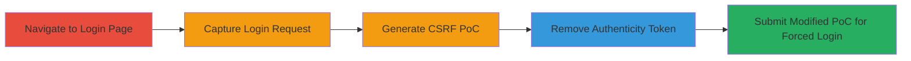

---
id: ac-834366-csrf-login-bypass
name: HackerOne Login CSRF Bypass Allowing Forced Authentication and Session Hijacking
type: attack_chain
description: Multi-stage attack exploiting a CSRF token bypass in HackerOne's login process to force victims to authenticate into an attacker's controlled account, enabling session hijacking, sensitive data addition, and IP logging for further attacks.
verified: false
submitted: false
step_count: 5
created_at: 2023-10-01T00:00:00Z
updated_at: 2023-10-01T00:00:00Z
procedures: [[procedures/Bypass-HackerOne-Login-CSRF-Token]]
techniques: [[Drive-by Compromise]], [[Exploit Public-Facing Application]]
tactics: [[Initial Access]]
tags: csrf, login-csrf, session-hijacking, account-takeover, web-vulnerability
platforms: Web
tools: [[tools/Burp-Suite]]
complexity: medium
skill_level: intermediate
impact_level: high
---

# HackerOne Login CSRF Bypass Allowing Forced Authentication and Session Hijacking

Multi-stage attack chain demonstrating a complete attack workflow exploiting CSRF token bypass in the HackerOne login endpoint.

## Chain Metrics Dashboard

| Metric | Value |
|--------|-------|
| Chain Status | Unverified |
| Total Steps | 5 |
| Execution Time | ~10 minutes |
| Skill Level | Intermediate |
| Complexity | Medium |
| Impact Level | High |

## Attack Flow Visualization



## Prerequisites & Requirements

### Required Tools

- [[tools/Burp-Suite]]

### Target Environment

- Web platform (Ruby on Rails with Devise authentication)
- Required services/ports: HTTPS on port 443
- Network access requirements: Direct internet access to hackerone.com

### Initial Access Requirements

- No prior credentials needed
- Attacker must host a malicious site or email with the PoC
- Victim interaction required (e.g., clicking a link)

## Detailed Attack Procedures

### Step 1: Navigate to the Login Page

procedure: [[procedures/Bypass-HackerOne-Login-CSRF-Token]]

**Objective**: Access the target login endpoint to prepare for request capture.

**Instructions**: Open a browser and navigate to the HackerOne login page.

**Expected Output**: Login form loaded at https://hackerone.com/users/sign_in.

**Success Indicators**:
- Page loads successfully without errors
- Form fields for email, password, and remember me are visible

### Step 2: Capture Login Request Packets

procedure: [[procedures/Bypass-HackerOne-Login-CSRF-Token]]

**Objective**: Intercept the normal login request to analyze the authenticity_token inclusion.

**Instructions**: Configure [[tools/Burp-Suite]] as a proxy, attempt a login with test credentials, and capture the POST request to /users/sign_in.

**Expected Output**: HTTP POST request captured, including fields: user[email], user[password], user[remember_me], and authenticity_token.

**Success Indicators**:
- Request intercepted showing all form parameters
- Token value visible in the request body

### Step 3: Generate CSRF PoC from Captured Request

procedure: [[procedures/Bypass-HackerOne-Login-CSRF-Token]]

**Objective**: Create an initial HTML-based proof-of-concept for the login action.

**Instructions**: In [[tools/Burp-Suite]], use Engagement Tools to generate an HTML form PoC from the captured request.

**Expected Output**: HTML file with a form submitting to https://hackerone.com/users/sign_in, including all original fields including authenticity_token.

**Success Indicators**:
- PoC HTML generated and viewable
- Form includes hidden inputs for email, password, remember_me, and token

### Step 4: Remove the Authenticity Token from the PoC

procedure: [[procedures/Bypass-HackerOne-Login-CSRF-Token]]

**Objective**: Modify the PoC to bypass CSRF protection by omitting the token.

**Instructions**: Edit the HTML PoC file to delete the <input type="hidden" name="authenticity_token" value="..." /> field.

**Expected Output**: Modified HTML without the token field, ready for submission.

**Success Indicators**:
- Token input removed from HTML source
- Form still submits other required fields

### Step 5: Submit the Modified PoC Request

procedure: [[procedures/Bypass-HackerOne-Login-CSRF-Token]]

**Objective**: Execute the bypass to force authentication without CSRF token validation.

**Instructions**: Host the modified PoC on an attacker-controlled site, trick victim into loading it (e.g., via phishing), and forward the request in Burp Suite to verify.

Use the modified [[commands/hackerone-csrf-poc-submit]] for testing:

```html
<html><!--CSRF PoC - generated by Burp Suite Professional --><body><script>history.pushState('','','/')</script><form action="https://hackerone.com/users/sign_in" method="POST"><input type="hidden" name="user[email]" value="victim@example.com"/><input type="hidden" name="user[password]" value="victimpass123"/><input type="hidden" name="user[remember_me" value="1"/><input type="submit" value="Submit request"/></form></body></html>
```

**Expected Output**: Server accepts the request, logs in successfully, and redirects to dashboard.

**Success Indicators**:
- HTTP 302 redirect to dashboard
- Victim authenticated without token, enabling attacker to log IP or add data

## Attack Chain Summary

### Key Achievements

1. Bypassed CSRF protection in login endpoint
2. Forced victim authentication into controlled session
3. Enabled potential session hijacking and data exfiltration

## Technique & Tactic Coverage

### MITRE ATT&CK Techniques

- [[Drive-by Compromise]] Drive-by Compromise
- [[Exploit Public-Facing Application]] Exploit Public-Facing Application

### MITRE ATT&CK Tactics

- [[Initial Access]] Initial Access

---

*Last updated: 2023-10-01T00:00:00Z*
